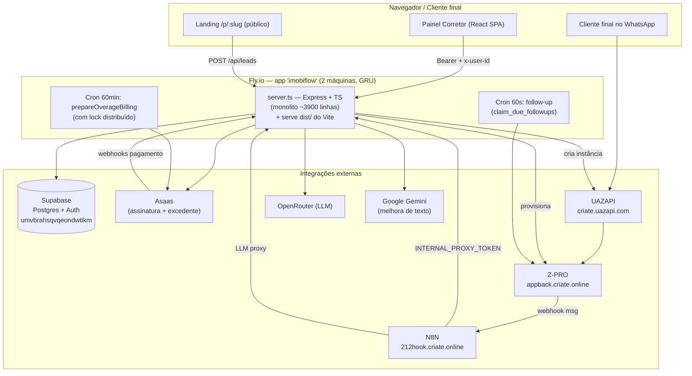
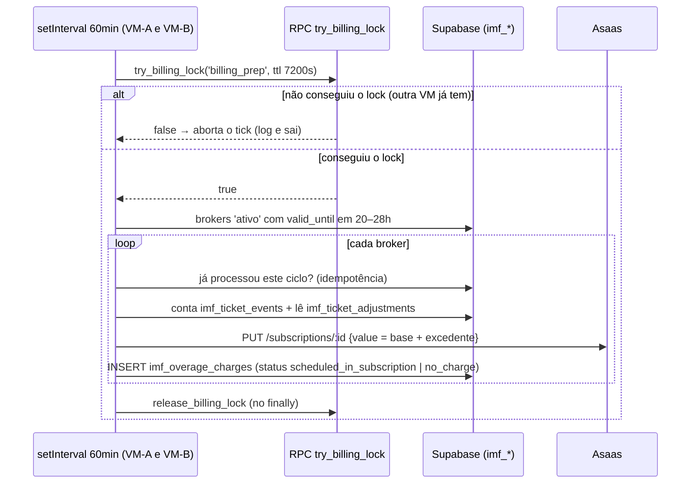
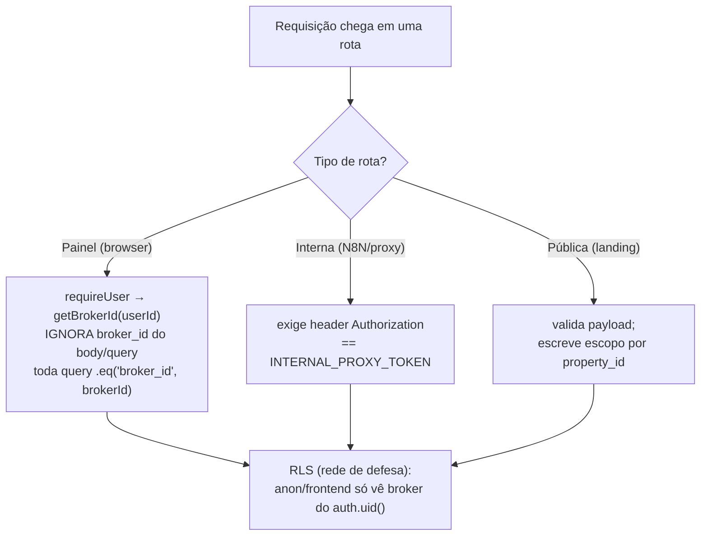
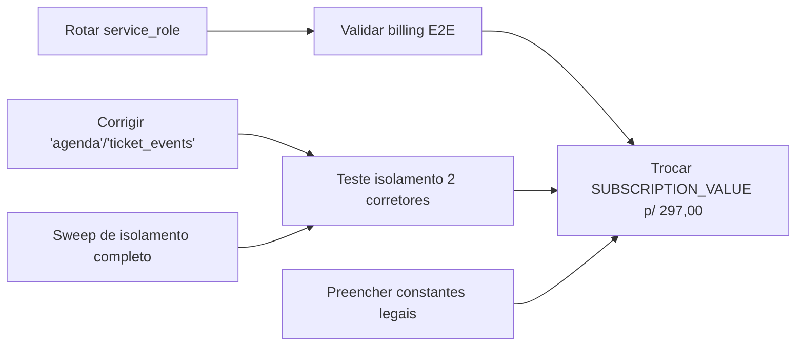

# ImobiFlow — Documentação do Projeto

> Documento de referência técnica e operacional. Cobre arquitetura, fluxo
> ponta a ponta, modelo de dados, endpoints, integrações e pontos pendentes.
> **Não contém valores de segredos** — apenas os nomes das variáveis (os
> valores ficam no `.env` local, nos *secrets* da Fly e nas notas de memória).

Última atualização: 2026-07-13. **Comece pela §14.16** — ela registra a
virada de arquitetura mais importante do projeto: **o v2 é agora o projeto
principal; o v1 (`main`/`imobiflow.fly.dev`) fica só como rollback de
segurança**, sem receber trabalho ativo. §14.1-14.15 descrevem o estado do
v1 (ainda válidas para conceitos compartilhados — Asaas, billing, modelo de
dados core) mas ficaram desatualizadas quanto à experiência de produto, ao
provisionamento de WhatsApp e a boa parte do backend, que mudaram no v2.

---

## 1. Visão geral

ImobiFlow é um **SaaS multitenant** para corretores de imóveis. A esteira é
automática: o corretor paga no **Asaas** → o sistema provisiona automaticamente
um atendimento WhatsApp isolado no **Z-PRO** (fork do Whaticket) usando a
**UAZAPI** como provedor de WhatsApp → um agente de IA (no **N8N**) responde os
clientes finais consultando os imóveis cadastrados.

Divisão de responsabilidades dos painéis:
- **ImobiFlow** (este projeto): cadastro/landing de **imóveis**, leads, agenda,
  configuração do agente de IA, pagamento e o motor de provisionamento.
- **Z-PRO** (`app.criate.online`): o corretor **lê o QR Code** e opera o
  atendimento WhatsApp (inbox, tickets).

---

## 2. Stack e infraestrutura

| Camada | Tecnologia |
|--------|-----------|
| Backend | Node + Express + TypeScript, rodado com `tsx server.ts` (porta 3000) |
| Frontend | Vite + React 19 + React Router 7 + Tailwind 4 (`motion`, `recharts`, `lucide-react`) |
| Banco / Auth | **Supabase** (project_id `umvbrahsqvqeondwtikm`) |
| Deploy | **Fly.io** — app `imobiflow` (`imobiflow.fly.dev`) |
| Pagamentos | **Asaas** (assinatura recorrente mensal via cartão) |
| WhatsApp | **Z-PRO** (`appback.criate.online` = API, `app.criate.online` = painel) sobre **UAZAPI** (`criate.uazapi.com`) |
| Automação IA | **N8N** (`212hook.criate.online`) |
| LLM | **OpenRouter** (chave por corretor, com fallback da empresa) |
| Texto auxiliar | **Google Gemini** (melhorar descrições de imóveis) |

### Como rodar / deployar
```bash
# Local (a partir de C:\Users\Criate\imob.criate)
npm run dev        # tsx --max-old-space-size=1024 server.ts  (porta 3000)
npm run build      # vite build → dist/
npm run lint       # tsc --noEmit (typecheck)

# Produção
fly deploy         # PowerShell, a partir da pasta do projeto
```
> Em prod o Express serve `dist/`. O flag `--max-old-space-size=1024` evita OOM
> (uploads em base64). O `.env` **local não tem** `ZPRO_JWT_SECRET` (só Fly).

---

## 3. Estrutura de arquivos

```
imob.criate/
├── server.ts                 # TODO o backend (Express): ~2790 linhas, 1 arquivo
├── index.html                # entrypoint Vite
├── vite.config.ts
├── Dockerfile / fly.toml      # build e deploy Fly
├── .env / .env.example        # variáveis de ambiente
├── HANDOFF.md                 # histórico de handoff entre sessões
├── README.md                  # leia-me geral
├── DOCUMENTACAO.md            # este arquivo
└── src/
    ├── App.tsx                # rotas (React Router)
    ├── main.tsx / index.css
    ├── lib/        supabase.ts, utils.ts
    ├── services/   auth.ts (token/headers), gemini.ts
    ├── components/ PropertyForm, AISettings, CorretoraSettings, MagicWandTextarea
    └── pages/      Dashboard, PropertyLanding, Login, Signup,
                    PaymentPending, PaymentSuccess, ForgotPassword,
                    ResetPassword, Termos, Privacidade, Admin
```

---

## 4. Modelo de dados (Supabase)

Tabelas usadas hoje pelo ImobiFlow estão abaixo. O projeto Supabase é
compartilhado com outros sistemas — tabelas `autoescola*`, `cfc*`, de clínicas
etc. **não** fazem parte deste projeto. Já a camada `ia_*` (`ia_tenants`,
`ia_clients`, `ia_chat_histories`, `ia_tenant_handoff_routes` etc.) **pertence
ao ImobiFlow e está em desenvolvimento** (features novas — ver §11).

### `brokers` — corretor / tenant (núcleo)
Identidade: `id` (uuid), `user_id` (Supabase Auth), `name`, `email`, `phone`, `is_admin`, `corretora_id`.
Plano/assinatura: `status` (`pendente`/`ativo`/`inativo`/`bloqueado`), `plan`, `valid_until`, `grace_until`, `asaas_customer_id`, `asaas_subscription_id`.
Provisionamento Z-PRO: `provisioning_status` (`pending`→`tenant_created`→`session_created`→`api_created`→`completed`, ou `processing`/`failed`/`disabled`), `provisioning_error`, `provisioning_completed_at`.
Credenciais Z-PRO: `zpro_tenant_id`, `zpro_channel_id`, `zpro_channel_name`, `zpro_user_email`, `zpro_username`, `zpro_password`, `zpro_qr_code`.
**API externa Z-PRO (convenção — ver §6):** `zpro_api_key` = **UUID** da api-config · `zpro_api_token` = **plainToken** (Bearer) · `zpro_api_url` = URL completa `…/v2/api/external/{UUID}`.
IA / config: `ai_name`, `broker_address`, `openrouter_api_key_enc` (chave OpenRouter criptografada AES-256).
Recuperação de senha: `reset_token`, `reset_token_expires_at`.

### `properties` — imóveis
`id`, `title`, `price`, `location`, `description`, `image_url` (JSON de URLs), `slug`, `link` (landing `/p/:slug`), `status`, `broker_id`, `created_at`, `updated_at`.

### `leads`
`id`, `property_id`, `name`, `phone`, `email`, `status`, `notes`, `broker_id`, `created_at`.

### `agenda` — visitas
`id`, `broker_id`, `lead_id`, `property_id`, `title`, `scheduled_at`, `status`, dados do cliente.

### `subscriptions` — histórico de pagamento
`id`, `broker_id`, `asaas_payment_id`, `asaas_customer_id`, `plan`, `amount` (centavos), `currency`, `status`, `paid_at`, `valid_until`.

### `corretoras` — imobiliária (nível acima do corretor)
`id`, `razao_social`, `cnpj`, `creci`, `owner_broker_id`. Vincula-se a `brokers.corretora_id`.

### `webhook_logs` — auditoria
`id`, `source` (`asaas`/`zpro`/`provisioning_webhook`), `event_type`, `payload` (jsonb), `status`, `broker_id`, `created_at`.

### `followup_config` — config do Follow-Up IA (1 por corretor)
`id`, `broker_id` (único), `enabled` (toggle), `delay_minutes_1` (default 1440 = 24h), `delay_minutes_2` (default 4320 = 3 dias), `delay_minutes_3` (default 10080 = 7 dias), `message_1/2/3`, timestamps.
Cada timer é independente: F1 conta a partir de `last_customer_message_at`; F2/F3 contam a partir de `follow_sent_at` do follow anterior.

### `followup_conversations` — estado do follow por conversa (corretor × cliente)
`id`, `broker_id`, `customer_phone`, `last_customer_message_at`, `follow_sent`, `follow_sent_at`, `follow_message_index` (0..3), `ai_active` (`false` = handover humano), `human_takeover_at`, **único(broker_id, customer_phone)**.
Função SQL `claim_due_followups()`: claim atômico (multi-máquina safe) — seleciona + marca + avança o índice numa única instrução.

---

## 5. Fluxo operacional completo

### 5.1 PROVISIONAMENTO (onboarding do corretor)
1. **Cadastro** — `Signup.tsx` → `POST /api/auth/signup`: cria user no Supabase Auth (já confirmado) + linha em `brokers` (`status: pendente`).
2. **Pagamento** — `PaymentPending.tsx` → `POST /api/checkout`: cria *customer* + **subscription mensal recorrente** (cartão) no Asaas; valida a 1ª cobrança (`CONFIRMED`/`RECEIVED`).
3. **Confirmação** — dois caminhos: (a) síncrono no próprio checkout; (b) assíncrono via `POST /api/webhooks/asaas` (`PAYMENT_RECEIVED`/`PAYMENT_CONFIRMED`). Ambos chamam `handleAsaasPaymentReceived`.
4. **Trava + disparo** — `handleAsaasPaymentReceived` ativa o corretor (`status: ativo`, `valid_until` +1 mês), registra `subscriptions`, e aplica **trava atômica** (`provisioning_status = processing`, condicional) para evitar provisionamento duplicado em webhooks repetidos → chama `createZproTenantAndChannel`.
5. **Esteira Z-PRO/UAZAPI** (`createZproTenantAndChannel`), 8 passos:
   1. `POST /tenants` (super admin) → tenant isolado (já com `uazapiHost`+`uazapiToken`).
   2. `POST /userTenants` → usuário admin do tenant (`status: active`, `restrictedUser: false`).
   3. `POST /auth/login` → token do tenant (fallback: `forgeTenantJwt`).
   4. `POST /whatsappTenants` → canal WhatsApp (`type: uazapi`, `DISCONNECTED`).
   5. **UAZAPI** `createUazapiInstanceForChannel`: `POST /instance/create` → grava `tokenAPI` e **`wabaId`** (= "Number ID / Instance ID") no canal, e configura o webhook UAZAPI→Z-PRO.
   6. `POST /api-config` → cria API externa; salva `zpro_api_key`(UUID), `zpro_api_token`(plainToken), `zpro_api_url`.
   7. Ativa Bots IA (`PUT /settings/n8n` + `/settings/n8nAllTickets`) e seta `n8nUrl` no canal (`PUT /whatsapp/:id`).
   8. `provisioning_status = completed` + `fireProvisioningWebhook`.
6. **Entrega de credenciais** — `fireProvisioningWebhook` → **PROVISIONING_WEBHOOK_URL** (N8N) com login/senha/URL/token → N8N entrega ao corretor.

### 5.2 ATIVAÇÃO (conectar o WhatsApp) — **no painel Z-PRO**
7. Corretor loga no **Z-PRO** (`app.criate.online`) com as credenciais recebidas.
8. Lê o **QR Code** no Z-PRO e escaneia no celular.
9. UAZAPI emite evento `connection` → webhook `…/uazapi-webhook/{instanceId}` → **Z-PRO casa o evento pelo `wabaId`** → canal vira `CONNECTED`/`plugged`.
   > **Descoberta crítica:** sem `wabaId` correto no canal, o Z-PRO ignora os eventos da UAZAPI e o canal nunca ativa ("Não ativado"). O webhook precisa existir **antes** de conectar.

### 5.3 OPERAÇÃO (atendimento automático)
10. Cliente final manda mensagem → UAZAPI → webhook → Z-PRO cria ticket → chama **N8N_WEBHOOK_URL** (`n8nUrl` do canal).
11. N8N: **Normalizar Dados** → **Buscar Corretor** (`brokers` por telefone, limpando o sufixo `:xxxx` da UAZAPI) → **Buscar Imóveis** (`properties` por `broker_id`).
12. Agente IA chama o **LLM Proxy** `POST /api/proxy/llm/:brokerPhone/*` → encaminha para OpenRouter usando a chave do corretor (ou fallback da empresa).
13. **Enviar Resposta** → `POST {zpro_api_url}` (URL **base**, sem sufixo) com header `Authorization: Token {zpro_api_token}` e body `{ body, number, externalKey, isClosed:false }`. Multitenant: cada corretor traz a própria URL/token via "Buscar Corretor". *(Formato confirmado no fluxo N8N real — não é `Bearer`/`/messages/send-text`.)*

### 5.4 CONTEÚDO (corretor cadastra imóveis) — **no painel ImobiFlow**
- `Dashboard.tsx` → `PropertyForm.tsx` → `POST /api/properties`: gera `slug` + **landing page** `/p/:slug`, salva imagens, vincula `broker_id`.
- Landing pública `PropertyLanding.tsx` (`/p/:slug`) → visitante preenche → `POST /api/leads` (opcional dispara `CHATBOT_WEBHOOK_URL`).
- Apoio: `POST /api/properties/upload-image`, `POST /api/brokers/upload-photo`, `POST /api/ai/enhance-text` (Gemini — "varinha mágica").

### 5.5 CICLO DE VIDA da assinatura (`POST /api/webhooks/asaas`)
- `PAYMENT_RECEIVED`/`PAYMENT_CONFIRMED` → renova `valid_until` (cobrança mensal recorrente).
- `PAYMENT_OVERDUE` → concede **grace de 3 dias** (`grace_until`); suspensão é *lazy* em `GET /api/subscription`.
- `PAYMENT_DELETED` → `status: inativo`.
- `SUBSCRIPTION_DELETED`/`INACTIVATED`/`CANCELED` → `status: inativo` + `provisioning_status: disabled`.

### 5.6 FOLLOW-UP IA (reativação de lead + handover humano) — VALIDADO EM PRODUÇÃO
Camada **isolada** (não altera o fluxo acima). Config por corretor na aba **Configurações** (`FollowUpSettings.tsx`).

**Regras:**
- Máximo 3 follows por ticket. `follow_message_index` vai de 0→1→2→3 e para.
- Index **nunca reseta** quando cliente responde — só reseta em `isNewTicket` (ticket_id diferente).
- **Timers independentes por follow:**
  - F1: conta a partir de `last_customer_message_at + delay_minutes_1` (padrão 1440 min = 24h)
  - F2: conta a partir de `follow_sent_at + delay_minutes_2` (padrão 4320 min = 3 dias)
  - F3: conta a partir de `follow_sent_at + delay_minutes_3` (padrão 10080 min = 7 dias)
- Auto-progressão: após F1 enviado, `follow_sent=false` é resetado; F2 dispara automaticamente no próximo tick após `follow_sent_at + delay_minutes_2`; idem F3.
- Mensagens vazias são puladas (sem loop infinito).
- **Handover humano:** corretor responde manualmente → `human_takeover_at` setado → `ai_active=false` → agente N8N interrompido e follow-ups pausados naquela conversa.

**Peças:**
1. **N8N → ImobiFlow:** o fluxo do agente chama `POST /api/followup/inbound` (registra a msg do cliente + retorna `respond`; se `false`, o agente para). Corretor manual → `POST /api/followup/broker-reply`.
2. **Marcador ZWSP (`​`):** agente e follow-up incluem um *zero-width space* (invisível) nas mensagens do **sistema**. O nó de handover só dispara quando a msg `fromMe` **não** tem o marcador (= corretor digitou manual) — resolve "agente vs corretor" sem depender de `wasSentByApi`.
3. **Motor (cron 60s):** `claim_due_followups()` faz claim atômico (multi-máquina safe na Fly) e envia via API externa Z-PRO (mesmo formato do agente — ver §6). Falha de envio → reverte o claim p/ retry no próximo tick.

---

## 6. Convenção dos campos da API externa Z-PRO (importante)

Cada corretor tem **uma** "api-config" no Z-PRO, vinculada ao canal, que expõe a
API externa em `…/v2/api/external/{UUID}`. **Envio de mensagem** usa header `Authorization: Token {plainToken}` (formato do agente N8N — confirmado em produção); endpoints de leitura (ex.: `showChannelById`) também aceitam `Bearer`.

| Campo Supabase | Conteúdo | Usado em |
|----------------|----------|----------|
| `zpro_api_key` | **UUID** da api-config | montar a URL externa |
| `zpro_api_token` | **plainToken** | header `Token {plainToken}` no envio (agente N8N + cron follow-up) |
| `zpro_api_url` | URL completa `…/external/{UUID}` | base das chamadas |

> O `plainToken` só é exibido **uma vez** na criação. Para reparar um corretor,
> recria-se a api-config logando como o tenant (não via super admin, senão cria
> uma config solta sem vínculo ao canal).

---

## 7. Integrações externas

| Integração | Uso | Auth |
|-----------|-----|------|
| **Asaas** | customer + subscription mensal; webhooks de pagamento | `ASAAS_API_KEY` |
| **Z-PRO** (admin) | criar tenant/user/canal/api-config; PUT canal | `ZPRO_ADMIN_TOKEN` (super admin) ou token de login do tenant; fallback `forgeTenantJwt` com `ZPRO_JWT_SECRET` |
| **Z-PRO** (externa) | enviar mensagem do corretor / follow-up | `zpro_api_token` (header `Token`) |
| **UAZAPI** | criar instância, configurar webhook | header `admintoken`/`token` = `UAZAPI_TOKEN` |
| **N8N** | provisioning webhook + processamento de mensagem + LLM proxy | `INTERNAL_PROXY_TOKEN` (N8N→servidor) |
| **OpenRouter** | LLM do agente | chave do corretor (`openrouter_api_key_enc`) ou `OPENROUTER_API_KEY` |
| **Gemini** | melhorar texto de imóveis | `GEMINI_API_KEY` |

### Os 3 webhooks (não confundir)
1. **PROVISIONING_WEBHOOK_URL** — entrega credenciais ao corretor (pós-provisionamento).
2. **N8N_WEBHOOK_URL** — recebe mensagens dos clientes finais (setado como `n8nUrl` no canal).
3. **CHATBOT_WEBHOOK_URL** *(opcional)* — dispara lead capturado na landing page.

Há ainda o webhook **UAZAPI→Z-PRO** (`…/uazapi-webhook/{instanceId}`), interno à camada WhatsApp.

---

## 8. Referência de endpoints (backend — `server.ts`)

**Auth** *(rate-limited: 10 req/15min por IP)*: `POST /api/auth/signup` · `/login` · `/forgot-password` · `/reset-password`
**Corretor:** `GET /api/brokers/me` · `POST /api/brokers/settings` · `POST|DELETE /api/brokers/openrouter-key` · `POST /api/brokers/upload-photo`
**Corretora:** `GET|POST /api/corretora` · `GET /api/corretora/brokers`
**Imóveis:** `GET|POST /api/properties` · `GET /api/properties/health` · `GET /api/properties/:slug` · `DELETE /api/properties/:id` · `PATCH /api/properties/:id/status` · `POST /api/properties/upload-image`
**Leads:** `POST|GET /api/leads` · `GET /api/leads/recent` · `PATCH /api/leads/:id/status`
**Agenda:** `GET /api/agenda` · `GET /api/agenda/visits`
**Dashboard:** `GET /api/dashboard/metrics` · `GET /api/dashboard/charts`
**IA:** `POST /api/ai/enhance-text` (Gemini)
**Pagamento** *(`/api/checkout` rate-limited: 5 req/1h; `/api/webhooks/asaas` rate-limited: 120 req/1min)*: `GET /api/config/plan` · `POST /api/checkout` · `GET /api/subscription` · `POST /api/webhooks/asaas` · `POST /api/webhooks/asaas/test` *(bloqueado em produção)*
**WhatsApp:** `POST /api/whatsapp/send` *(N8N, auth `INTERNAL_PROXY_TOKEN`)*
**Follow-Up IA:** `GET|POST /api/followup/config` *(corretor)* · `POST /api/followup/inbound` *(N8N: msg do cliente + gate `respond`)* · `POST /api/followup/broker-reply` *(N8N: handover humano)* — N8N usa `INTERNAL_PROXY_TOKEN`; um cron interno (60s) dispara os follows
**Admin** *(exige `requireAdmin` via header `x-user-id` de um broker `is_admin`)*: `GET /api/admin/brokers` · `GET /api/admin/metrics` · `PATCH /api/admin/brokers/:id/status` · `GET /api/admin/brokers/:id` · `POST /api/admin/brokers/:id/provision` · `PATCH /api/admin/brokers/:id/zpro-credentials` · `POST /api/admin/brokers/:id/cancel-plan` · `DELETE /api/admin/brokers/:id` · `POST /api/admin/brokers/:id/relink-uazapi`
**Proxy LLM:** `ALL /api/proxy/llm/:brokerPhone/*`

Autenticação geral: o frontend envia `Authorization: Bearer <supabase_token>` + `x-user-id: <user.id>` (ver `src/services/auth.ts`).

---

## 9. Frontend — rotas (`src/App.tsx`)

| Rota | Página | Acesso |
|------|--------|--------|
| `/login`, `/signup` | Login, Signup | público |
| `/forgot-password`, `/reset-password` | recuperação de senha | público |
| `/termos`, `/privacidade` | textos legais | público |
| `/p/:slug` | **PropertyLanding** (landing do imóvel) | público |
| `/payment`, `/payment/success`, `/payment/cancelled` | fluxo de pagamento | logado |
| `/admin` | **Admin** | logado (`is_admin`) |
| `/` | **Dashboard** | logado **+ assinatura ativa** (`PrivateRoute` checa `GET /api/subscription`; `pendente` → `/payment`) |

Dashboard concentra as abas: imóveis (`PropertyForm`), leads, agenda, configurações de IA (`AISettings`) + **Follow-Up Inteligente** (`FollowUpSettings`), corretora (`CorretoraSettings`).

---

## 10. Variáveis de ambiente (nomes — valores no `.env`/Fly)

`SUPABASE_URL`/`VITE_SUPABASE_URL`, `SUPABASE_SERVICE_ROLE_KEY`/`VITE_SUPABASE_SERVICE_ROLE_KEY`, `VITE_SUPABASE_ANON_KEY` ·
`APP_URL` · `GEMINI_API_KEY` ·
`ASAAS_API_KEY`, `ASAAS_ENV`, `SUBSCRIPTION_VALUE` ·
`UAZAPI_TOKEN`, `UAZAPI_HOST`, `UAZAPI_PLATFORM_SESSION` ·
`ZPRO_ADMIN_URL`, `ZPRO_ADMIN_TOKEN`, `ZPRO_API_SECRET`, `ZPRO_JWT_SECRET` ·
`PROVISIONING_WEBHOOK_URL`, `N8N_WEBHOOK_URL`, `CHATBOT_WEBHOOK_URL` ·
`INTERNAL_PROXY_TOKEN`, `LLM_PROXY_ENC_KEY`, `OPENROUTER_API_KEY`.

> O servidor **recusa subir** sem `SUPABASE_SERVICE_ROLE_KEY`.

---

## 11. Pontos de atenção / roadmap

### ✅ Concluído (2026-05-27)
- **Rebranding "Criate":** title, favicon, header desktop, sidebar mobile, nav da landing.
- **Follow-Up Inteligente:** 3 timers independentes, auto-progressão, skip mensagens vazias — validado em produção.
- **Rate limiting:** `express-rate-limit` nos endpoints de auth, checkout e webhook Asaas.
- **Termos de Uso e Política de Privacidade:** 20 cláusulas cada, cobrindo LGPD, Marco Civil, Lei do Software, CDC, Decreto 7.962/2013.
- **Limpeza do histórico git:** service_role key do Supabase expurgada de todos os commits com `git-filter-repo`.
- **Tenant 209 (David):** validado.

### ⚠️ Urgente / bloqueante comercial
- **Rotacionar service_role key do Supabase** (chave antiga ficou no histórico git — ver HANDOFF.md §7).
- **Páginas legais:** preencher constantes de empresa (`RAZAO_SOCIAL`, `CNPJ`, `ENDERECO`, `EMAIL_CONTATO`, `EMAIL_DPO`) no topo de `Termos.tsx` e `Privacidade.tsx`.

### 🟡 Pendente / roadmap
1. **N8N — sub-workflow "Deletar Agendamento":** campo `id visita` vazio; URL correta: `$json.url/scheduleReminder/delete/$json['id visita']`; nó "When Executed by Another Workflow" precisa de `$fromAI()` no campo; body `{}`.
2. **Email real de notificação de lead:** atualmente `console.log('[E-MAIL SIMULADO]')` em `server.ts` — implementar com Resend, SendGrid ou Nodemailer.
3. **Agente IA "Juliana":** colar conteúdo de `agent_system_message.txt` no nó "Agente IA Corretor" do N8N.
4. **GitHub Actions CI/CD:** `fly deploy` automático no push para `main` (`FLY_API_TOKEN` como secret).
5. **Rate limiting distribuído (Redis):** hoje cada máquina Fly tem contador independente — para multi-máquina correta, usar Redis (ex.: `rate-limit-redis`).
6. **Verificar ticket aberto antes de follow:** idealmente consultar Z-PRO API para não disparar follow em ticket já encerrado.
7. **Sentry / error tracking:** vários `catch` silenciosos em `server.ts`.
8. **Bug pré-existente:** `src/pages/ResetPassword.tsx:94` referencia `accessToken` inexistente (erro de typecheck, não afeta runtime).
9. **`UAZAPI_PLATFORM_SESSION`:** placeholder no `.env` local — recuperação de senha por WhatsApp só funciona se configurado na Fly.
10. **Lead/visita via WhatsApp:** hoje só a landing grava `leads`; gravar a partir da conversa do agente está no roadmap.
11. **`POST /api/whatsapp/send`:** caminho alternativo de envio (autenticado por `INTERNAL_PROXY_TOKEN`), não usado pelo fluxo N8N atual — candidato a consolidação futura.

---

## 12. Limpeza realizada (código morto removido em 2026-05-22)

Removido por estar **comprovadamente órfão** (sem referências; typecheck
confirmou que nada quebrou). Nenhuma lógica viva foi alterada:

| Item | Motivo |
|------|--------|
| `src/pages/WhatsAppSetup.tsx` | Página não roteada (não importada no `App.tsx`); leitura de QR migrou para o Z-PRO |
| `GET /api/whatsapp/status` (em `server.ts`) | Único consumidor era a página acima |
| `check.ts`, `check_env.ts`, `check_schema.ts` | Scripts de diagnóstico soltos (2 com service-role key hardcoded; um inseria dado de teste) |

---

## 13. Billing de excedente de atendimentos (implementado em 2026-06-11)

### Modelo de cobrança

| Parâmetro | Valor padrão | Env var para alterar |
|-----------|-------------|---------------------|
| Plano mensal |  (R$ 5,00 durante validação; futuro R$ 297,00) | Updating existing machines in 'imobiflow' with rolling strategy
> [1/2] Updating 7814053f9e2078 [app]
> [1/2] Updating 7814053f9e2078 [app]
> [1/2] Waiting for 7814053f9e2078 [app] to have state: started
> [1/2] Machine 7814053f9e2078 [app] has state: started
> [1/2] Checking that 7814053f9e2078 [app] is up and running
> [1/2] Waiting for 7814053f9e2078 [app] to become healthy: 1/1

✔ [1/2] Machine 7814053f9e2078 [app] update succeeded
> [2/2] Updating 7840637a265778 [app]
> [2/2] Updating 7840637a265778 [app]
> [2/2] Waiting for 7840637a265778 [app] to have state: started
> [2/2] Machine 7840637a265778 [app] has state: started
> [2/2] Checking that 7840637a265778 [app] is up and running
> [2/2] Waiting for 7840637a265778 [app] to become healthy: 1/1

✔ [2/2] Machine 7840637a265778 [app] update succeeded |
| Atendimentos inclusos/ciclo | 100 | Updating existing machines in 'imobiflow' with rolling strategy
> [1/2] Updating 7814053f9e2078 [app]
> [1/2] Updating 7814053f9e2078 [app]
> [1/2] Waiting for 7814053f9e2078 [app] to have state: started
> [1/2] Machine 7814053f9e2078 [app] has state: started
> [1/2] Checking that 7814053f9e2078 [app] is up and running
> [1/2] Waiting for 7814053f9e2078 [app] to become healthy: 1/1

✔ [1/2] Machine 7814053f9e2078 [app] update succeeded
> [2/2] Updating 7840637a265778 [app]
> [2/2] Updating 7840637a265778 [app]
> [2/2] Waiting for 7840637a265778 [app] to have state: started
> [2/2] Machine 7840637a265778 [app] has state: started
> [2/2] Checking that 7840637a265778 [app] is up and running
> [2/2] Waiting for 7840637a265778 [app] to become healthy: 1/1

✔ [2/2] Machine 7840637a265778 [app] update succeeded |
| Preço por atendimento excedente | R$ 2,00 | Updating existing machines in 'imobiflow' with rolling strategy
> [1/2] Updating 7814053f9e2078 [app]
> [1/2] Updating 7814053f9e2078 [app]
> [1/2] Waiting for 7814053f9e2078 [app] to have state: started
> [1/2] Machine 7814053f9e2078 [app] has state: started
> [1/2] Checking that 7814053f9e2078 [app] is up and running
> [1/2] Waiting for 7814053f9e2078 [app] to become healthy: 1/1

✔ [1/2] Machine 7814053f9e2078 [app] update succeeded
> [2/2] Updating 7840637a265778 [app]
> [2/2] Updating 7840637a265778 [app]
> [2/2] Waiting for 7840637a265778 [app] to have state: started
> [2/2] Machine 7840637a265778 [app] has state: started
> [2/2] Checking that 7840637a265778 [app] is up and running
> [2/2] Waiting for 7840637a265778 [app] to become healthy: 1/1

✔ [2/2] Machine 7840637a265778 [app] update succeeded |

**Exemplo:** corretor com 250 atendimentos no ciclo → 150 excedentes → R$ 300,00 cobrado automaticamente no cartão.

---

### O que conta como atendimento

Um **ticket novo no Z-PRO** = 1 atendimento. A contagem é feita pela chave composta :
- Primeira mensagem de um lead novo → ticket A → conta 1
- Segunda mensagem do mesmo lead no mesmo ticket → mesmo ticket A → **não conta** (idempotente via UNIQUE INDEX)
- Lead retorna após meses, Z-PRO cria ticket B → conta +1

A contabilização ocorre no endpoint  (disparado pelo N8N a cada mensagem recebida).

---

### Tabelas envolvidas

#### 
Registra cada atendimento único por broker.

| Coluna | Tipo | Descrição |
|--------|------|-----------|
| uid=197609(Criate) gid=197121 groups=197121 | UUID PK | — |
|  | UUID FK brokers | Corretor dono do atendimento |
|  | TEXT | ID do ticket no Z-PRO |
|  | TEXT | Telefone normalizado do lead |
|  | TIMESTAMPTZ | Momento do primeiro contato deste ticket |

Índice único:  → garante que o mesmo ticket só conta uma vez.

#### 
Registra cada ciclo processado (com ou sem excedente).

| Coluna | Tipo | Descrição |
|--------|------|-----------|
| uid=197609(Criate) gid=197121 groups=197121 | UUID PK | — |
|  | UUID FK brokers | — |
|  | TIMESTAMPTZ | Início do ciclo () |
|  | TIMESTAMPTZ | Fim do ciclo ( anterior) |
|  | INT | Total de tickets no ciclo |
|  | INT | Limite do plano (padrão 100) |
|  | INT | Tickets acima do limite |
|  | NUMERIC | Preço unitário aplicado |
|  | INT | Valor cobrado em centavos |
|  | TEXT |  /  /  /  /  |
|  | TEXT | ID do payment no Asaas (quando ) |
|  | TEXT | Mensagem de erro (quando ) |
|  | TIMESTAMPTZ | Quando a cobrança foi confirmada |

####  — nova coluna
| Coluna | Tipo | Descrição |
|--------|------|-----------|
|  | TEXT | Token do cartão retornado pelo Asaas na criação da subscription. Permite cobranças avulsas futuras sem pedir o cartão novamente. |

---

### Fluxo de cobrança de excedente


**Tolerância de atraso:** o webhook do Asaas pode chegar com até 7 dias de atraso;  só processa se .

**Falha não-bloqueante:** se a cobrança de excedente falhar (cartão recusado, timeout), o registro fica  no banco, mas a renovação da assinatura principal **não é afetada**. Revisão manual via tabela .

---

### Endpoint para o corretor

 — autenticado com 

Retorna:


---

### Variáveis de ambiente relevantes

| Variável | Descrição |
|----------|-----------|
|  | Valor mensal do plano (R$ — padrão 49.90, validação 5.00, futuro 297.00) |
|  | Atendimentos inclusos no plano (padrão 100) |
|  | Preço por atendimento excedente em R$ (padrão 2.00) |
|  | Chave da API Asaas — necessária para criar payments de excedente |
|  |  = api.asaas.com; qualquer outro = sandbox |

Para alterar limites sem redeploy:
Updating existing machines in 'imobiflow' with rolling strategy
> [1/2] Updating 7814053f9e2078 [app]
> [1/2] Updating 7814053f9e2078 [app]
> [1/2] Waiting for 7814053f9e2078 [app] to have state: started
> [1/2] Machine 7814053f9e2078 [app] has state: started
> [1/2] Checking that 7814053f9e2078 [app] is up and running
> [1/2] Waiting for 7814053f9e2078 [app] to become healthy: 1/1

✔ [1/2] Machine 7814053f9e2078 [app] update succeeded
> [2/2] Updating 7840637a265778 [app]
> [2/2] Updating 7840637a265778 [app]
> [2/2] Waiting for 7840637a265778 [app] to have state: started
> [2/2] Machine 7840637a265778 [app] has state: started
> [2/2] Checking that 7840637a265778 [app] is up and running
> [2/2] Waiting for 7840637a265778 [app] to become healthy: 1/1

✔ [2/2] Machine 7840637a265778 [app] update succeeded


---

# 14. Estado Consolidado e Continuidade (atualizado 2026-07-02)

> **Leia esta seção primeiro se você é novo no projeto.** Ela é auto-contida e
> reflete o estado **real e verificado** do código em produção nesta data.
> Onde houver divergência com seções anteriores (§4 e §13), **esta seção
> prevalece** — as seções 1–13 foram escritas antes de duas mudanças grandes:
> (a) o *rename* das tabelas para o prefixo `imf_` (commit `c11caa4`) e
> (b) a migração do modelo de cobrança de excedente para "valor da assinatura
> ajustado antes da renovação". A §13 do documento, além disso, está
> **corrompida** (saída de `fly deploy` foi colada dentro das células das
> tabelas) — ignore-a e use a §14.5 abaixo.

---

## 14.1. Objetivo geral do projeto

**ImobiFlow** (marca comercial **Criate**) é um **SaaS B2B multitenant** para
corretores de imóveis brasileiros. A proposta de valor é uma **esteira 100%
automática**: o corretor assina o plano, paga pelo **Asaas**, e o sistema
**provisiona sozinho** um atendimento de WhatsApp isolado (número, sessão,
canal e um agente de IA) sem intervenção humana. A partir daí, um **agente de
IA no N8N** atende os clientes finais do corretor 24/7, respondendo com base
nos **imóveis que o corretor cadastrou** no painel e reativando leads silenciosos
via **follow-up automático**.

Em uma frase: **"pague e, minutos depois, tenha um vendedor de imóveis por IA
no seu WhatsApp, alimentado pelo seu próprio catálogo."**

Divisão de painéis (importante não confundir):
- **ImobiFlow / Criate** (este repositório, `imobiflow.fly.dev`): cadastro de
  imóveis, landing pages, leads, agenda, configuração do agente de IA,
  pagamento, billing de excedente e o **motor de provisionamento**.
- **Z-PRO** (`app.criate.online`): onde o corretor **lê o QR Code** e opera a
  caixa de entrada do WhatsApp (inbox/tickets). É um produto de terceiros
  (fork do Whaticket) que orquestramos via API.

---

## 14.2. Arquitetura atual

### Visão de componentes



### Características arquiteturais-chave

- **Monólito intencional — agora modular (concluído em 2026-07-02).** Um único
  processo/deploy no Fly continua sendo a decisão certa (ver §14.8); só o
  **arquivo** deixou de ser monolítico. `server.ts` caiu de **181KB (4025
  linhas) para 3,2KB (~85 linhas)** — virou puramente um orquestrador: cria o
  app Express, monta os middlewares globais, monta os routers por domínio e
  os cron jobs, e sobe o servidor. Toda a lógica foi redistribuída em 22
  arquivos sob `server/`:
  - `server/config.ts` — todas as env vars.
  - `server/supabase.ts` — cliente Supabase.
  - `server/lib/` — `crypto.ts` (encrypt/decrypt/normalizePhoneBR),
    `zproAuth.ts` (JWT do Z-PRO), `infra.ts` (Sentry/Redis).
  - `server/middleware/` — `auth.ts` (requireUser/optionalUser/requireAdmin/
    getBrokerId), `rateLimits.ts` (os 3 limiters).
  - `server/services/` — `billing.ts` (handleAsaasPaymentReceived,
    prepareOverageBilling, chargeOverageIfDue, asaasHeaders),
    `provisioning.ts` (toda a esteira Z-PRO/UAZAPI — createZproTenantAndChannel
    e as ~12 funções auxiliares), `followup.ts` (runFollowupTick + engine).
  - `server/routes/` — um arquivo por domínio (auth, brokers, properties,
    corretora, ai, dashboard, leads, agenda, billing, whatsapp, llmProxy,
    admin, followup), cada um exportando um `express.Router()` montado em
    `server.ts`.
  - Verificação: **65 de 65** combinações método+rota conferidas 1:1 contra o
    arquivo original (nenhuma perdida/duplicada), `tsc --noEmit` limpo, build
    ok, `tsx server.ts` sobe sem erro. Nenhum comportamento foi alterado —
    é reorganização pura de código.
  - Domínios novos do roadmap (Locação, Lançamentos, Financeiro, Equipe...)
    já nascem como `server/routes/<dominio>.ts` a partir de agora — ver
    `UX_MASTERPLAN.md`.
- **Multitenant por `broker_id`.** Cada corretor é um *tenant*. O isolamento
  é **100% responsabilidade do código de aplicação**, porque o backend usa a
  `service_role` do Supabase, que **ignora RLS** (ver §14.5.2 e §14.9).
- **Stateless + 2 máquinas.** O Fly roda 2 VMs com `auto_start_machines`.
  Qualquer job agendado (`setInterval`) roda **nas duas** — daí a necessidade
  de **locks/claims atômicos no Postgres** para tudo que não pode duplicar.
- **Frontend só fala com o backend.** O SPA nunca consulta o Supabase
  diretamente (o cliente `anon` em `src/lib/supabase.ts` é exportado mas
  **nenhum** `.from()`/`.rpc()` o usa). Isso torna seguro habilitar RLS sem
  quebrar a UI.

---

## 14.3. Tecnologias utilizadas

| Camada | Tecnologia | Observação |
|--------|-----------|-----------|
| Backend | Node + Express + TypeScript, via `tsx server.ts` (porta 3000) | `--max-old-space-size=1024` evita OOM em uploads base64 |
| Frontend | Vite + React 19 + React Router 7 + Tailwind 4 | Design system "Liquid Glass" (`motion`, `recharts`, `lucide-react`) |
| Banco/Auth | Supabase (`umvbrahsqvqeondwtikm`) — Postgres + Auth | Instância **compartilhada** com outros projetos (ver §14.5) |
| Deploy | Fly.io — app `imobiflow` (`imobiflow.fly.dev`), 2 máquinas GRU | CI/CD: GitHub Actions faz `fly deploy` no push para `main` |
| Pagamentos | Asaas — assinatura mensal recorrente + cobrança de excedente | `ASAAS_ENV=production` → `api.asaas.com`; senão sandbox |
| WhatsApp | Z-PRO (fork Whaticket) sobre UAZAPI | Z-PRO orquestra; UAZAPI é o provedor real do número |
| Automação IA | N8N (`212hook.criate.online`) | Fluxo do agente + provisioning webhook |
| LLM | OpenRouter | Chave por corretor (fallback da empresa) via proxy |
| Texto auxiliar | Google Gemini | "Varinha mágica" para melhorar descrições de imóveis |

Rodar / deployar:
```bash
# Local (em C:\Users\Criate\imob.criate)
npm run dev     # tsx --max-old-space-size=1024 server.ts (porta 3000)
npm run build   # vite build → dist/
npm run lint    # tsc --noEmit (typecheck — sempre rode antes de commitar)

# Produção: push para main dispara GitHub Actions → fly deploy
# (ou manual) fly deploy --app imobiflow
```

---

## 14.4. Estrutura do banco de dados (Supabase) — **fonte de verdade atual**

> ⚠️ **Mudança crítica vs. §4:** as tabelas **núcleo** foram renomeadas para o
> prefixo `imf_` no commit `c11caa4`. A §4 (que lista `brokers`, `properties`,
> `agenda`, `ticket_events`, `overage_charges`) está **desatualizada**. Além
> disso, a instância Supabase é **compartilhada** com outros sistemas da Criate
> (CVV usa prefixo `cvv_`, Criate IA usa `ia_`, zpro-dashboard usa `zpro_`).
> **Sempre filtre pelo prefixo `imf_` ao mexer em tabelas deste projeto.**

### Tabelas com prefixo `imf_` (renomeadas — núcleo do produto)

| Tabela | Papel | Colunas relevantes |
|--------|-------|--------------------|
| `imf_brokers` | Corretor / tenant (núcleo) | `id`, `user_id` (Auth), `name`, `email`, `phone`, `is_admin`, `corretora_id`, `status` (`pendente`/`ativo`/`inativo`/`bloqueado`), `plan`, `valid_until`, `grace_until`, `asaas_customer_id`, `asaas_subscription_id`, `asaas_credit_card_token`, `provisioning_status`, credenciais Z-PRO (`zpro_*`), `ai_name`, `broker_address`, `openrouter_api_key_enc`, `reset_token` |
| `imf_properties` | Imóveis | `id`, `title`, `price`, `location`, `description`, `image_url` (JSON), `slug`, `link`, `status`, `broker_id`, timestamps |
| `imf_agenda` | Visitas/agenda (calendário) | `id`, `broker_id`, `lead_id`, `property_id`, `title`, `scheduled_at`, `status`, dados do cliente |
| `imf_ticket_events` | 1 linha por atendimento único (base do billing) | `id`, `broker_id`, `zpro_ticket_id`, `customer_phone`, `created_at`. **UNIQUE `(broker_id, zpro_ticket_id)`** garante idempotência |
| `imf_ticket_adjustments` | Ajustes manuais de atendimentos (admin) | `id`, `broker_id`, `type` (`bonus` \| `charge`), `amount`, `period_start`, ... |
| `imf_overage_charges` | Log de cada ciclo de billing processado | ver §14.5. **UNIQUE `(broker_id, billing_period_end)`** (índice `uq_overage_broker_period`, criado nesta rodada) |
| `imf_billing_lock` | **NOVO** — lock distribuído do cron de billing | `lock_key` (PK), `acquired_at`, `expires_at` |

### Tabelas **sem** prefixo (não foram renomeadas — atenção!)

`leads`, `corretoras`, `subscriptions`, `webhook_logs`, `followup_config`,
`followup_conversations`, `broker_agents`.

- **`broker_agents`** (novo): agente(s) de IA por corretor —
  `id`, `broker_id`, `agent_name`, `system_prompt`, `is_active`, `updated_at`.
  Substitui a antiga UI de `ai_custom_prompt`. O N8N lê via
  `GET /api/brokers/:id/agent` (auth `INTERNAL_PROXY_TOKEN`).
- **`followup_conversations`**: estado do follow por conversa —
  `broker_id`, `customer_phone`, `last_customer_message_at`, `follow_sent`,
  `follow_sent_at`, `follow_message_index` (0..3), `ai_active`,
  `human_takeover_at`. **UNIQUE `(broker_id, customer_phone)`**.

### RPCs (funções Postgres) em uso

| Função | Uso | Onde |
|--------|-----|------|
| `claim_due_followups()` | Claim atômico dos follow-ups vencidos (multi-máquina safe) | cron 60s |
| `try_billing_lock(p_key, p_ttl_seconds)` | **NOVO** — adquire lock do billing; retorna `true`/`false` | `prepareOverageBilling` |
| `release_billing_lock(p_key)` | **NOVO** — libera o lock no `finally` | `prepareOverageBilling` |

---

## 14.5. Fluxos implementados

Os fluxos 5.1–5.6 da §5 (provisionamento, ativação, operação, conteúdo,
ciclo de assinatura, follow-up) continuam **válidos** — apenas troque os nomes
de tabela para o prefixo `imf_`. Abaixo estão os fluxos **novos ou alterados**.

### 14.5.1. Billing de excedente (modelo atual — substitui §13)

O modelo **mudou**: em vez de criar uma cobrança avulsa no cartão, o sistema
**ajusta o valor da própria assinatura no Asaas** antes da renovação. Assim o
corretor recebe **uma única cobrança** = mensalidade + excedente.

**Parâmetros (env vars, alteráveis sem redeploy via `fly secrets set`):**

| Parâmetro | Valor atual | Env var |
|-----------|-------------|---------|
| Mensalidade | R$ 5,00 (validação) → R$ 297,00 (futuro) | `SUBSCRIPTION_VALUE` |
| Atendimentos inclusos/ciclo | 100 | `PLAN_INCLUDED_TICKETS` |
| Preço por excedente | **R$ 3,00** | `PLAN_OVERAGE_PRICE` |

> Nota: a §13 menciona R$ 2,00 — está **desatualizada**. O valor vigente é
> **R$ 3,00/ticket** (commits `dfbf16f`, `51f852f`).

**O que conta como atendimento:** 1 ticket novo no Z-PRO = 1 atendimento.
Mensagens subsequentes no mesmo ticket **não** contam (idempotência via UNIQUE
em `imf_ticket_events`). A contagem é registrada quando o N8N chama o endpoint
de inbound a cada mensagem.

**Ajustes manuais (admin):** via `imf_ticket_adjustments`, o admin pode lançar
`bonus` (aumenta o limite incluso) ou `charge` (soma direto ao excedente).
O cálculo efetivo é:
```
effectiveLim = max(PLAN_INCLUDED_TICKETS, PLAN_INCLUDED_TICKETS + bonusAdj)
overage      = max(0, totalTickets - effectiveLim) + max(0, chargeAdj)
totalValue   = SUBSCRIPTION_VALUE + overage * PLAN_OVERAGE_PRICE
```

**Fluxo do cron `prepareOverageBilling` (roda a cada 60 min, nas 2 máquinas):**



**Status possíveis em `imf_overage_charges`:** `scheduled_in_subscription`
(excedente agendado no próximo ciclo), `included_in_subscription` (renovação já
cobrou), `no_charge` (sem excedente), e os legados `pending`/`charged`/`failed`/`waived`.

**Três camadas de proteção contra cobrança dupla** (implementadas nesta rodada):
1. **Lock distribuído** (`imf_billing_lock` + RPCs) — só uma VM executa o tick.
2. **Idempotência de ciclo** — checa se já existe registro para o período antes de agendar.
3. **UNIQUE `(broker_id, billing_period_end)`** — rede final: o banco recusa
   uma 2ª linha para o mesmo corretor no mesmo ciclo.

### 14.5.2. Isolamento multi-tenant (endurecido nesta rodada)

Como o backend usa `service_role` (ignora RLS), **cada rota** precisa derivar o
tenant do **token de autenticação**, nunca de `broker_id` vindo do cliente.



**Correções aplicadas (commit `fc5b7e7`):**
- `DELETE /api/properties/:id` — **estava sem autenticação nenhuma**. Agora:
  `requireUser` + `getBrokerId` + `.eq('broker_id', brokerId)`.
- `PATCH /api/properties/:id/status` — agora escopado por `broker_id` (403 se não for dono).
- `PATCH /api/leads/:id/status` — escopado via `property_id` do broker (403 se não for dono).
- **RLS habilitado** em `imf_properties`, `imf_agenda`, `imf_overage_charges`
  (+ condicionalmente `imf_ticket_adjustments` e `followup_conversations`),
  com policy `broker_id = (SELECT id FROM imf_brokers WHERE user_id = auth.uid())`.
  É **defesa em profundidade**: não protege o backend (service_role ignora RLS),
  mas blinda qualquer acesso futuro via chave `anon`.

---

## 14.6. Integrações realizadas

Idêntico à §7 (Asaas, Z-PRO admin+externa, UAZAPI, N8N, OpenRouter, Gemini).
Pontos que um novo dev precisa memorizar:

- **Envio de mensagem no Z-PRO:** header `Authorization: Token {zpro_api_token}`
  (não `Bearer`), body `{ body, number, externalKey, isClosed:false }`, na URL
  base `zpro_api_url`. Confirmado em produção.
- **`wabaId` é o campo crítico** da UAZAPI→Z-PRO: sem ele, o canal nunca ativa.
  O webhook precisa existir **antes** de conectar o WhatsApp (ver §4).
- **N8N → backend** sempre autentica com `INTERNAL_PROXY_TOKEN` (Bearer).

**Os 3 webhooks (não confundir):** `PROVISIONING_WEBHOOK_URL` (entrega
credenciais), `N8N_WEBHOOK_URL` (mensagens dos clientes), `CHATBOT_WEBHOOK_URL`
(lead da landing, opcional). Há ainda o webhook interno UAZAPI→Z-PRO.

---

## 14.7. Funcionalidades já concluídas

- [x] Esteira completa de provisionamento (8 passos) — Z-PRO + UAZAPI.
- [x] Dashboard do corretor (imóveis, leads, agenda, configurações).
- [x] Landing page por imóvel `/p/:slug` + captura de leads.
- [x] Pagamento Asaas (assinatura recorrente, grace period, webhooks).
- [x] Follow-Up Inteligente (3 timers independentes, handover humano) — **validado**.
- [x] Rate limiting (auth/checkout/webhook) + Redis distribuído com fallback.
- [x] Termos de Uso e Política de Privacidade (LGPD/Marco Civil/CDC).
- [x] CI/CD GitHub Actions (`fly deploy` no push para `main`).
- [x] **Rename das tabelas para prefixo `imf_`** (higiene do banco compartilhado).
- [x] **Agente(s) por corretor** (`broker_agents`, `system_prompt` custom).
- [x] **Agenda com calendário completo** (CRUD painel + endpoints N8N que substituem `/appointment/*` do Z-PRO).
- [x] **Billing de excedente** — contagem idempotente + ajuste da assinatura no Asaas.
- [x] **Ajuste manual de atendimentos** no painel admin (bonus/charge).
- [x] **[Esta rodada] Lock distribuído no billing** — impede cobrança duplicada em 2 VMs.
- [x] **[Esta rodada] Endurecimento multi-tenant** — 3 rotas corrigidas + RLS de defesa.
- [x] **[2026-07-01] Correção das 2 regressões pós-rename** — `GET /api/tickets/recent` passou a ler `imf_ticket_events`; `GET /api/agenda` retorna `[]` hardcoded (a feature de slots públicos nunca existiu de fato — expor `imf_agenda` ali vazaria nome/telefone de clientes de todos os corretores, pois o endpoint é público).
- [x] **[2026-07-01] Idempotência de pagamento + guarda anti-reativação** — `subscriptions` com upsert `ON CONFLICT (asaas_payment_id)`; renovação de um broker com `provisioning_status='disabled'` (cancelado) não reativa mais a conta (grava `paid_after_cancellation` + alerta em `webhook_logs`).
- [x] **[2026-07-01] Textos legais preenchidos** — `RAZAO_SOCIAL`, `CNPJ`, `ENDERECO`, `EMAIL_CONTATO`/`EMAIL_DPO` em `Termos.tsx`/`Privacidade.tsx` com dados oficiais da Receita Federal.
- [x] **[2026-07-01] Registro de aceite dos Termos + re-aceite** — colunas `terms_version`/`terms_accepted_at` em `imf_brokers`; constante `TERMS_VERSION` no `server.ts` (mudar quando os Termos mudarem); `GET /api/terms/status` + `POST /api/terms/accept`; modal `TermsGate.tsx` bloqueia o painel até o aceite da versão vigente.
- [x] **[2026-07-02] Copyright dinâmico** em todas as páginas — componente `src/components/Copyright.tsx` com ano calculado em runtime (`variant='dark'|'light'`, `short` para espaços estreitos como a sidebar).

### Superfície de endpoints nova/alterada desde a §8

| Endpoint | Auth | Função |
|----------|------|--------|
| `GET|POST /api/brokers/my-agent` | corretor | lê/salva o agente de IA do corretor |
| `GET /api/brokers/:id/agent` | `INTERNAL_PROXY_TOKEN` | N8N busca prompt do agente |
| `GET|POST|PATCH|DELETE /api/agenda/visits[/:id]` | corretor | CRUD do calendário |
| `GET /api/agenda/n8n/list` · `POST .../create` · `PATCH|DELETE .../:id` | `INTERNAL_PROXY_TOKEN` | agenda pelo agente N8N |
| `GET /api/billing/usage` | corretor | uso do ciclo atual + histórico |
| `GET /api/admin/brokers/:id/ticket-usage` | admin | uso detalhado de um corretor |
| `POST /api/admin/brokers/:id/ticket-adjustment` | admin | lança bonus/charge |

---

## 14.8. Decisões arquiteturais tomadas

| Decisão | Por quê |
|---------|---------|
| **Monólito `server.ts`** | Um dev só, iteração rápida, deploy trivial. Fragmentar cedo custaria mais do que resolve. Reavaliar só quando escalar o time. |
| **Lock por tabela (`imf_billing_lock`) e não `pg_advisory_lock`** | supabase-js usa conexões **pooled**; um advisory lock preso a uma sessão é frágil. Uma tabela com `expires_at` sobrevive à troca de conexão e **se auto-cura** de deadlock via TTL. |
| **Idempotência em 3 camadas no billing** | Cobrança dupla é dano financeiro direto ao cliente. Lock (evita concorrência) + checagem de ciclo (evita repetição lógica) + UNIQUE (garantia do banco). "Na dúvida, não cobra." |
| **Manter `service_role` no backend + RLS só como defesa** | Trocar para `anon` quebraria toda a escrita do sistema. A regra virou: **nunca confiar em `broker_id` do cliente**; RLS é rede, não o muro principal. |
| **`INTERNAL_PROXY_TOKEN` para rotas do N8N** | Separa claramente "rota de browser" (token de usuário) de "rota máquina-a-máquina" (token compartilhado), sem expor dados de um tenant a outro. |
| **Marcador ZWSP nas mensagens do sistema** | Distingue "mensagem do agente/follow-up" de "corretor digitou manualmente" sem depender de flags não confiáveis do Z-PRO — dispara o handover humano corretamente. |
| **Cron a cada 60min com janela 20–28h** | Prepara o billing com folga antes da renovação, tolerando atraso de webhook do Asaas, sem preparar cedo demais. |

---

## 14.9. Problemas encontrados e como foram resolvidos

| Problema | Resolução |
|----------|-----------|
| **Cobrança duplicada** se o Fly subir 2 VMs (ambas rodam o `setInterval` de billing) | Lock distribuído no Postgres (`try_billing_lock`/`release_billing_lock`) + idempotência de ciclo + UNIQUE `(broker_id, billing_period_end)`. |
| **`DELETE /api/properties/:id` sem autenticação** (qualquer um deletava imóvel de qualquer corretor) | Adicionado `requireUser` + escopo `.eq('broker_id', getBrokerId(userId))`. |
| **Vazamento cross-tenant** em rotas que confiavam em `broker_id` do cliente | Rotas de painel passam a derivar o tenant **sempre** do token; rotas internas exigem `INTERNAL_PROXY_TOKEN`; RLS habilitado como rede. |
| **`ADD CONSTRAINT IF NOT EXISTS` é inválido no Postgres** (bug no arquivo de migration) | Trocado por `CREATE UNIQUE INDEX IF NOT EXISTS` (idempotente, mesmo efeito) — commit `b4d441c`. |
| **supabase-js `.rpc()` não é Promise nativa** (`.catch` não existe até dar `await`) | `release_billing_lock` embrulhado em `try/catch` com `await`, dentro do `finally`. |
| **Sem rota de rede para o Supabase a partir do ambiente de dev** (TLS falha) | Verificação de banco (RLS ativo, funções existem) feita pelo usuário no **SQL Editor** do Supabase. |
| **`wabaId` ausente → canal "Não ativado"** | Gravar `wabaId = instance.id` no canal e criar o webhook **antes** de conectar (ver §4). |
| **Cancelamento no painel Asaas não remove cobranças já geradas** — episódio real (broker hunter, 2026-06/07): cancelou a assinatura, mas uma cobrança `PAYMENT_OVERDUE` remanescente sofreu retry do Asaas e reativou a conta | `handleAsaasPaymentReceived` agora checa `provisioning_status==='disabled'` antes de reativar por renovação; grava `paid_after_cancellation` em vez de reativar (commit `267baf0`). |
| **Webhooks da Asaas chegam duplicados (~200ms de intervalo)** — causava risco de linha dupla em `subscriptions` | `upsert` com `ON CONFLICT (asaas_payment_id)` + `ignoreDuplicates` (commit `267baf0`, migração `20260701_subscriptions_payment_idempotency.sql`). |
| **Suposição errada: "a Asaas tem tokenização client-side (Asaas.js) para tirar o cartão do backend"** | Verificado na documentação oficial da Asaas (2026-07-02): **não existe**. O fluxo atual (servidor recebe, repassa via HTTPS, nunca loga/persiste) já é o padrão recomendado pela própria Asaas para quem processa cartão no backend (SAQ-D). Reduzir para SAQ-A exigiria migrar para o checkout hospedado deles (redirect), o que é decisão de produto, não bug. |

---

## 14.10. Estado atual do sistema

- **Em produção**, 2 VMs no Fly (GRU), deploy automático via GitHub Actions.
- Billing de excedente **protegido contra duplicidade** e **verificado no banco**
  (RLS ativo em `imf_properties`/`imf_agenda`/`imf_overage_charges`; funções
  `try_billing_lock`/`release_billing_lock` existem; índice único aplicado).
- Isolamento multi-tenant **endurecido** nas rotas de escrita conhecidas.
- Modelo de cobrança vigente: **R$ 5,00 (validação) + R$ 3,00/atendimento
  excedente acima de 100/ciclo**. Trocar para R$ 297,00 após validação ponta a ponta.
- Regressões pós-rename corrigidas, billing com idempotência de pagamento e
  guarda anti-reativação, textos legais completos, aceite de Termos rastreado
  e copyright dinâmico em todas as telas — tudo deployado e verificado em produção.
- **Sem assinante pagante ativo no momento** (o único broker de teste com cartão
  real foi cancelado/removido) — a validação viva do lock de billing na renovação
  (§14.11.A item 4) segue pendente por falta de um ciclo real para observar.

> Commits desta rodada (2026-07-01/02): `649d88c`, `7adbb11`, `34ff34e`,
> `267baf0`, `869e3db`, `0b6ff89`, `d03dbed`. Commits da rodada anterior:
> `fc5b7e7` (isolamento + billing lock) e `b4d441c` (correção da migration).
> Migrations versionadas em `supabase/migrations/20260630_billing_lock_and_rls.sql`,
> `20260701_subscriptions_payment_idempotency.sql`, `20260701_terms_acceptance.sql`.

---

## 14.11. Próximos passos (roadmap detalhado para continuidade)

### A. O que ainda precisa ser desenvolvido / concluído

1. **⚠️ Rotacionar a `service_role key` do Supabase** *(segurança, bloqueante)*.
   A chave antiga ficou no histórico git (já expurgado, mas a chave real
   continua válida). Regenerar no dashboard → `fly secrets set SUPABASE_SERVICE_ROLE_KEY=...`.
   Travado: chave compartilhada entre vários projetos, aguardando autorização do líder.
2. ~~Corrigir 2 regressões de nomenclatura pós-rename~~ ✅ **RESOLVIDO 2026-07-01**
   (commits `649d88c` + `34ff34e`) — ver §14.7.
3. **Teste de isolamento com 2 corretores** *(validação da §14.5.2)*: autenticar
   como corretor A e tentar deletar/editar recurso do corretor B → esperar 403.
   Requer acesso de rede à produção (indisponível no ambiente de dev) — ainda não
   executado ao vivo (o sweep de código foi feito, mas não o teste black-box).
4. **Validar billing de renovação ponta a ponta**: lock distribuído (`fc5b7e7`) e
   idempotência de pagamento (`267baf0`) já estão deployados, mas **nunca foram
   testados com uma renovação real** — o único broker com cartão real (hunter)
   foi cancelado e removido do painel em 2026-07-01. Falta um teste dedicado em
   sandbox ou aguardar o próximo cliente pagante real. Monitorar
   `imf_overage_charges` (esperar 1 linha/ciclo) e `subscriptions.asaas_payment_id`
   (sem duplicatas) nesse teste.
5. ~~Preencher constantes legais~~ ✅ **RESOLVIDO 2026-07-01** (commit `869e3db`).
5b. ~~Registro de aceite dos Termos + re-aceite~~ ✅ **RESOLVIDO 2026-07-01**
    (commit `0b6ff89`). Aviso prévio de 30 dias por e-mail quando os Termos
    mudarem (seção 18) segue **manual** — o sistema não automatiza esse envio.
6. **Observabilidade:** confirmar se `SENTRY_DSN` está de fato setado nos Fly
   secrets — o código já suporta (`server.ts`, ativa sozinho se a env existir),
   mas não foi possível confirmar via `fly secrets list` neste ambiente
   (CLI sem permissão de execução no dev). Sem ele, exceções caem em `catch`
   silenciosos sem alerta.
7. **Ativar Redis distribuído** (`fly redis create` → `REDIS_URL`) — mesma
   observação do item 6: suportado no código, status real não confirmado.
8. **PCI — investigado em 2026-07-02, sem mudança de código ainda**: o item
   antigo "considerar tokenização Asaas.js no front" partia de uma premissa
   errada — a Asaas **não** oferece SDK de tokenização client-side (não existe
   "Asaas.js"). A documentação oficial recomenda que o comerciante que processa
   cartão no próprio backend seja certificado **SAQ-D** — que é exatamente o
   modelo atual (`POST /api/checkout` recebe os dados, repassa para a Asaas via
   HTTPS e **nunca loga nem persiste** PAN/CVV; só o `creditCardToken` de
   retorno é salvo em `imf_brokers.asaas_credit_card_token`). A única forma real
   de reduzir o escopo para **SAQ-A** seria trocar o formulário próprio
   (`PaymentPending.tsx`) pelo **checkout hospedado da Asaas** (redirect do
   cliente para a `invoiceUrl`, onde ele digita o cartão fora do seu domínio) —
   isso é uma mudança de produto/UX (perde o formulário com a marca própria),
   não uma correção técnica. Decisão de negócio pendente do usuário.
9. **Limpar registros de teste** em `imf_ticket_adjustments` (`+10`, `+50`, `-1`
   etc. lançados durante o desenvolvimento do ajuste manual de admin) — cosmético,
   não afeta billing real. Como o ambiente de dev não tem rota de rede ao
   Supabase, a limpeza precisa ser feita pelo usuário no SQL Editor (ver §14.13).

### B. Quais componentes devem ser alterados

| Componente | Alteração |
|-----------|-----------|
| `server.ts` (rotas de leitura pós-rename) | trocar `'agenda'`→`'imf_agenda'` e `'ticket_events'`→`'imf_ticket_events'` |
| `server.ts` (auditoria de isolamento) | varrer **todas** as rotas restantes que leem `broker_id`/`brokerId` de `req.query`/`req.body` e aplicar o padrão `getBrokerId` (a §14.5.2 cobriu as 3 conhecidas; falta um sweep completo) |
| `supabase/migrations/` | novas policies RLS para tabelas ainda sem RLS (`leads`, `subscriptions`, `webhook_logs`), se/quando o frontend passar a usar `anon` |
| `Termos.tsx` / `Privacidade.tsx` | constantes da empresa |
| Secrets Fly | `SERVICE_ROLE` rotacionada, `SENTRY_DSN`, `REDIS_URL` |

### C. Quais novos fluxos serão criados

- **Cobrança de excedente via cartão avulso** (caminho alternativo ao ajuste da
  assinatura), usando `imf_brokers.asaas_credit_card_token` — útil para cobrar
  fora do ciclo. Já há coluna e token salvos; falta o disparo.
- **Registro de lead/visita a partir da conversa do agente** (hoje só a landing
  grava `leads`) — o agente N8N passaria a criar lead + agendar visita.
- **Sub-workflow N8N "Deletar Agendamento"** — já mapeado (`/scheduleReminder/delete/`).

### D. Como isso se conecta à arquitetura existente

- As correções de nomenclatura e o sweep de isolamento são **locais** ao
  `server.ts` e não mudam contratos externos — baixo risco de regressão.
- A cobrança avulsa reaproveita `asaas_credit_card_token` + `imf_overage_charges`
  (novo status), encaixando no mesmo modelo de billing (§14.5.1).
- Lead-via-agente reaproveita o endpoint de inbound do N8N + tabela `leads` +
  `imf_agenda` — apenas estende o fluxo 5.3 (operação).

### E. Dependências entre as etapas



- **Rotacionar a chave** deve preceder qualquer validação séria de produção.
- **Trocar o preço para R$ 297** só depois de billing E2E **e** isolamento validados.

### F. Cuidados técnicos importantes

- **Sempre `npm run lint` (tsc) antes de commitar** — o typecheck pega
  regressões cedo (foi assim que o `.catch` do `.rpc()` foi flagrado).
- **Não confie em `broker_id` de query/body** em nenhuma rota de browser.
- **Não use `if (FLY_MACHINE_ID === 'x')`** como guarda de execução única —
  quebra em restart/realocação. Use lock/claim atômico no Postgres.
- **Postgres não aceita `ADD CONSTRAINT IF NOT EXISTS`** — use
  `CREATE UNIQUE INDEX IF NOT EXISTS`.
- **Não alterar valores/regras de billing** ao mexer em concorrência — só
  impedir execução duplicada.
- **Não troque `service_role` por `anon` no backend** — quebra a escrita.
- **Verificação de banco é feita pelo usuário no SQL Editor** (o ambiente de dev
  não tem rota de rede ao Supabase).

### G. Riscos e pontos de atenção

Ver §14.12.

---

## 14.12. Riscos e pontos de atenção (leitura obrigatória)

1. ~~Regressão pós-rename (`ticket_events`)~~ ✅ **RESOLVIDO 2026-07-01** (commit
   `649d88c`) — `GET /api/tickets/recent` já lê `imf_ticket_events`.
2. ~~`GET /api/agenda` silenciosamente vazio~~ ✅ **RESOLVIDO 2026-07-01** (commit
   `34ff34e`) — decidiu-se **não** apontar para `imf_agenda` (o endpoint é
   público e vazaria dados de clientes de todos os corretores); retorna `[]`
   hardcoded porque a feature de slots públicos nunca existiu de fato.
3. **RLS não protege o backend:** `service_role` ignora RLS por design. A
   proteção real do multitenant continua sendo o **código**. RLS só blinda
   acesso via `anon`. Nunca relaxe a regra do `getBrokerId`.
4. ~~Sweep de isolamento incompleto~~ ✅ **FEITO 2026-07-01** — revisados todos
   os ~180 usos de `broker_id`/`brokerId` em `server.ts`; nenhuma rota nova
   vulnerável encontrada além das 3 já corrigidas pelo `b4d441c`. Falta apenas
   o teste black-box ao vivo com 2 corretores reais (§14.11.A item 3).
5. **`service_role` ainda não rotacionada:** a chave antiga é válida e vazou no
   histórico git (mesmo expurgado). Bloqueante comercial.
6. **Instância Supabase compartilhada:** nunca rode migration/DROP sem filtrar
   pelo prefixo `imf_`. Tabelas `cvv_*`, `ia_*`, `zpro_*`, `luxashade*` são de
   **outros** projetos.
7. **§13 corrompida e §4 desatualizada:** use a §14 como fonte de verdade.
8. **Billing só é seguro se as 3 camadas estiverem ativas** (lock + idempotência
   + UNIQUE). Se alguém remover o índice único, a rede final cai.

---

## 14.13. Atualização 2026-07-02 — hardening de billing, legal, copyright e limpeza

Resumo do que mudou desde a última consolidação (todos os itens já **deployados
e verificados em produção**, exceto onde indicado):

- **Regressões pós-rename corrigidas** (`649d88c`, `34ff34e`) e **sweep completo
  de isolamento multi-tenant** (nenhuma rota nova vulnerável) — ver §14.7 e §14.12.
- **Episódio hunter (cancelamento + cobrança órfã):** broker de teste cancelou a
  assinatura no painel Asaas, mas uma cobrança remanescente sofreu retry e
  reativou a conta. Corrigido com idempotência de pagamento + guarda
  anti-reativação (`267baf0`, migração `20260701_subscriptions_payment_idempotency.sql`).
  Episódio encerrado sem dano financeiro real (usuário confirmou no app do
  cartão); o broker de teste foi removido do painel — **não há mais assinante
  pagante ativo**, então a validação viva do lock de billing (§14.11.A item 4)
  segue pendente.
- **Textos legais e aceite de Termos** (`869e3db`, `0b6ff89`): `Termos.tsx`/
  `Privacidade.tsx` com dados oficiais da empresa; rastreamento de aceite
  (`terms_version`/`terms_accepted_at` em `imf_brokers`) com modal de re-aceite
  (`TermsGate.tsx`) sempre que `TERMS_VERSION` mudar no `server.ts`.
- **Copyright dinâmico** (`d03dbed`): componente `Copyright.tsx` em todas as
  páginas (auth, legal, dashboard, admin, landing pública), ano calculado em
  runtime — nada para atualizar manualmente na virada do ano.
- **Investigação PCI (sem mudança de código):** confirmado com a documentação
  oficial da Asaas que não existe tokenização client-side ("Asaas.js"); o fluxo
  atual do checkout já segue o padrão recomendado (SAQ-D). Ver §14.11.A item 8
  para as opções reais caso se queira reduzir o escopo de PCI no futuro.
- **Organização de arquivos:** scratch de trabalho do workflow N8N do agente de
  IA (`agent_params.json`, `agent_system_message.txt`, `n8n_sdk_read.txt`,
  `n8n_workflow_update.js`, `gen_n8n_sdk.py`) e um rascunho de commit
  (`.commit_msg.txt`) foram movidos da raiz do repo para `scratch/`, agora no
  `.gitignore` — não afetam build/deploy (nenhum é importado por `server.ts`
  ou `src/`).

### Pendente: limpeza de `imf_ticket_adjustments` de teste

Existem lançamentos de teste (`+10`, `+50`, `-1` etc.) feitos durante o
desenvolvimento do ajuste manual de admin. São cosméticos — não afetam o
cálculo de billing real de nenhum corretor — mas poluem a visão do admin.
Como o ambiente de dev não tem rota de rede ao Supabase, rode você mesmo no
SQL Editor:

```sql
-- 1) Identifique o(s) broker(s) de teste e os lançamentos suspeitos
select ta.id, ta.broker_id, b.name, ta.type, ta.amount, ta.reason, ta.created_at
from imf_ticket_adjustments ta
join imf_brokers b on b.id = ta.broker_id
order by ta.created_at desc;

-- 2) Depois de confirmar quais IDs são de teste, apague só esses
-- (troque a lista de IDs pelos que você identificou no passo 1)
delete from imf_ticket_adjustments where id in ('<uuid1>', '<uuid2>');
```

Não deletei nada automaticamente porque a tabela é histórico financeiro
(mesmo que hoje sem impacto, o `historicTotal` de cada `type` é usado para
limitar estornos futuros — ver `server.ts` linha ~2601) e o comerciante deve
confirmar visualmente quais linhas são realmente de teste antes de apagar.

## 14.14. Atualização 2026-07-02 (continuação) — Carteira real + bug de follow-up encontrado

**Nova interface (`/app`) — sequência de 3 tarefas concluída** (ver `UX_MASTERPLAN.md`
§9 para o histórico completo):
1. Backend modularizado: `server.ts` (4025 linhas) → 22 arquivos em `server/`
   (config/supabase/lib/middleware/services/routes), `server.ts` virou orquestrador
   de ~85 linhas. Zero rota perdida (diff método+path 1:1 contra o original).
2. Cockpit "Hoje" do Corretor ligado a dados reais (`src/experience/realData.ts`).
3. Carteira real (`src/experience/CarteiraArea.tsx`) — lista/cria/edita/exclui
   imóveis reaproveitando `GET/DELETE /api/properties`, `PATCH .../status` e o
   `PropertyForm.tsx` já existentes, sem nenhuma rota nova.

Tudo verificado com `tsc --noEmit` limpo, `vite build` limpo e teste ao vivo (login
real, dados reais). **Nada disso foi commitado nem deployado ainda** — aguardando
aprovação explícita do usuário, dado que altera o backend inteiro de um sistema de
pagamento em produção sem suíte de testes automatizada.

**Pendente de decisão do usuário:** hoje o login sempre redireciona para `/`
(Dashboard antigo); a experiência nova só é vista acessando `/app` manualmente. Se
`/app` virar o destino padrão, é preciso portar antes a checagem de assinatura que
hoje só existe em `PrivateRoute` (bloqueia corretor inadimplente) — `ExperienceShell`
ainda só checa login, não status de pagamento.

**Bug encontrado (não relacionado à refatoração, pré-existente) — follow-up
automático quebrado, e correção detalhada na §14.15** (a primeira versão desta
seção continha um SQL baseado no arquivo local desatualizado — **não a use**;
a versão certa está na §14.15 e no arquivo `20260702_fix_claim_due_followups.sql`).

## 14.15. Auditoria de schema 2026-07-02 — tabelas, colunas e funções reais do Supabase

Rodada uma auditoria read-only (`information_schema`/`pg_catalog`) no banco
compartilhado, filtrando só o que é do ImobiFlow (prefixo `imf_` + `leads`,
`corretoras`, `subscriptions`, `webhook_logs`, `followup_*`, `broker_agents`).
Resultado: **nenhuma tabela faltando, nenhuma tabela nova sem o prefixo `imf_`
(sem risco de isolamento)**. Achados pontuais:

- **`claim_due_followups()` diverge do arquivo local `supabase_followup_per_delay.sql`.**
  A função que está rodando de verdade no banco já tem uma melhoria que nunca
  voltou pro repo: Follow 2 e Follow 3 contam o atraso a partir de
  `follow_sent_at` (quando o follow anterior foi enviado), não de
  `last_customer_message_at` como o arquivo local ainda diz. Além disso, a
  função ao vivo **também** tem o bug do `JOIN brokers` (tabela renomeada pra
  `imf_brokers`) — confirmado na definição real via `pg_get_functiondef`, não
  só suposto pelo arquivo.
- **Segundo bug, novo, achado na mesma função:** `claim_due_followups()` nunca
  devolve `zpro_ticket_id` no `RETURNS TABLE`. `server/services/followup.ts`
  já espera esse campo (`checkTicketOpen(row.zpro_ticket_id)`) pra não mandar
  follow-up se o corretor já assumiu a conversa manualmente no Z-PRO — sem o
  campo, `ticketId` chega sempre `undefined` e essa proteção nunca roda de
  verdade (o follow-up sai mesmo com o corretor já respondendo por fora).
- **Correção única para os 2 bugs:** `20260702_fix_claim_due_followups.sql`
  (raiz do repo) — recria a função preservando a lógica de cascata já em
  produção, corrige o nome da tabela e passa a devolver `zpro_ticket_id`.
  ✅ **APLICADO pelo usuário no Supabase em 2026-07-02** (precisou `DROP
  FUNCTION` antes — Postgres não deixa `CREATE OR REPLACE` mudar o tipo de
  retorno de uma função existente, erro `42P13`; arquivo já atualizado com o
  DROP incluso).
- **Doc desatualizada (cosmético):** §14.4 lista `lead_id` como coluna de
  `imf_agenda` — não existe. As colunas reais de cliente na agenda são
  `client_name`/`client_phone`/`client_email` (denormalizadas, sem FK pra
  `leads`). Não é bug de código, só a tabela deste doc estava errada.
- **Bug adicional achado ao verificar a correção acima — `GET /api/agenda/visits`
  sempre retornava 500.** O código usa `select('*, imf_properties(title))`
  (sintaxe de embed do PostgREST), que exige uma foreign key entre
  `imf_agenda.property_id` e `imf_properties.id` — a coluna existia, a FK não.
  Afetava o Dashboard antigo, o `AgendaCalendar.tsx` **e** o cockpit novo (os
  três chamam o mesmo endpoint); passou despercebido porque `imf_agenda`
  estava com 0 linhas. ✅ **CORRIGIDO em 2026-07-02** — usuário rodou
  `ALTER TABLE imf_agenda ADD CONSTRAINT imf_agenda_property_id_fkey FOREIGN KEY (property_id) REFERENCES imf_properties(id) ON DELETE SET NULL;`
  no Supabase (tabela vazia = zero risco de dado órfão travar o ALTER).
  Verificado ao vivo: endpoint voltou a responder `200 []` em vez de 500.
- **Colunas legadas do Stripe, sem uso** (não são bug, só ruído): `imf_brokers`
  tem `stripe_customer_id`/`stripe_subscription_id` e `subscriptions` tem
  `stripe_session_id`/`stripe_customer_id`/`stripe_subscription_id`/
  `stripe_payment_intent_id` + `UNIQUE(stripe_session_id)` — sobra de quando o
  billing era Stripe, antes de migrar pra Asaas. Nenhum código atual lê essas
  colunas. Seguro ignorar; só vale limpar se um dia normalizar o schema.
- **Nomes de constraint legados** (cosmético, sem impacto): `imf_brokers`,
  `imf_properties`, `imf_overage_charges`, `imf_ticket_adjustments`,
  `imf_ticket_events` têm PK/UNIQUE com nome antigo (ex.: `brokers_pkey` em vez
  de `imf_brokers_pkey`) — sobra do rename para o prefixo `imf_`, que não
  renomeou as constraints. Não afeta nada, não vale o churn de renomear.
- **Constraints de idempotência conferidas e intactas:**
  `followup_config_broker_id_key`, `followup_conversations_broker_id_customer_phone_key`,
  `uq_overage_broker_period`, `imf_properties_slug_key` — todas presentes.

## 14.16. Atualização 2026-07-13 — v2 vira o projeto principal; auditoria de features + hardening de segurança

### 🎯 Decisão de produto — leia isto primeiro

**O projeto principal agora é o v2.** `imobiflow-v2` — branch `v2`, deployado
num app Fly **separado**, `imobiflow-v2.fly.dev` — é onde todo o
desenvolvimento ativo acontece daqui pra frente. `imobiflow` (branch `main`,
app `imobiflow.fly.dev`, o "v1") **deixou de receber trabalho ativo** e
existe agora só como rollback de segurança, caso o v2 tenha algum problema
grave. Correções, features e hardening daqui pra frente são feitos no v2;
não devem ser retroportados pro v1 a menos que seja explicitamente pedido.
Isolamento de deploy mantido como sempre: `main` continua auto-deployando
via `.github/workflows/deploy.yml` só quando alguém dá push em `main` — o
trabalho no v2 não aciona isso.

### O que aconteceu entre a §14.15 (02/07) e hoje (13/07) — resumo da virada pro v2

Entre a última atualização deste documento e hoje, o v2 saiu de protótipo
(cockpit "Hoje" com dado mock) para um sistema completo com dado real em
praticamente toda superfície. Resumo do arco (detalhe completo, com commits,
está no histórico de sessões — este documento não reproduz cada passo):

- **Etapas 4-7 do `UX_MASTERPLAN.md`**: Negócios (funil), Agenda, Locação
  (contratos de aluguel) e Lançamentos (unidades de incorporadora, com
  reserva e trava por tempo) saíram de mock para núcleo real.
- **Etapas 12+13 — "cérebro" e autonomia reais**: a command bar deixou de
  ser decorativa. Hoje é um agente (`server/services/agent.ts`) que lê o
  estado real da conta (imóveis, visitas, contratos, unidades — conforme o
  tipo de conta) e decide, via Gemini com fallback automático pra OpenRouter
  em caso de cota esgotada, uma entre 12 ações possíveis. A autonomia
  (piloto/copiloto/manual) governa de verdade: piloto executa na hora,
  copiloto/manual só propõem e esperam confirmação. Toda mutação revalida
  posse no backend, independente da IA ter "decidido" a ação.
- **Tipo de conta real**: corretor/imobiliária/incorporadora deixou de ser
  um toggle de front (`account_type` em `imf_brokers`, escolhido no
  cadastro) — cada tipo só acende as superfícies relevantes.
- **Eliminação do Z-PRO** (plano em `stateless-drifting-turing.md`): Fases 1+2
  concluídas — provisionamento de WhatsApp passou a ser nativo via UAZAPI
  (`provisionUazapiInstanceNative`), sem o Z-PRO no meio. Fases 4+6 também
  prontas — tela de Conversas própria, com abas ia/aguardando/encerrado,
  substituindo o inbox do Z-PRO.
- **Episódio de rollback real (07/07)**: o v2 foi publicado direto em cima
  do `main` uma vez; um bug de UX (sem botão de logout, sessão de conta
  antiga presa no `localStorage` do navegador) pareceu, a princípio, um
  vazamento de autenticação entre corretores. Foi revertido na hora via
  `fly deploy -i <imagem anterior>`. Investigação confirmou que o
  isolamento por `broker_id` sempre foi sólido — o problema era só a UX de
  sessão (sem "Sair" visível). Esse episódio é parte do motivo do v2 hoje
  rodar num app Fly **separado** em vez de em cima do `main`.
- **Assistente ganhou ações progressivamente**: primeiro 6 (responder,
  navegar, cadastrar lead, agendar visita, consultar agenda, mandar
  mensagem real de WhatsApp) — validadas ao vivo com conta real, incluindo
  envio de WhatsApp de verdade. Hoje soma 12, incluindo `create_property`
  (ver próxima seção e a seção logo abaixo sobre 13/07).

### Auditoria completa de features (13/07) — 16 funcional / 5 parcial / 1 quebrada

Rodada uma auditoria das 22 funções do sistema, testadas via código e ao
vivo com 4 personas reais logadas simultaneamente (corretor, imobiliária,
incorporadora, admin). Achados e correções aplicadas na sequência:

- **Vitrine pública** (era a única "quebrada"): formulário de captação de
  lead e modal de "Entre em Contato" existiam prontos no código
  (`src/pages/PropertyLanding.tsx`) mas **nenhum botão os abria** — corrigido,
  adicionado o gatilho que faltava. De passagem, removido um segundo
  formulário de lead duplicado e nunca usado, e um passo de "escolher
  horário" que dependia de um endpoint público intencionalmente stubado
  (`GET /api/agenda` sempre devolve `[]` pra não vazar dado de agenda entre
  corretores).
- **Locação**: adicionado botão de editar contrato (não existia — só dava
  pra criar), campo de CPF/CNPJ com detecção e máscara automática
  (`src/lib/document.ts::maskCpfCnpj` — decide CPF vs. CNPJ pela quantidade
  de dígitos), campo de fim de contrato, e a UI de "gerar cobrança do mês"
  conectada de verdade ao boleto/PIX real via Asaas (`imf_rental_payments`).
- **Financeiro**: passou a agregar inadimplência real e um "fluxo de caixa"
  com os últimos 12 pagamentos de aluguel (`server/routes/financeiro.ts`) —
  antes só contava contratos ativos, sem nenhum dado de pagamento de fato.
- **Admin**: removidas 2 rotas Z-PRO órfãs, sem nenhum caller no frontend
  (`PATCH /brokers/:id/zpro-credentials`, `POST /brokers/:id/relink-uazapi`);
  botão de "provisionar" corrigido pra checar `uazapi_instance_id` (fluxo
  nativo) em vez de `zpro_tenant_id` (nunca era limpo pelo fluxo novo, então
  o botão nunca sumia mesmo já provisionado).
- **Assistente — 2 bugs reais achados em uso normal, ambos corrigidos**:
  (1) preço editado pelo assistente gravava número cru (`"350000"`) em vez
  do formato do app (`"R$ 350.000"`) — `normalizePriceToBRL()` em `agent.ts`
  resolve; (2) **fuso horário**: o servidor no Fly roda em UTC, então "13h"
  virava 13h UTC = 10h em Brasília — corrigido ancorando toda escrita e
  leitura de data/hora do agente em `America/Sao_Paulo`
  (`agent.ts::brDateTimeToISO` na escrita, `timeZone: BR_TZ` em todo
  `toLocaleString`/`toLocaleTimeString` de leitura).
- **Assistente ganhou 5 ações novas** (de 6 para 11), pedidas explicitamente
  depois da auditoria revelar essas lacunas: `update_property` (editar
  preço/título/status de imóvel), `cancel_visit`, `update_visit`
  (remarcar), `end_rental_contract` (só imobiliária), `update_unit`
  (reservar/vender/liberar, só incorporadora). **Bug real achado testando**:
  um cliente de teste chamado "Ana Teste Cancel" fez o modelo confundir e
  executar `cancel_visit` em vez de `create_visit`, cancelando uma visita
  antiga não relacionada. Corrigido com 2 regras novas no system prompt (id
  só é escolhido se o nome bater exatamente com a lista de contexto; uma
  palavra dentro do NOME de alguém não é comando) — retestado e confirmado.
- **Assistente ganhou a 12ª ação, `create_property`** (achada em uso real
  pelo usuário, não em auditoria): pedir pra IA "cadastrar um imóvel novo"
  sempre caía em `update_property` (a única ação relacionada a imóveis até
  então), que exige um `property_id` existente — resultava numa resposta
  confusa em vez de cadastrar. `create_property` cadastra de verdade,
  reaproveitando a MESMA convenção do `PropertyForm.tsx`/`properties.ts`:
  campos sem coluna própria (quartos, banheiros, área, piscina, vagas,
  tipo, finalidade, varanda gourmet) vão serializados dentro do
  `description`, depois de um separador `---DETALHES-GERADOS---`; o que não
  tem campo estruturado nenhum (suítes, andar, "banheiro de serviço") vira
  texto natural de venda escrito pela própria IA. Testado ao vivo (função
  chamada direto, sem precisar de login) com o mesmo pedido que falhou:
  "apartamento no Setor Oeste, 1 milhão, 3 quartos sendo 3 suítes, 1
  banheiro de serviço, área gourmet, piscina do prédio, 19º andar" — o
  agente extraiu preço "R$ 1.000.000", 3 quartos, 4 banheiros (3 suíte + 1
  serviço, somado corretamente), piscina e área gourmet marcados, e
  escreveu os detalhes sem campo próprio (andar, suítes) numa descrição de
  venda natural. Imóvel de teste removido depois da verificação.

### Auditoria de hardening de segurança (13/07) — 46 itens avaliados, 3 críticos

Auditoria separada, focada em segurança de infraestrutura (headers,
validação, rate limit, dependências, container/CI, testes, isolamento
multi-tenant, webhooks), cobrindo um checklist de 5 fases. Método: leitura
direta do billing/checkout, mais 3 agentes de exploração em paralelo
cobrindo headers/validação/rate-limit, dependências/Docker/CI, e testes de
segurança — todos só-leitura. Resultado: **3 críticos, 23 não implementados,
12 parciais, 8 OK**.

**Os 3 críticos, corrigidos e deployados no v2 no mesmo dia:**

1. **Vazamento de segredos na landing pública** —
   `server/routes/properties.ts` (`GET /api/properties/:slug`) fazia
   `select('*, imf_brokers(*))` sem allowlist nem autenticação, devolvendo a
   linha inteira de `imf_brokers` — incluindo `reset_token`,
   `zpro_api_token`, `uazapi_instance_token`, `asaas_credit_card_token`,
   `zpro_password`, `is_admin` — pra qualquer um que acessasse um slug de
   imóvel. **Corrigido**: allowlist explícita
   (`select('*, brokers:imf_brokers(name, phone, broker_address)')`) —
   exatamente os 3 campos que `PropertyLanding.tsx` usa. Achado de bônus: o
   frontend sempre leu a chave `brokers` (não `imf_brokers`), então o bloco
   "Fale com o corretor" da landing estava silenciosamente quebrado desde
   sempre — a mesma correção resolveu os dois problemas.
2. **Chave de serviço do Supabase com prefixo `VITE_`** — o `.env` local
   tinha `VITE_SUPABASE_SERVICE_ROLE_KEY` (prefixo que o Vite expõe no
   bundle do navegador) em vez de `SUPABASE_SERVICE_ROLE_KEY`.
   **Confirmado via `fly secrets list`**: produção (v1 e v2) já usava o
   nome correto — o erro nunca vazou de verdade, era só local. Corrigido o
   `.env` local e removido o fallback inseguro em `server/config.ts` que
   aceitava o nome com `VITE_` (pra esse erro não poder "funcionar
   silenciosamente" de novo no futuro).
3. **Webhook de entrada da UAZAPI sem autenticação** —
   `POST /api/wpp-shim/inbound/:instanceId` (`server/routes/wppShim.ts`)
   não validava token nem assinatura nenhuma, só confiava que o
   `:instanceId` da URL batesse com algum corretor no banco. Quem
   descobrisse um `instanceId` podia injetar "mensagem de cliente" falsa ou
   acionar a IA a mandar WhatsApp real em nome de um corretor. **Corrigido**:
   a rota agora exige que `body.token` bata com o `uazapi_instance_token`
   salvo do corretor — verificado contra 5 payloads reais recentes em
   `webhook_logs` antes de implementar (a UAZAPI ecoa o token da própria
   instância em todo evento; bateu 5 de 5).

**Ficou pendente (não crítico, não corrigido ainda)**: CSP desativada
(`helmet({ contentSecurityPolicy: false })`), `Permissions-Policy` ausente,
sem validação de schema centralizada (zod/joi), erros de rota vazando
`err.message` cru quase universalmente, sem `trust proxy` (crítico atrás do
proxy do Fly), rate limit provavelmente em memória por VM (não confirmado
`REDIS_URL` ativo), sem timeout/retry nas chamadas a Asaas/UAZAPI/Gemini,
webhook do Asaas sem `ASAAS_WEBHOOK_TOKEN` setado no v2 (setado no v1),
7 vulnerabilidades `high` no `npm audit` (2 delas em `nodemailer`/
`http-proxy-middleware`, dependências mortas sem uso real), Dockerfile
single-stage rodando como root sem pin de digest, backend nunca compilado
(roda `tsx` interpretado em produção), e a GitHub Action de deploy pinada
em `superfly/flyctl-actions/setup-flyctl@master` — um branch mutável, o
vetor clássico de supply-chain attack via Actions.

### Próximo passo (aguardando o usuário)

Uma nova rodada de auditoria será trazida pelo usuário em breve — os itens
"pendente" acima são o ponto de partida esperado para essa próxima rodada.

## 14.17. Atualização 2026-07-13 (continuação) — 9 itens de hardening fechados + WhatsApp por membro (codificado, bloqueado)

### 9 itens não-críticos do hardening, fechados um a um (todos deployados no v2)

Depois dos 3 críticos da §14.16, o usuário pediu pra seguir pela lista
restante "um por um". Cada item abaixo foi implementado, testado
(`tsc --noEmit`/`vite build`), deployado (`fly deploy -a imobiflow-v2`) e
confirmado com `curl` antes do próximo:

1. **`trust proxy`** — `app.set('trust proxy', 1)` em `server.ts`, necessário
   pro rate limit por IP e pros logs refletirem o IP real atrás do proxy do Fly.
2. **Dependências mortas removidas** — `nodemailer`, `@types/nodemailer`,
   `http-proxy-middleware` (zero uso real confirmado); `npm audit` high caiu
   de 7 pra 5.
3. **`Permissions-Policy`** — nega câmera/microfone/geolocalização/pagamento/
   USB/sensores/`interest-cohort` por padrão (confirmado que o app não usa
   nenhuma dessas APIs — só `navigator.clipboard.writeText`, não afetado).
4. **Health check sem vazamento** — `GET /api/properties/health` parou de
   devolver `full_error` (objeto de erro completo) numa rota pública; loga
   só no servidor agora.
5. **Timeout de 15s em toda chamada externa** — novo `server/lib/http.ts::fetchWithTimeout`
   (wrapper de `fetch` com `AbortController`), aplicado nos ~29 call sites
   pra Asaas/UAZAPI/Z-PRO/OpenRouter/N8N, mais `httpOptions.timeout` nas 2
   chamadas do SDK do Gemini.
6. **CSP em modo Report-Only** — política real (mapeada por leitura de
   código: zero script/style inline no build de produção, zero
   `dangerouslySetInnerHTML`, origens externas reais catalogadas — Google
   Fonts, iframe do Maps, Storage do Supabase, picsum.photos placeholder),
   com `POST /api/csp-report` coletando violações. Deliberadamente
   report-only, não enforcing — sem acesso a browser confiável pra QA visual
   completa nesta sessão. Trocar `reportOnly: true` → `false` depois de um
   período sem violação real.
7. **`Cache-Control` diferenciado** — `no-store` em toda `/api/*`, `no-cache`
   em `index.html`, `public, max-age=31536000, immutable` nos assets com
   hash do Vite.
8. **`noopener,noreferrer`** no único `window.open` que faltava
   (`PropertyLanding.tsx`, botão de WhatsApp).
9. **Validação de schema com zod** — novo `server/middleware/validate.ts::validateBody`,
   aplicado nas 3 rotas de maior risco (`POST /api/auth/signup`, `/login`,
   `/api/checkout`). Escopo deliberadamente parcial — não cobre as ~115 rotas
   do sistema, só auth+dinheiro.

**Restam ~23 itens não-críticos** do checklist original (validação nas
rotas restantes, erros vazando `err.message`, Redis pro rate limit,
retry/fila, Dockerfile completo, GitHub Action `@master`, RBAC granular,
`ASAAS_WEBHOOK_TOKEN` ausente no v2, anti-replay Asaas, scanner de segredo
no CI).

### WhatsApp por membro — ✅ NO AR (2026-07-13)

Decisão de produto que estava em aberto desde 10/07 (ver §11.10 do
histórico/memória) foi **fechada pelo usuário**: os dois modelos convivem —
pra cada convite individual, o dono da conta escolhe se o corretor terá
WhatsApp **próprio** ou vai **compartilhar** o da conta, até um limite por
conta (`imf_brokers.member_limit`, ajuste manual do admin — sem sistema
formal de tiers de plano ainda).

Passou por Plan Mode (2 agentes Explore mapeando toda a arquitetura de
mensageria/provisionamento existente antes de desenhar a solução) e foi
**100% codificada**: migração de schema (`whatsapp_mode` em
`imf_broker_members`/`imf_broker_invites`, `instance_owner_user_id` em
`followup_conversations`), `provisionUazapiInstanceForMember` em
`provisioning.ts`, resolver `resolveOutboundInstanceToken` em
`wppShim.ts` usado nos 4 pontos de envio, roteamento de entrada por membro
no webhook inbound, convite com escolha de modo (`equipe.ts`/`auth.ts`),
tela de QR por membro (`ConfigArea.tsx`), UI de convite
(`EquipeArea.tsx`/`JoinTeam.tsx`) e controle de limite no admin. De brinde,
corrigiu um bug pré-existente não relacionado: o cron de follow-up
automático estava morto (usava formato Z-PRO que o provisionamento atual
nunca preenche) — reescrito pra UAZAPI nativo.

**✅ Testada ao vivo e deployada.** A migração `supabase/migrations/20260713_member_whatsapp.sql`
foi rodada e reconfirmada por checagem direta. Teste ponta a ponta contra
dados reais (membro existente do broker de teste "hunter"): provisionamento
real na UAZAPI (criou instância de verdade), simulação do evento inbound
contra a rota real do webhook confirmando `instance_owner_user_id` setado
corretamente, e `resolveOutboundInstanceToken` validado nos dois casos
(instância própria do membro vs. compartilhada da conta). `fly deploy` feito
e verificado (`200` em `imobiflow-v2.fly.dev`).

**Achado incidental durante o teste, corrigido no caminho:** o CHECK
constraint de `followup_conversations.conversation_status` só permitia
`open`/`closed`, mas o código (webhook inbound, validação manual, tela de
Conversas com 3 abas) sempre tratou `pending` como terceiro status válido —
toda conversa nova ou reaberta falhava silenciosamente desde que essa
lógica entrou (confirmado: só 2 linhas na tabela, ambas `open`, nenhuma
`pending`). Corrigido com `supabase/migrations/20260713b_fix_conversation_status_pending.sql`,
rodada e reconfirmada antes do deploy.

Detalhe completo do design em `C:\Users\Criate\.claude\plans\agile-sleeping-sphinx.md`
e na memória `project_imobiflow_whatsapp_por_membro`.

### Auditoria cruzada externa (Codex) — tentada, não concluída

Outra ferramenta (Codex) fez 2 correções locais nos mesmos arquivos
(`auth.ts`: reset de senha parou de logar o link/token; `billing.ts`:
webhook Asaas virou fail-closed sem `ASAAS_WEBHOOK_TOKEN`) e pediu uma
revisão cruzada read-only com resultado anexado a um relatório externo. A
tarefa foi interrompida pelo usuário duas vezes antes de concluir — nenhuma
seção foi escrita nesse relatório. Se retomada, começar do zero.

## 14.18. Atualização 2026-07-14 — Teste ponta a ponta ao vivo (persona corretor): 9 bugs reais corrigidos + Assistente ganha voz e memória persistida

Usuário criou uma conta de corretor real ("Jean Carlos") e testou o fluxo
completo — signup → assinatura sandbox Asaas → WhatsApp provisionado e
conectado de verdade via UAZAPI → cadastro de imóvel → atendimento
automático real pelo WhatsApp → uso do Assistente interno do app. Cada bug
abaixo foi achado em uso real (não em auditoria de código) e corrigido,
testado e deployado no mesmo dia.

### Atendimento automático (N8N) — 3 bugs em cadeia

1. **N8N ainda chamava o mecanismo de resposta do Z-PRO morto** (IA
   respondendo "the resource could not be found" pro cliente final). O nó
   `Enviar Resposta WhatsApp4` do workflow `AUhszL11lwYtzFQe`
   (`212n8n.criate.online`) apontava pro endpoint Z-PRO — trocado pra
   chamar um endpoint novo, ver item 3 abaixo.
2. **IA inventando imóveis que não existem na carteira do corretor.**
   Causa raiz era wiring errado no N8N, não no backend: o system prompt do
   nó `Agente IA Corretor1` referenciava `{{ $json.lista_de_imoveis }}`,
   mas `$json` ali é a saída do nó imediatamente anterior (que não tem
   essa lista) — a lista real estava 3 nós atrás, em `Aggregate1`. Corrigido
   pra referência explícita por nome de nó
   (`{{ $('Aggregate1').item.json.lista_de_imoveis }}`). Bug universal —
   afetava todo corretor, não só carteira vazia.
3. **Respostas da IA paravam de aparecer no Conversas do app** — efeito
   colateral do fix 1: o endpoint Z-PRO antigo fazia duas coisas (enviar +
   gravar em `imf_conversation_messages`); apontar direto pra UAZAPI
   resolveu o envio mas perdeu a gravação. Corrigido com endpoint novo
   `POST /api/wpp-shim/ai-reply` (`server/routes/wppShim.ts`, auth
   `Bearer INTERNAL_PROXY_TOKEN`) que resolve a instância certa via
   `resolveOutboundInstanceToken` (respeitando WhatsApp por membro), envia
   E grava com `sender_type: 'ai'`. O N8N passou a chamar esse endpoint.

### Link de landing page gravando `localhost` — bug sistêmico (9/12 imóveis)

`server/routes/properties.ts` priorizava `req.headers.origin`/`referer`
sobre `APP_URL` do servidor ao montar o `link` salvo no cadastro — qualquer
sessão de desenvolvimento local batendo contra o Supabase de produção
contaminava esse campo pra sempre (só calculado na criação, nunca
recalculado). **9 dos 12 imóveis da plataforma inteira** tinham o link
quebrado. Corrigido: sempre usa `APP_URL`, nunca headers do cliente; os 9
registros existentes foram corrigidos via script direto no banco.
Divulgação nunca teve esse bug (monta o link no client com
`window.location.origin`).

### Assistente sem visibilidade de conversas de WhatsApp

Perguntado "quantas pessoas entraram em contato?", o Assistente respondia
"nenhum lead registrado" mesmo com conversas reais rolando —
`buildSnapshot()` em `agent.ts` só consultava a tabela formal `leads`
(populada só via ação explícita `create_lead`), nunca
`followup_conversations`. Adicionado `conversationsTotal`/
`conversationCounts` (mesma categorização ia/aguardando/encerrado da tela
Conversas) ao snapshot, com instrução no prompt pra usar esse número em
perguntas desse tipo. Depois, ganhou também `recentConversations` (nome,
telefone, última mensagem, se já tem visita marcada) pra responder "quem é
o provável comprador" ou "quem está mais perto de fechar visita" apontando
o contato específico em vez de confundir com lista de imóveis ou dizer que
não tem a informação.

### Foto no chat da IA + preço unificado + whitelist de confirmação incompleta

Testando `create_property` pelo chat, usuário achou: sem opção de subir
foto, e o preço gravado pela IA (`R$ 500.000`) divergia em formato do
gravado pelo formulário manual (`R$ 500.000,00`). Escolheu o escopo maior
pra foto: anexar direto na conversa (não abrir formulário depois).

- **Preço**: `normalizePriceToBRL()` em `agent.ts` passou a forçar sempre
  2 casas decimais (`toLocaleString('pt-BR', {minimumFractionDigits:2,
  maximumFractionDigits:2})`), idêntico ao `maskFromCents()` do formulário
  manual (`src/lib/money.ts`).
- **Foto**: anexo é **mecânico, não semântico** — o modelo nunca vê a
  imagem, só sabe que existe um anexo depois da ação já decidida.
  `CommandBar.tsx` ganhou botão de clipe, sobe cada foto na hora (mesma
  compressão 800×800/jpeg 0.6 do `PropertyForm.tsx`) pro endpoint já
  existente `POST /api/properties/upload-image`, e manda as URLs junto no
  próximo `POST /api/agent/command`. `runAgent()` anexa essas URLs em
  `action.image_urls` **depois** da resposta do modelo — nunca faz parte
  do schema que o modelo preenche, então não tem como ele inventar/
  alucinar uma URL de imagem.
- **Bug de brinde, achado lendo o código**: `POST /api/agent/execute`
  (confirmação de ação nos modos copiloto/manual) tinha uma whitelist
  desatualizada — só reconhecia `create_lead`/`create_visit`/
  `send_message`; as outras 9 ações (`create_property`, `update_property`,
  `cancel_visit`, `update_visit`, `end_rental_contract`, `update_unit`)
  davam 400 "não precisa de confirmação" mesmo precisando, sempre que a
  conta não estivesse em modo piloto. Whitelist corrigida pras 9 ações.

### Contato automático por WhatsApp (pushName)

Pedido explícito: quando um cliente manda a primeira mensagem, o sistema
deve salvar o contato sozinho, identificando o nome do perfil do WhatsApp.
O payload real da UAZAPI já trazia isso (`message.senderName` e
`chat.wa_contactName`/`wa_name`), só nunca era usado. `server/routes/
wppShim.ts` (rota inbound) passou a fazer `upsert` em `imf_contacts`
(`onConflict: broker_id,phone, ignoreDuplicates: true` — nunca sobrescreve
um nome que o corretor já editou manualmente). Precisou de
`UNIQUE (broker_id, phone)` nova em `imf_contacts`
(`20260714_contacts_auto_save.sql`).

### Visita marcada 3h errada — bug de fuso na ferramenta de agendamento do N8N

Cliente confirmou "16h" pelo WhatsApp; a Agenda do app mostrava 13h.
Causa raiz **diferente** do bug de fuso já corrigido em `agent.ts` (sessão
de 13/07) — esse é um caminho de código separado: a tool "agendamento" do
N8N chama `POST /api/agenda/n8n/create` (`server/routes/agenda.ts`), um
passthrough puro (`new Date(startAt).toISOString()`) que confia no offset
que vem de fora. O prompt do N8N instruía o modelo a montar o horário com
sufixo `"Z"` (UTC) pra uma hora que era, na real, Brasília local — nunca
convertia. Corrigido em 3 frentes: (1) a linha já quebrada no banco
ajustada manualmente; (2) `GET /api/agenda/n8n/list` ganhou o campo
`horario_brasilia` pré-formatado (mesmo princípio de nunca pedir pro
modelo fazer conta de fuso sozinho); (3) prompt do N8N corrigido pra usar
offset `"-03:00"` em vez de `"Z"`, tanto no agendamento quanto na
remarcação.

### "Cancela e avisa" + histórico do Assistente persistido

Pedido: cancelar uma visita E avisar o cliente do motivo — o Assistente
cancelava mas nunca mandava a mensagem (o esquema de resposta só permite
uma ação por turno, então o "avisar" da frase combinada se perdia). Campo
novo `notify_message` em `cancel_visit`/`update_visit`, preenchido pelo
modelo só quando pedido explicitamente; `executeAction()` cancela/remarca
e, se preenchido, manda a mensagem de verdade em seguida
(`sendNotification()`, mesmo caminho de `send_message`). Nunca desfaz a
ação principal se a notificação falhar.

Também nesta rodada: o histórico do Assistente vivia só no estado local do
React — fechar o chat ou recarregar a página apagava tudo, sem registro
pra consultar depois. Nova tabela `imf_agent_log` (por `broker_id`+
`user_id` — ferramenta pessoal, cada membro só vê a própria conversa),
`GET /api/agent/history` carrega ao abrir o chat, cada turno é gravado em
`/api/agent/command` e `/api/agent/execute`.

### Preço inflando 100x ao editar um imóvel criado pela IA — bug crítico

Achado pelo usuário abrindo "Editar Imóvel" de um imóvel cadastrado pelo
Assistente: preço real `R$ 1.000.000,00` aparecia como `R$
100.000.000,00` na tela. Causa: `parseLegacyPriceToCents()` em
`PropertyForm.tsx` foi escrita pra preços legados sem centavos (texto
livre, só dígitos) e tratava QUALQUER dígito extraído como reais inteiros,
multiplicando por 100 — mas preços gerados pelo Assistente já vêm
formatados com centavos (`"R$ 1.000.000,00"`), então os "00" de centavo
eram lidos como parte do valor e multiplicados de novo. Se o corretor
salvasse a edição sem perceber, o preço real no banco viraria 100x maior.
Corrigido detectando vírgula decimal (preço já formatado) e pulando o
`*100` nesse caso — mesma lógica dupla que `normalizePriceToBRL()` em
`agent.ts` já usava. Preço real confirmado intacto no banco (nunca foi
salvo com o bug).

### Campos estruturados (quartos/banheiros/piscina...) não vinham do Assistente — reforço de prompt

Dois casos reais confirmaram: mesmo descrevendo tudo numa mensagem só
("4 quartos, sendo duas suítes, 1 banheiro interno e 1 externo, área
gourmet, piscina, garagem pra 2 carros"), a IA escrevia uma descrição
correta e completa em texto livre, mas deixava os campos estruturados do
formulário (quartos, banheiros, piscina, vagas_garagem, varanda_gourmet)
todos zerados/"Não". O modelo claramente entendia a informação — só não
replicava pros campos estruturados, tratando-os como dispensáveis já que
"já está no texto". Reforçada a instrução em `buildSystemPrompt()`
(`agent.ts`): deixou de dizer "campos opcionais" e passou a listar cada
campo com regra explícita de contagem (ex.: banheiros elípticos — "1
interno e 1 externo" = 2, mesmo sem repetir a palavra) mais um exemplo de
mapeamento completo, texto→campos, baseado num dos casos reais. **É
reforço de prompt, não fix determinístico** — melhora a taxa de acerto mas
depende do modelo seguir a instrução; vale reconfirmar em testes futuros.
Os 2 imóveis de teste afetados foram corrigidos manualmente no banco.

### "Nova conversa" no Assistente

Consequência natural do histórico persistido: sem forma de zerar. Botão
novo no cabeçalho do `CommandBar.tsx` chama `DELETE /api/agent/history`
(apaga os logs do usuário — é ferramenta pessoal de trabalho, não log de
auditoria, e não existe tela pra navegar entre "conversas antigas") e
limpa a tela.

### Assistente ganha entrada por voz

Pedido do usuário: botão de microfone pro Assistente "ouvir". Implementado
com `MediaRecorder` do navegador (funciona em qualquer browser/celular,
diferente da Web Speech API que não existe no Firefox/Safari) — grava,
manda o blob pro novo endpoint `POST /api/ai/transcribe`
(`server/routes/ai.ts`, `requireUser`) pra virar texto. O texto cai no
campo de digitação pra revisão — nunca envia a mensagem sozinho. Botão de
enviar fica bloqueado enquanto grava/transcreve. **Modelo/provider usado
nessa transcrição mudou logo depois — ver §14.19 abaixo.**

### Status final da rodada

Todos os itens acima: `tsc --noEmit` + `vite build` limpos, deploy feito
(`fly deploy -a imobiflow-v2 --config fly.toml --remote-only`) e `curl`
confirmando `200`, um item de cada vez. A maioria testada contra dados
reais da conta "Jean Carlos"; exceções documentadas caso a caso (ex.: o
teste de "avisar por WhatsApp real" foi bloqueado pelo próprio guard-rail
de segurança do agente ao tentar reusar um número de teste sem autorização
explícita pra aquele envio específico — não contornado). **Pendências que
seguem em aberto**: confirmar em uso real se o reforço de prompt de campos
estruturados realmente melhorou a taxa de acerto; confirmar ao vivo a
gravação/transcrição de voz (não há login disponível nesta ferramenta pra
testar a UI autenticada); Fly ficou temporariamente rodando em 1 máquina
em vez de 2 por falta de capacidade momentânea na região (app seguiu
saudável, vale monitorar se persistir).

## 14.19. Atualização 2026-07-14 (continuação) — Microfone bloqueado por header, e Gemini removido de vez (OpenRouter é a única fonte de IA)

### Botão de voz não funcionava: `Permissions-Policy` bloqueava o microfone

Usuário testou o botão de voz (§14.18) e recebeu "Não consegui acessar o
microfone" sempre, mesmo aceitando a permissão. Causa: `server.ts` seta um
header `Permissions-Policy` (parte do hardening de segurança de
2026-07-13) com `microphone=()` — nega a API de microfone pro site
INTEIRO, antes mesmo do navegador oferecer o prompt de permissão pro
usuário. Corrigido pra `microphone=(self)` (libera só pro próprio
domínio, mantém `camera`/`geolocation`/etc. negados). Confirmado via
`curl -I` em produção.

### Gravação funcionou, mas a transcrição falhava — cota do Gemini zerada em TODOS os modelos

Corrigido o microfone, a transcrição em si passou a falhar com erro de
cota. Investigando, **testei a chave Gemini direto contra a API do Google,
sem passar pelo app** (bypassa toda a aplicação) com dois modelos
diferentes (`gemini-2.0-flash` e `gemini-2.0-flash-lite`), texto puro e
áudio: **todos os 4 testes retornaram `RESOURCE_EXHAUSTED` com
`limit: 0`** — não é cota estourada por uso, é cota **zero** alocada pro
projeto Google associado a essa chave. Confirma um padrão que já
aparecia nos logs do dia inteiro (§14.18): provavelmente boa parte das
respostas de IA do dia já vinham só do fallback OpenRouter, mascarado
pelo `try Gemini / catch quota / fallback OpenRouter` que já existia.

### Decisão do usuário: descartar a chave Gemini pessoal, OpenRouter é a única fonte

Diante disso, o usuário decidiu de forma explícita: **"a key utilizada
sempre será openrouter, a key pessoal pode ser descartada"**. Removido o
caminho Gemini por completo (não só reordenado) dos 3 pontos de IA do
app:

- `server/services/agent.ts` — apagados `callGemini()`, `responseSchema`
  (schema estruturado só usado pela chamada Gemini) e o import de
  `@google/genai`/`Type`. `runAgent()` chama só `callOpenRouter()`
  (`openai/gpt-4o-mini`, já validado em produção).
- `server/routes/ai.ts` — apagados `enhanceWithGemini()` e
  `transcribeWithGemini()`. `enhance-text` usa só `openai/gpt-4o-mini`.
  `transcribe` usa `google/gemini-2.5-flash-lite` **via OpenRouter**
  (cota da própria OpenRouter, não do projeto Gemini pessoal — resolve a
  causa raiz também pra essa rota específica). Escolha testada
  diretamente contra a API real antes de integrar: os modelos de áudio da
  própria OpenAI no catálogo da OpenRouter (`openai/gpt-audio-mini`) só
  aceitam `format: "wav"|"mp3"` e **rejeitam `"webm"` com 400** — inviável,
  já que o `MediaRecorder` do navegador grava webm/opus por padrão e não
  tem como gerar wav nativamente sem lib extra. Os modelos Gemini
  servidos pela OpenRouter aceitam `"webm"` sem validar à risca —
  confirmado com request real antes de trocar o código.

### Achado de brinde: chave Gemini exposta no bundle do navegador (vetor de vazamento dormente)

Lendo `vite.config.ts` pra confirmar que nenhum outro lugar dependia do
Gemini, achei um `define: { 'process.env.GEMINI_API_KEY':
JSON.stringify(env.GEMINI_API_KEY) }` — isso expõe o valor da chave
diretamente no JS que roda no **navegador do cliente**, não só no
servidor. Alimentava um arquivo `src/services/gemini.ts` (resíduo de v1,
`generatePropertyDescription()`) que **nunca era importado em lugar
nenhum** — não vazava hoje só porque o tree-shaking do Vite descartava o
arquivo morto do bundle final, mas era um vetor de vazamento de segredo
latente: bastaria alguém importar aquela função um dia (ex. copiar/colar
de um exemplo antigo) pra a chave aparecer em texto puro no JS servido a
qualquer visitante. Removidos os dois — arquivo deletado, `define`
apagado do `vite.config.ts`.

### Verificação

`tsc --noEmit` limpo. `vite build` gerou o **mesmo hash de bundle** do
build anterior (`index-CvByTcAj.js`) — confirma que o arquivo morto já
não influenciava o output final, então a remoção foi puramente defensiva,
sem risco de regressão visual/funcional. Testado ao vivo em produção:
`POST /api/ai/enhance-text` (rota pública, não exige login) respondeu
corretamente via OpenRouter. Deployado
(`fly deploy -a imobiflow-v2 --config fly.toml --remote-only`),
`curl` confirmando `200`.

**Pendência**: confirmar ao vivo que a transcrição de voz funciona de
ponta a ponta agora (gravação → OpenRouter → texto no campo) — ainda não
testado pelo usuário depois dessa troca de provider.

## 14.20. Atualização 2026-07-15 — Lançamentos, Fase 1: simulador de financiamento

### Escopo entregue

O detalhe da unidade em `src/experience/LancamentosArea.tsx` ganhou um
simulador de pagamento para o mundo Incorporadora. O corretor escolhe entrada
em percentual ou em reais e informa de 1 a 120 parcelas. O cálculo usa sempre
o `price_cents` real da unidade e formata os resultados pelas convenções de
`src/lib/money.ts`; não existem valores mockados.

A fórmula deliberadamente simples e transparente é:

`saldo = preço - entrada`; `parcela = saldo / quantidade`, sem juros.

Todo o cálculo acontece em centavos por `src/lib/financing.ts`. A divisão usa
parcelas regulares inteiras e coloca apenas o eventual resto de centavos na
última parcela, garantindo que entrada + parcelas sejam exatamente iguais ao
preço. Entradas fora de 0–100%/acima do preço e quantidades fora de 1–120 são
rejeitadas na simulação.

### Decisões e limites desta fase

- A simulação não é persistida e não chama backend ou provedor externo.
- Não representa aprovação de crédito, CET, juros bancários, correção por índice
  ou compromisso comercial; a própria UI identifica o cálculo como “sem juros”.
- A separação evita criar proposta incompleta antes do histórico de reservas e
  da cobrança PIX, que pertencem à Fase 2.
- `src/pages/*` não foi alterado; a entrega existe somente no produto ativo
  `/app`, em `src/experience/*`.

### Validação local do checkpoint

- `tsc --noEmit` passou sem erros.
- O build Vite passou com 2.135 módulos; permaneceu somente o aviso conhecido
  do chunk principal acima de 500 kB.
- Testes determinísticos cobriram entrada percentual, entrada em reais,
  distribuição do resto na última parcela e rejeição de percentual/valor/
  quantidade fora do intervalo.
- Commit funcional: `78e86d7` (`feat(lancamentos): add simple financing simulator`).
- Publicado no Fly V2 `v65` em 15/07/2026 17:17 BRT, imagem
  `deployment-01KXKPSEVQ0T24SEK7EV5ZKZ4P`, manifesto
  `sha256:2d15d1b8c4ee52da33a5dbd74396ead183f3c3bdc9496f11400fe9182d5f3c3f`.
- A máquina em GRU voltou a `started`, health check `1/1`, e `/`/`/app`
  responderam `200` externamente.
- O navegador sem sessão foi redirecionado corretamente de `/app` para `/login`.
  A interação visual dentro do modal de unidade não foi executada por ausência de
  credencial de teste autenticada; não foi criado usuário nem reutilizado segredo
  para contornar esse bloqueio.

## 14.21. Atualização 2026-07-15 — Lançamentos, Fase 2: reserva com sinal PIX (checkpoint local)

### Escopo implementado localmente

O fluxo de reserva financeira foi separado do estado atual de `imf_units`. A
migração `supabase/migrations/20260715_unit_reservations_pix.sql` cria
`imf_unit_reservations`, que preserva cada tentativa de reserva, comprador,
valor do sinal em centavos, prazo, estado do pagamento e identificadores Asaas.
A unidade continua guardando somente o resumo operacional atual.

Decisões de segurança e integridade:

- o CPF/CNPJ completo não é persistido pelo ImobiFlow: passa pela memória do
  servidor durante a criação do customer Asaas e o histórico guarda somente os
  quatro últimos dígitos;
- o runtime não depende de RPC: primeiro cria o histórico protegido pelo índice
  único parcial e depois atualiza a unidade somente se ela ainda estiver
  `disponivel`; retries com a mesma request key recuperam com segurança uma
  interrupção entre as etapas antes de chamar a Asaas;
- `(broker_id, request_key)` e o índice parcial por unidade impedem cobranças e
  reservas financeiras ativas duplicadas, inclusive sob concorrência;
- a função SQL é `SECURITY INVOKER`, tem `search_path` fixo e só pode ser
  executada por `service_role`; a tabela tem RLS e policy por `broker_id`;
- unidades com histórico financeiro não são apagadas em cascata nem podem ser
  excluídas pela API, preservando a trilha de auditoria;
- o endpoint de criação valida checksum de CPF/CNPJ, nome, telefone, valor em
  centavos, prazo de 1–168 horas e limita a geração a 12 tentativas/hora por JWT;
- respostas de erro da Asaas são sanitizadas. O webhook compartilhado deixou de
  persistir o payload bruto do provedor e grava apenas identificadores, estado e
  valor necessários para auditoria, reduzindo retenção acidental de PII;
- QR e copia-e-cola são removidos do banco quando o pagamento é confirmado,
  cancelado ou reembolsado.

`server/services/unitReservationBilling.ts` cria/relocaliza customer e payment
por `externalReference: unit-reservation:<reservation_id>`, gera cobrança
`billingType: PIX`, busca QR/copia-e-cola e processa os eventos compartilhados
`PAYMENT_RECEIVED`, `PAYMENT_CONFIRMED`, `PAYMENT_OVERDUE`, `PAYMENT_DELETED` e
eventos de reembolso/chargeback. A venda fica bloqueada enquanto houver reserva
financeira não paga; um sinal pago exige conclusão da venda ou conciliação antes
da liberação.

Rotas novas, sempre protegidas por JWT e isolamento do broker:

- `GET /api/lancamentos/units/:id/reservation` — reserva financeira ativa, sem
  documento completo; membros recebem `financial_access: false`;
- `POST /api/lancamentos/units/:id/reservations` — exclusivo do titular da
  conta; cria/reexecuta de forma idempotente a reserva e o PIX;
- `POST /api/webhooks/asaas` — passou a despachar pagamentos de reserva antes de
  aluguel/assinatura.

Na UI ativa, `src/experience/LancamentosArea.tsx`, o modal da unidade ganhou
CPF/CNPJ com a máscara existente, valor livre do sinal, ação “Reservar e gerar
PIX”, QR Code, copia-e-cola e estados reais da cobrança. A reserva operacional
sem cobrança continua disponível como opção explícita. Toda mutação verifica
`res.ok` antes de alterar a interface; `src/pages/*` não foi tocado.

### Validação e bloqueio deste checkpoint

- `npx tsc --noEmit` e `npm run lint` passaram sem erros;
- `npm run build` passou com 2.135 módulos, bundle JS inicial de 872,44 kB e
  somente o aviso conhecido de chunk acima de 500 kB;
- `git diff --check` passou;
- a migração foi aplicada externamente e confirmada por consulta read-only com a
  service role: `imf_unit_reservations` existe e tinha zero registros antes do
  primeiro teste;
- a primeira release encontrou `PGRST202` para a função SQL opcional; o runtime
  foi ajustado para usar diretamente índice único + update condicional, mantendo
  concorrência e recuperação idempotente sem depender do cache de RPC;
- neste ponto do checkpoint, a fase ainda não havia sido publicada nem testada
  contra a Asaas sandbox; essas evidências serão acrescentadas após o deploy;
- reembolso/chargeback coloca o histórico em `refunded`, mas a decisão comercial
  de liberar ou manter a unidade é manual; ainda não existe política automática
  de retenção/anonimização para nome e telefone do histórico.
