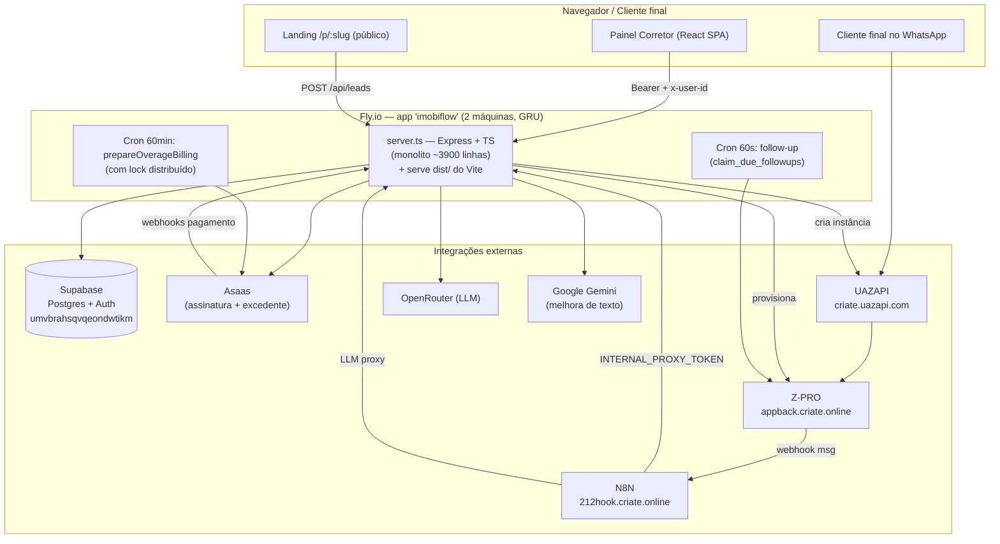
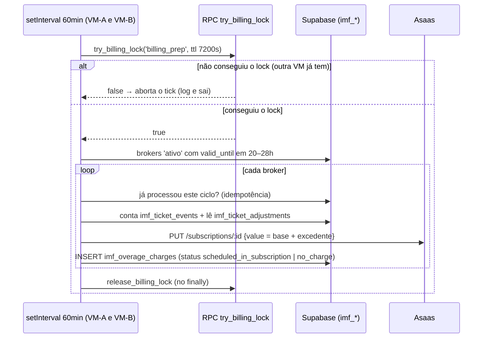
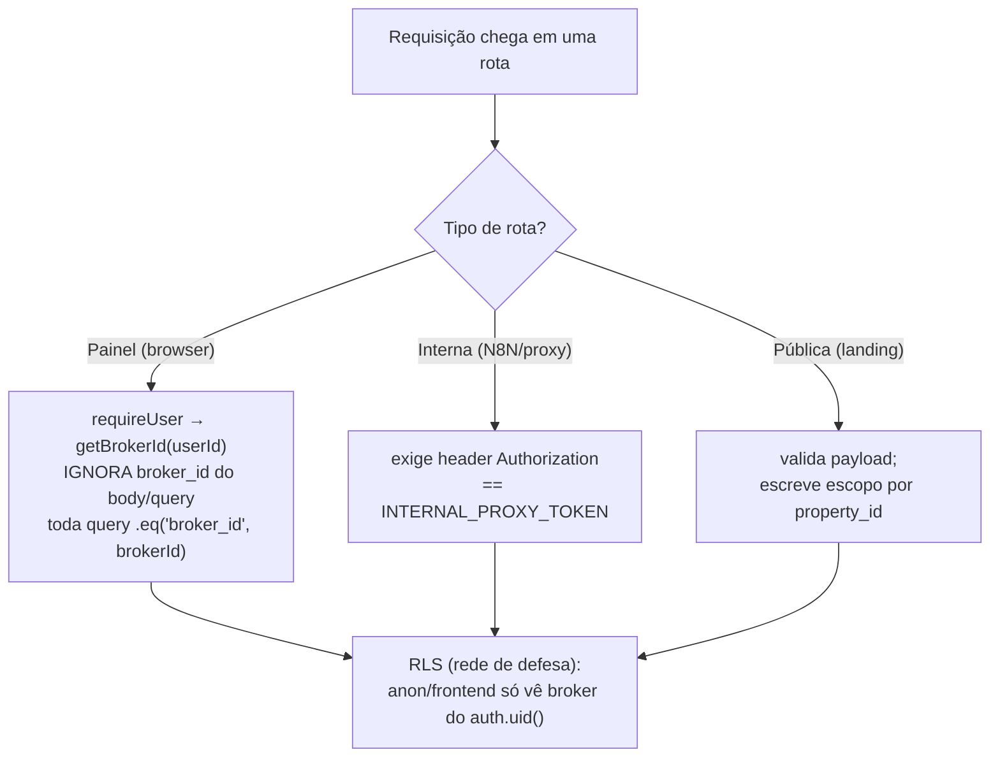
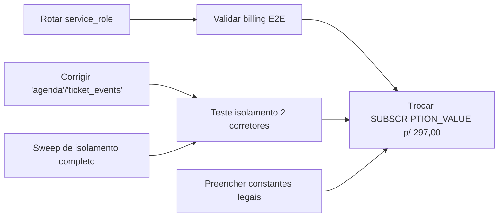

# ImobiFlow — Documentação do Projeto

> Documento de referência técnica e operacional. Cobre arquitetura, fluxo
> ponta a ponta, modelo de dados, endpoints, integrações e pontos pendentes.
> **Não contém valores de segredos** — apenas os nomes das variáveis (os
> valores ficam no `.env` local, nos *secrets* da Fly e nas notas de memória).

Última atualização: 2026-07-01. **Comece pela §14** (estado consolidado e
continuidade) — ela é a fonte de verdade atual e supersede as §4 e §13.

---

## 1. Visão geral

ImobiFlow é um **SaaS multitenant** para corretores de imóveis. A esteira é
automática: o corretor paga no **Asaas** → o sistema provisiona automaticamente
um atendimento WhatsApp isolado no **Z-PRO** (fork do Whaticket) usando a
**UAZAPI** como provedor de WhatsApp → um agente de IA (no **N8N**) responde os
clientes finais consultando os imóveis cadastrados.

Divisão de responsabilidades dos painéis:
- **ImobiFlow** (este projeto): cadastro/landing de **imóveis**, leads, agenda,
  configuração do agente de IA, pagamento e o motor de provisionamento.
- **Z-PRO** (`app.criate.online`): o corretor **lê o QR Code** e opera o
  atendimento WhatsApp (inbox, tickets).

---

## 2. Stack e infraestrutura

| Camada | Tecnologia |
|--------|-----------|
| Backend | Node + Express + TypeScript, rodado com `tsx server.ts` (porta 3000) |
| Frontend | Vite + React 19 + React Router 7 + Tailwind 4 (`motion`, `recharts`, `lucide-react`) |
| Banco / Auth | **Supabase** (project_id `umvbrahsqvqeondwtikm`) |
| Deploy | **Fly.io** — app `imobiflow` (`imobiflow.fly.dev`) |
| Pagamentos | **Asaas** (assinatura recorrente mensal via cartão) |
| WhatsApp | **Z-PRO** (`appback.criate.online` = API, `app.criate.online` = painel) sobre **UAZAPI** (`criate.uazapi.com`) |
| Automação IA | **N8N** (`212hook.criate.online`) |
| LLM | **OpenRouter** (chave por corretor, com fallback da empresa) |
| Texto auxiliar | **Google Gemini** (melhorar descrições de imóveis) |

### Como rodar / deployar
```bash
# Local (a partir de C:\Users\Criate\imob.criate)
npm run dev        # tsx --max-old-space-size=1024 server.ts  (porta 3000)
npm run build      # vite build → dist/
npm run lint       # tsc --noEmit (typecheck)

# Produção
fly deploy         # PowerShell, a partir da pasta do projeto
```
> Em prod o Express serve `dist/`. O flag `--max-old-space-size=1024` evita OOM
> (uploads em base64). O `.env` **local não tem** `ZPRO_JWT_SECRET` (só Fly).

---

## 3. Estrutura de arquivos

```
imob.criate/
├── server.ts                 # TODO o backend (Express): ~2790 linhas, 1 arquivo
├── index.html                # entrypoint Vite
├── vite.config.ts
├── Dockerfile / fly.toml      # build e deploy Fly
├── .env / .env.example        # variáveis de ambiente
├── HANDOFF.md                 # histórico de handoff entre sessões
├── README.md                  # leia-me geral
├── DOCUMENTACAO.md            # este arquivo
└── src/
    ├── App.tsx                # rotas (React Router)
    ├── main.tsx / index.css
    ├── lib/        supabase.ts, utils.ts
    ├── services/   auth.ts (token/headers), gemini.ts
    ├── components/ PropertyForm, AISettings, CorretoraSettings, MagicWandTextarea
    └── pages/      Dashboard, PropertyLanding, Login, Signup,
                    PaymentPending, PaymentSuccess, ForgotPassword,
                    ResetPassword, Termos, Privacidade, Admin
```

---

## 4. Modelo de dados (Supabase)

Tabelas usadas hoje pelo ImobiFlow estão abaixo. O projeto Supabase é
compartilhado com outros sistemas — tabelas `autoescola*`, `cfc*`, de clínicas
etc. **não** fazem parte deste projeto. Já a camada `ia_*` (`ia_tenants`,
`ia_clients`, `ia_chat_histories`, `ia_tenant_handoff_routes` etc.) **pertence
ao ImobiFlow e está em desenvolvimento** (features novas — ver §11).

### `brokers` — corretor / tenant (núcleo)
Identidade: `id` (uuid), `user_id` (Supabase Auth), `name`, `email`, `phone`, `is_admin`, `corretora_id`.
Plano/assinatura: `status` (`pendente`/`ativo`/`inativo`/`bloqueado`), `plan`, `valid_until`, `grace_until`, `asaas_customer_id`, `asaas_subscription_id`.
Provisionamento Z-PRO: `provisioning_status` (`pending`→`tenant_created`→`session_created`→`api_created`→`completed`, ou `processing`/`failed`/`disabled`), `provisioning_error`, `provisioning_completed_at`.
Credenciais Z-PRO: `zpro_tenant_id`, `zpro_channel_id`, `zpro_channel_name`, `zpro_user_email`, `zpro_username`, `zpro_password`, `zpro_qr_code`.
**API externa Z-PRO (convenção — ver §6):** `zpro_api_key` = **UUID** da api-config · `zpro_api_token` = **plainToken** (Bearer) · `zpro_api_url` = URL completa `…/v2/api/external/{UUID}`.
IA / config: `ai_name`, `broker_address`, `openrouter_api_key_enc` (chave OpenRouter criptografada AES-256).
Recuperação de senha: `reset_token`, `reset_token_expires_at`.

### `properties` — imóveis
`id`, `title`, `price`, `location`, `description`, `image_url` (JSON de URLs), `slug`, `link` (landing `/p/:slug`), `status`, `broker_id`, `created_at`, `updated_at`.

### `leads`
`id`, `property_id`, `name`, `phone`, `email`, `status`, `notes`, `broker_id`, `created_at`.

### `agenda` — visitas
`id`, `broker_id`, `lead_id`, `property_id`, `title`, `scheduled_at`, `status`, dados do cliente.

### `subscriptions` — histórico de pagamento
`id`, `broker_id`, `asaas_payment_id`, `asaas_customer_id`, `plan`, `amount` (centavos), `currency`, `status`, `paid_at`, `valid_until`.

### `corretoras` — imobiliária (nível acima do corretor)
`id`, `razao_social`, `cnpj`, `creci`, `owner_broker_id`. Vincula-se a `brokers.corretora_id`.

### `webhook_logs` — auditoria
`id`, `source` (`asaas`/`zpro`/`provisioning_webhook`), `event_type`, `payload` (jsonb), `status`, `broker_id`, `created_at`.

### `followup_config` — config do Follow-Up IA (1 por corretor)
`id`, `broker_id` (único), `enabled` (toggle), `delay_minutes_1` (default 1440 = 24h), `delay_minutes_2` (default 4320 = 3 dias), `delay_minutes_3` (default 10080 = 7 dias), `message_1/2/3`, timestamps.
Cada timer é independente: F1 conta a partir de `last_customer_message_at`; F2/F3 contam a partir de `follow_sent_at` do follow anterior.

### `followup_conversations` — estado do follow por conversa (corretor × cliente)
`id`, `broker_id`, `customer_phone`, `last_customer_message_at`, `follow_sent`, `follow_sent_at`, `follow_message_index` (0..3), `ai_active` (`false` = handover humano), `human_takeover_at`, **único(broker_id, customer_phone)**.
Função SQL `claim_due_followups()`: claim atômico (multi-máquina safe) — seleciona + marca + avança o índice numa única instrução.

---

## 5. Fluxo operacional completo

### 5.1 PROVISIONAMENTO (onboarding do corretor)
1. **Cadastro** — `Signup.tsx` → `POST /api/auth/signup`: cria user no Supabase Auth (já confirmado) + linha em `brokers` (`status: pendente`).
2. **Pagamento** — `PaymentPending.tsx` → `POST /api/checkout`: cria *customer* + **subscription mensal recorrente** (cartão) no Asaas; valida a 1ª cobrança (`CONFIRMED`/`RECEIVED`).
3. **Confirmação** — dois caminhos: (a) síncrono no próprio checkout; (b) assíncrono via `POST /api/webhooks/asaas` (`PAYMENT_RECEIVED`/`PAYMENT_CONFIRMED`). Ambos chamam `handleAsaasPaymentReceived`.
4. **Trava + disparo** — `handleAsaasPaymentReceived` ativa o corretor (`status: ativo`, `valid_until` +1 mês), registra `subscriptions`, e aplica **trava atômica** (`provisioning_status = processing`, condicional) para evitar provisionamento duplicado em webhooks repetidos → chama `createZproTenantAndChannel`.
5. **Esteira Z-PRO/UAZAPI** (`createZproTenantAndChannel`), 8 passos:
   1. `POST /tenants` (super admin) → tenant isolado (já com `uazapiHost`+`uazapiToken`).
   2. `POST /userTenants` → usuário admin do tenant (`status: active`, `restrictedUser: false`).
   3. `POST /auth/login` → token do tenant (fallback: `forgeTenantJwt`).
   4. `POST /whatsappTenants` → canal WhatsApp (`type: uazapi`, `DISCONNECTED`).
   5. **UAZAPI** `createUazapiInstanceForChannel`: `POST /instance/create` → grava `tokenAPI` e **`wabaId`** (= "Number ID / Instance ID") no canal, e configura o webhook UAZAPI→Z-PRO.
   6. `POST /api-config` → cria API externa; salva `zpro_api_key`(UUID), `zpro_api_token`(plainToken), `zpro_api_url`.
   7. Ativa Bots IA (`PUT /settings/n8n` + `/settings/n8nAllTickets`) e seta `n8nUrl` no canal (`PUT /whatsapp/:id`).
   8. `provisioning_status = completed` + `fireProvisioningWebhook`.
6. **Entrega de credenciais** — `fireProvisioningWebhook` → **PROVISIONING_WEBHOOK_URL** (N8N) com login/senha/URL/token → N8N entrega ao corretor.

### 5.2 ATIVAÇÃO (conectar o WhatsApp) — **no painel Z-PRO**
7. Corretor loga no **Z-PRO** (`app.criate.online`) com as credenciais recebidas.
8. Lê o **QR Code** no Z-PRO e escaneia no celular.
9. UAZAPI emite evento `connection` → webhook `…/uazapi-webhook/{instanceId}` → **Z-PRO casa o evento pelo `wabaId`** → canal vira `CONNECTED`/`plugged`.
   > **Descoberta crítica:** sem `wabaId` correto no canal, o Z-PRO ignora os eventos da UAZAPI e o canal nunca ativa ("Não ativado"). O webhook precisa existir **antes** de conectar.

### 5.3 OPERAÇÃO (atendimento automático)
10. Cliente final manda mensagem → UAZAPI → webhook → Z-PRO cria ticket → chama **N8N_WEBHOOK_URL** (`n8nUrl` do canal).
11. N8N: **Normalizar Dados** → **Buscar Corretor** (`brokers` por telefone, limpando o sufixo `:xxxx` da UAZAPI) → **Buscar Imóveis** (`properties` por `broker_id`).
12. Agente IA chama o **LLM Proxy** `POST /api/proxy/llm/:brokerPhone/*` → encaminha para OpenRouter usando a chave do corretor (ou fallback da empresa).
13. **Enviar Resposta** → `POST {zpro_api_url}` (URL **base**, sem sufixo) com header `Authorization: Token {zpro_api_token}` e body `{ body, number, externalKey, isClosed:false }`. Multitenant: cada corretor traz a própria URL/token via "Buscar Corretor". *(Formato confirmado no fluxo N8N real — não é `Bearer`/`/messages/send-text`.)*

### 5.4 CONTEÚDO (corretor cadastra imóveis) — **no painel ImobiFlow**
- `Dashboard.tsx` → `PropertyForm.tsx` → `POST /api/properties`: gera `slug` + **landing page** `/p/:slug`, salva imagens, vincula `broker_id`.
- Landing pública `PropertyLanding.tsx` (`/p/:slug`) → visitante preenche → `POST /api/leads` (opcional dispara `CHATBOT_WEBHOOK_URL`).
- Apoio: `POST /api/properties/upload-image`, `POST /api/brokers/upload-photo`, `POST /api/ai/enhance-text` (Gemini — "varinha mágica").

### 5.5 CICLO DE VIDA da assinatura (`POST /api/webhooks/asaas`)
- `PAYMENT_RECEIVED`/`PAYMENT_CONFIRMED` → renova `valid_until` (cobrança mensal recorrente).
- `PAYMENT_OVERDUE` → concede **grace de 3 dias** (`grace_until`); suspensão é *lazy* em `GET /api/subscription`.
- `PAYMENT_DELETED` → `status: inativo`.
- `SUBSCRIPTION_DELETED`/`INACTIVATED`/`CANCELED` → `status: inativo` + `provisioning_status: disabled`.

### 5.6 FOLLOW-UP IA (reativação de lead + handover humano) — VALIDADO EM PRODUÇÃO
Camada **isolada** (não altera o fluxo acima). Config por corretor na aba **Configurações** (`FollowUpSettings.tsx`).

**Regras:**
- Máximo 3 follows por ticket. `follow_message_index` vai de 0→1→2→3 e para.
- Index **nunca reseta** quando cliente responde — só reseta em `isNewTicket` (ticket_id diferente).
- **Timers independentes por follow:**
  - F1: conta a partir de `last_customer_message_at + delay_minutes_1` (padrão 1440 min = 24h)
  - F2: conta a partir de `follow_sent_at + delay_minutes_2` (padrão 4320 min = 3 dias)
  - F3: conta a partir de `follow_sent_at + delay_minutes_3` (padrão 10080 min = 7 dias)
- Auto-progressão: após F1 enviado, `follow_sent=false` é resetado; F2 dispara automaticamente no próximo tick após `follow_sent_at + delay_minutes_2`; idem F3.
- Mensagens vazias são puladas (sem loop infinito).
- **Handover humano:** corretor responde manualmente → `human_takeover_at` setado → `ai_active=false` → agente N8N interrompido e follow-ups pausados naquela conversa.

**Peças:**
1. **N8N → ImobiFlow:** o fluxo do agente chama `POST /api/followup/inbound` (registra a msg do cliente + retorna `respond`; se `false`, o agente para). Corretor manual → `POST /api/followup/broker-reply`.
2. **Marcador ZWSP (`​`):** agente e follow-up incluem um *zero-width space* (invisível) nas mensagens do **sistema**. O nó de handover só dispara quando a msg `fromMe` **não** tem o marcador (= corretor digitou manual) — resolve "agente vs corretor" sem depender de `wasSentByApi`.
3. **Motor (cron 60s):** `claim_due_followups()` faz claim atômico (multi-máquina safe na Fly) e envia via API externa Z-PRO (mesmo formato do agente — ver §6). Falha de envio → reverte o claim p/ retry no próximo tick.

---

## 6. Convenção dos campos da API externa Z-PRO (importante)

Cada corretor tem **uma** "api-config" no Z-PRO, vinculada ao canal, que expõe a
API externa em `…/v2/api/external/{UUID}`. **Envio de mensagem** usa header `Authorization: Token {plainToken}` (formato do agente N8N — confirmado em produção); endpoints de leitura (ex.: `showChannelById`) também aceitam `Bearer`.

| Campo Supabase | Conteúdo | Usado em |
|----------------|----------|----------|
| `zpro_api_key` | **UUID** da api-config | montar a URL externa |
| `zpro_api_token` | **plainToken** | header `Token {plainToken}` no envio (agente N8N + cron follow-up) |
| `zpro_api_url` | URL completa `…/external/{UUID}` | base das chamadas |

> O `plainToken` só é exibido **uma vez** na criação. Para reparar um corretor,
> recria-se a api-config logando como o tenant (não via super admin, senão cria
> uma config solta sem vínculo ao canal).

---

## 7. Integrações externas

| Integração | Uso | Auth |
|-----------|-----|------|
| **Asaas** | customer + subscription mensal; webhooks de pagamento | `ASAAS_API_KEY` |
| **Z-PRO** (admin) | criar tenant/user/canal/api-config; PUT canal | `ZPRO_ADMIN_TOKEN` (super admin) ou token de login do tenant; fallback `forgeTenantJwt` com `ZPRO_JWT_SECRET` |
| **Z-PRO** (externa) | enviar mensagem do corretor / follow-up | `zpro_api_token` (header `Token`) |
| **UAZAPI** | criar instância, configurar webhook | header `admintoken`/`token` = `UAZAPI_TOKEN` |
| **N8N** | provisioning webhook + processamento de mensagem + LLM proxy | `INTERNAL_PROXY_TOKEN` (N8N→servidor) |
| **OpenRouter** | LLM do agente | chave do corretor (`openrouter_api_key_enc`) ou `OPENROUTER_API_KEY` |
| **Gemini** | melhorar texto de imóveis | `GEMINI_API_KEY` |

### Os 3 webhooks (não confundir)
1. **PROVISIONING_WEBHOOK_URL** — entrega credenciais ao corretor (pós-provisionamento).
2. **N8N_WEBHOOK_URL** — recebe mensagens dos clientes finais (setado como `n8nUrl` no canal).
3. **CHATBOT_WEBHOOK_URL** *(opcional)* — dispara lead capturado na landing page.

Há ainda o webhook **UAZAPI→Z-PRO** (`…/uazapi-webhook/{instanceId}`), interno à camada WhatsApp.

---

## 8. Referência de endpoints (backend — `server.ts`)

**Auth** *(rate-limited: 10 req/15min por IP)*: `POST /api/auth/signup` · `/login` · `/forgot-password` · `/reset-password`
**Corretor:** `GET /api/brokers/me` · `POST /api/brokers/settings` · `POST|DELETE /api/brokers/openrouter-key` · `POST /api/brokers/upload-photo`
**Corretora:** `GET|POST /api/corretora` · `GET /api/corretora/brokers`
**Imóveis:** `GET|POST /api/properties` · `GET /api/properties/health` · `GET /api/properties/:slug` · `DELETE /api/properties/:id` · `PATCH /api/properties/:id/status` · `POST /api/properties/upload-image`
**Leads:** `POST|GET /api/leads` · `GET /api/leads/recent` · `PATCH /api/leads/:id/status`
**Agenda:** `GET /api/agenda` · `GET /api/agenda/visits`
**Dashboard:** `GET /api/dashboard/metrics` · `GET /api/dashboard/charts`
**IA:** `POST /api/ai/enhance-text` (Gemini)
**Pagamento** *(`/api/checkout` rate-limited: 5 req/1h; `/api/webhooks/asaas` rate-limited: 120 req/1min)*: `GET /api/config/plan` · `POST /api/checkout` · `GET /api/subscription` · `POST /api/webhooks/asaas` · `POST /api/webhooks/asaas/test` *(bloqueado em produção)*
**WhatsApp:** `POST /api/whatsapp/send` *(N8N, auth `INTERNAL_PROXY_TOKEN`)*
**Follow-Up IA:** `GET|POST /api/followup/config` *(corretor)* · `POST /api/followup/inbound` *(N8N: msg do cliente + gate `respond`)* · `POST /api/followup/broker-reply` *(N8N: handover humano)* — N8N usa `INTERNAL_PROXY_TOKEN`; um cron interno (60s) dispara os follows
**Admin** *(exige `requireAdmin` via header `x-user-id` de um broker `is_admin`)*: `GET /api/admin/brokers` · `GET /api/admin/metrics` · `PATCH /api/admin/brokers/:id/status` · `GET /api/admin/brokers/:id` · `POST /api/admin/brokers/:id/provision` · `PATCH /api/admin/brokers/:id/zpro-credentials` · `POST /api/admin/brokers/:id/cancel-plan` · `DELETE /api/admin/brokers/:id` · `POST /api/admin/brokers/:id/relink-uazapi`
**Proxy LLM:** `ALL /api/proxy/llm/:brokerPhone/*`

Autenticação geral: o frontend envia `Authorization: Bearer <supabase_token>` + `x-user-id: <user.id>` (ver `src/services/auth.ts`).

---

## 9. Frontend — rotas (`src/App.tsx`)

| Rota | Página | Acesso |
|------|--------|--------|
| `/login`, `/signup` | Login, Signup | público |
| `/forgot-password`, `/reset-password` | recuperação de senha | público |
| `/termos`, `/privacidade` | textos legais | público |
| `/p/:slug` | **PropertyLanding** (landing do imóvel) | público |
| `/payment`, `/payment/success`, `/payment/cancelled` | fluxo de pagamento | logado |
| `/admin` | **Admin** | logado (`is_admin`) |
| `/` | **Dashboard** | logado **+ assinatura ativa** (`PrivateRoute` checa `GET /api/subscription`; `pendente` → `/payment`) |

Dashboard concentra as abas: imóveis (`PropertyForm`), leads, agenda, configurações de IA (`AISettings`) + **Follow-Up Inteligente** (`FollowUpSettings`), corretora (`CorretoraSettings`).

---

## 10. Variáveis de ambiente (nomes — valores no `.env`/Fly)

`SUPABASE_URL`/`VITE_SUPABASE_URL`, `SUPABASE_SERVICE_ROLE_KEY`/`VITE_SUPABASE_SERVICE_ROLE_KEY`, `VITE_SUPABASE_ANON_KEY` ·
`APP_URL` · `GEMINI_API_KEY` ·
`ASAAS_API_KEY`, `ASAAS_ENV`, `SUBSCRIPTION_VALUE` ·
`UAZAPI_TOKEN`, `UAZAPI_HOST`, `UAZAPI_PLATFORM_SESSION` ·
`ZPRO_ADMIN_URL`, `ZPRO_ADMIN_TOKEN`, `ZPRO_API_SECRET`, `ZPRO_JWT_SECRET` ·
`PROVISIONING_WEBHOOK_URL`, `N8N_WEBHOOK_URL`, `CHATBOT_WEBHOOK_URL` ·
`INTERNAL_PROXY_TOKEN`, `LLM_PROXY_ENC_KEY`, `OPENROUTER_API_KEY`.

> O servidor **recusa subir** sem `SUPABASE_SERVICE_ROLE_KEY`.

---

## 11. Pontos de atenção / roadmap

### ✅ Concluído (2026-05-27)
- **Rebranding "Criate":** title, favicon, header desktop, sidebar mobile, nav da landing.
- **Follow-Up Inteligente:** 3 timers independentes, auto-progressão, skip mensagens vazias — validado em produção.
- **Rate limiting:** `express-rate-limit` nos endpoints de auth, checkout e webhook Asaas.
- **Termos de Uso e Política de Privacidade:** 20 cláusulas cada, cobrindo LGPD, Marco Civil, Lei do Software, CDC, Decreto 7.962/2013.
- **Limpeza do histórico git:** service_role key do Supabase expurgada de todos os commits com `git-filter-repo`.
- **Tenant 209 (David):** validado.

### ⚠️ Urgente / bloqueante comercial
- **Rotacionar service_role key do Supabase** (chave antiga ficou no histórico git — ver HANDOFF.md §7).
- **Páginas legais:** preencher constantes de empresa (`RAZAO_SOCIAL`, `CNPJ`, `ENDERECO`, `EMAIL_CONTATO`, `EMAIL_DPO`) no topo de `Termos.tsx` e `Privacidade.tsx`.

### 🟡 Pendente / roadmap
1. **N8N — sub-workflow "Deletar Agendamento":** campo `id visita` vazio; URL correta: `$json.url/scheduleReminder/delete/$json['id visita']`; nó "When Executed by Another Workflow" precisa de `$fromAI()` no campo; body `{}`.
2. **Email real de notificação de lead:** atualmente `console.log('[E-MAIL SIMULADO]')` em `server.ts` — implementar com Resend, SendGrid ou Nodemailer.
3. **Agente IA "Juliana":** colar conteúdo de `agent_system_message.txt` no nó "Agente IA Corretor" do N8N.
4. **GitHub Actions CI/CD:** `fly deploy` automático no push para `main` (`FLY_API_TOKEN` como secret).
5. **Rate limiting distribuído (Redis):** hoje cada máquina Fly tem contador independente — para multi-máquina correta, usar Redis (ex.: `rate-limit-redis`).
6. **Verificar ticket aberto antes de follow:** idealmente consultar Z-PRO API para não disparar follow em ticket já encerrado.
7. **Sentry / error tracking:** vários `catch` silenciosos em `server.ts`.
8. **Bug pré-existente:** `src/pages/ResetPassword.tsx:94` referencia `accessToken` inexistente (erro de typecheck, não afeta runtime).
9. **`UAZAPI_PLATFORM_SESSION`:** placeholder no `.env` local — recuperação de senha por WhatsApp só funciona se configurado na Fly.
10. **Lead/visita via WhatsApp:** hoje só a landing grava `leads`; gravar a partir da conversa do agente está no roadmap.
11. **`POST /api/whatsapp/send`:** caminho alternativo de envio (autenticado por `INTERNAL_PROXY_TOKEN`), não usado pelo fluxo N8N atual — candidato a consolidação futura.

---

## 12. Limpeza realizada (código morto removido em 2026-05-22)

Removido por estar **comprovadamente órfão** (sem referências; typecheck
confirmou que nada quebrou). Nenhuma lógica viva foi alterada:

| Item | Motivo |
|------|--------|
| `src/pages/WhatsAppSetup.tsx` | Página não roteada (não importada no `App.tsx`); leitura de QR migrou para o Z-PRO |
| `GET /api/whatsapp/status` (em `server.ts`) | Único consumidor era a página acima |
| `check.ts`, `check_env.ts`, `check_schema.ts` | Scripts de diagnóstico soltos (2 com service-role key hardcoded; um inseria dado de teste) |

---

## 13. Billing de excedente de atendimentos (implementado em 2026-06-11)

### Modelo de cobrança

| Parâmetro | Valor padrão | Env var para alterar |
|-----------|-------------|---------------------|
| Plano mensal |  (R$ 5,00 durante validação; futuro R$ 297,00) | Updating existing machines in 'imobiflow' with rolling strategy
> [1/2] Updating 7814053f9e2078 [app]
> [1/2] Updating 7814053f9e2078 [app]
> [1/2] Waiting for 7814053f9e2078 [app] to have state: started
> [1/2] Machine 7814053f9e2078 [app] has state: started
> [1/2] Checking that 7814053f9e2078 [app] is up and running
> [1/2] Waiting for 7814053f9e2078 [app] to become healthy: 1/1

✔ [1/2] Machine 7814053f9e2078 [app] update succeeded
> [2/2] Updating 7840637a265778 [app]
> [2/2] Updating 7840637a265778 [app]
> [2/2] Waiting for 7840637a265778 [app] to have state: started
> [2/2] Machine 7840637a265778 [app] has state: started
> [2/2] Checking that 7840637a265778 [app] is up and running
> [2/2] Waiting for 7840637a265778 [app] to become healthy: 1/1

✔ [2/2] Machine 7840637a265778 [app] update succeeded |
| Atendimentos inclusos/ciclo | 100 | Updating existing machines in 'imobiflow' with rolling strategy
> [1/2] Updating 7814053f9e2078 [app]
> [1/2] Updating 7814053f9e2078 [app]
> [1/2] Waiting for 7814053f9e2078 [app] to have state: started
> [1/2] Machine 7814053f9e2078 [app] has state: started
> [1/2] Checking that 7814053f9e2078 [app] is up and running
> [1/2] Waiting for 7814053f9e2078 [app] to become healthy: 1/1

✔ [1/2] Machine 7814053f9e2078 [app] update succeeded
> [2/2] Updating 7840637a265778 [app]
> [2/2] Updating 7840637a265778 [app]
> [2/2] Waiting for 7840637a265778 [app] to have state: started
> [2/2] Machine 7840637a265778 [app] has state: started
> [2/2] Checking that 7840637a265778 [app] is up and running
> [2/2] Waiting for 7840637a265778 [app] to become healthy: 1/1

✔ [2/2] Machine 7840637a265778 [app] update succeeded |
| Preço por atendimento excedente | R$ 2,00 | Updating existing machines in 'imobiflow' with rolling strategy
> [1/2] Updating 7814053f9e2078 [app]
> [1/2] Updating 7814053f9e2078 [app]
> [1/2] Waiting for 7814053f9e2078 [app] to have state: started
> [1/2] Machine 7814053f9e2078 [app] has state: started
> [1/2] Checking that 7814053f9e2078 [app] is up and running
> [1/2] Waiting for 7814053f9e2078 [app] to become healthy: 1/1

✔ [1/2] Machine 7814053f9e2078 [app] update succeeded
> [2/2] Updating 7840637a265778 [app]
> [2/2] Updating 7840637a265778 [app]
> [2/2] Waiting for 7840637a265778 [app] to have state: started
> [2/2] Machine 7840637a265778 [app] has state: started
> [2/2] Checking that 7840637a265778 [app] is up and running
> [2/2] Waiting for 7840637a265778 [app] to become healthy: 1/1

✔ [2/2] Machine 7840637a265778 [app] update succeeded |

**Exemplo:** corretor com 250 atendimentos no ciclo → 150 excedentes → R$ 300,00 cobrado automaticamente no cartão.

---

### O que conta como atendimento

Um **ticket novo no Z-PRO** = 1 atendimento. A contagem é feita pela chave composta :
- Primeira mensagem de um lead novo → ticket A → conta 1
- Segunda mensagem do mesmo lead no mesmo ticket → mesmo ticket A → **não conta** (idempotente via UNIQUE INDEX)
- Lead retorna após meses, Z-PRO cria ticket B → conta +1

A contabilização ocorre no endpoint  (disparado pelo N8N a cada mensagem recebida).

---

### Tabelas envolvidas

#### 
Registra cada atendimento único por broker.

| Coluna | Tipo | Descrição |
|--------|------|-----------|
| uid=197609(Criate) gid=197121 groups=197121 | UUID PK | — |
|  | UUID FK brokers | Corretor dono do atendimento |
|  | TEXT | ID do ticket no Z-PRO |
|  | TEXT | Telefone normalizado do lead |
|  | TIMESTAMPTZ | Momento do primeiro contato deste ticket |

Índice único:  → garante que o mesmo ticket só conta uma vez.

#### 
Registra cada ciclo processado (com ou sem excedente).

| Coluna | Tipo | Descrição |
|--------|------|-----------|
| uid=197609(Criate) gid=197121 groups=197121 | UUID PK | — |
|  | UUID FK brokers | — |
|  | TIMESTAMPTZ | Início do ciclo () |
|  | TIMESTAMPTZ | Fim do ciclo ( anterior) |
|  | INT | Total de tickets no ciclo |
|  | INT | Limite do plano (padrão 100) |
|  | INT | Tickets acima do limite |
|  | NUMERIC | Preço unitário aplicado |
|  | INT | Valor cobrado em centavos |
|  | TEXT |  /  /  /  /  |
|  | TEXT | ID do payment no Asaas (quando ) |
|  | TEXT | Mensagem de erro (quando ) |
|  | TIMESTAMPTZ | Quando a cobrança foi confirmada |

####  — nova coluna
| Coluna | Tipo | Descrição |
|--------|------|-----------|
|  | TEXT | Token do cartão retornado pelo Asaas na criação da subscription. Permite cobranças avulsas futuras sem pedir o cartão novamente. |

---

### Fluxo de cobrança de excedente


**Tolerância de atraso:** o webhook do Asaas pode chegar com até 7 dias de atraso;  só processa se .

**Falha não-bloqueante:** se a cobrança de excedente falhar (cartão recusado, timeout), o registro fica  no banco, mas a renovação da assinatura principal **não é afetada**. Revisão manual via tabela .

---

### Endpoint para o corretor

 — autenticado com 

Retorna:


---

### Variáveis de ambiente relevantes

| Variável | Descrição |
|----------|-----------|
|  | Valor mensal do plano (R$ — padrão 49.90, validação 5.00, futuro 297.00) |
|  | Atendimentos inclusos no plano (padrão 100) |
|  | Preço por atendimento excedente em R$ (padrão 2.00) |
|  | Chave da API Asaas — necessária para criar payments de excedente |
|  |  = api.asaas.com; qualquer outro = sandbox |

Para alterar limites sem redeploy:
Updating existing machines in 'imobiflow' with rolling strategy
> [1/2] Updating 7814053f9e2078 [app]
> [1/2] Updating 7814053f9e2078 [app]
> [1/2] Waiting for 7814053f9e2078 [app] to have state: started
> [1/2] Machine 7814053f9e2078 [app] has state: started
> [1/2] Checking that 7814053f9e2078 [app] is up and running
> [1/2] Waiting for 7814053f9e2078 [app] to become healthy: 1/1

✔ [1/2] Machine 7814053f9e2078 [app] update succeeded
> [2/2] Updating 7840637a265778 [app]
> [2/2] Updating 7840637a265778 [app]
> [2/2] Waiting for 7840637a265778 [app] to have state: started
> [2/2] Machine 7840637a265778 [app] has state: started
> [2/2] Checking that 7840637a265778 [app] is up and running
> [2/2] Waiting for 7840637a265778 [app] to become healthy: 1/1

✔ [2/2] Machine 7840637a265778 [app] update succeeded


---

# 14. Estado Consolidado e Continuidade (atualizado 2026-07-01)

> **Leia esta seção primeiro se você é novo no projeto.** Ela é auto-contida e
> reflete o estado **real e verificado** do código em produção nesta data.
> Onde houver divergência com seções anteriores (§4 e §13), **esta seção
> prevalece** — as seções 1–13 foram escritas antes de duas mudanças grandes:
> (a) o *rename* das tabelas para o prefixo `imf_` (commit `c11caa4`) e
> (b) a migração do modelo de cobrança de excedente para "valor da assinatura
> ajustado antes da renovação". A §13 do documento, além disso, está
> **corrompida** (saída de `fly deploy` foi colada dentro das células das
> tabelas) — ignore-a e use a §14.5 abaixo.

---

## 14.1. Objetivo geral do projeto

**ImobiFlow** (marca comercial **Criate**) é um **SaaS B2B multitenant** para
corretores de imóveis brasileiros. A proposta de valor é uma **esteira 100%
automática**: o corretor assina o plano, paga pelo **Asaas**, e o sistema
**provisiona sozinho** um atendimento de WhatsApp isolado (número, sessão,
canal e um agente de IA) sem intervenção humana. A partir daí, um **agente de
IA no N8N** atende os clientes finais do corretor 24/7, respondendo com base
nos **imóveis que o corretor cadastrou** no painel e reativando leads silenciosos
via **follow-up automático**.

Em uma frase: **"pague e, minutos depois, tenha um vendedor de imóveis por IA
no seu WhatsApp, alimentado pelo seu próprio catálogo."**

Divisão de painéis (importante não confundir):
- **ImobiFlow / Criate** (este repositório, `imobiflow.fly.dev`): cadastro de
  imóveis, landing pages, leads, agenda, configuração do agente de IA,
  pagamento, billing de excedente e o **motor de provisionamento**.
- **Z-PRO** (`app.criate.online`): onde o corretor **lê o QR Code** e opera a
  caixa de entrada do WhatsApp (inbox/tickets). É um produto de terceiros
  (fork do Whaticket) que orquestramos via API.

---

## 14.2. Arquitetura atual

### Visão de componentes



### Características arquiteturais-chave

- **Monólito intencional.** Todo o backend vive em um único arquivo
  `server.ts` (~3900 linhas). Isso é uma **decisão deliberada** (ver §14.8),
  não dívida acidental. Não fragmente sem necessidade real.
- **Multitenant por `broker_id`.** Cada corretor é um *tenant*. O isolamento
  é **100% responsabilidade do código de aplicação**, porque o backend usa a
  `service_role` do Supabase, que **ignora RLS** (ver §14.5.2 e §14.9).
- **Stateless + 2 máquinas.** O Fly roda 2 VMs com `auto_start_machines`.
  Qualquer job agendado (`setInterval`) roda **nas duas** — daí a necessidade
  de **locks/claims atômicos no Postgres** para tudo que não pode duplicar.
- **Frontend só fala com o backend.** O SPA nunca consulta o Supabase
  diretamente (o cliente `anon` em `src/lib/supabase.ts` é exportado mas
  **nenhum** `.from()`/`.rpc()` o usa). Isso torna seguro habilitar RLS sem
  quebrar a UI.

---

## 14.3. Tecnologias utilizadas

| Camada | Tecnologia | Observação |
|--------|-----------|-----------|
| Backend | Node + Express + TypeScript, via `tsx server.ts` (porta 3000) | `--max-old-space-size=1024` evita OOM em uploads base64 |
| Frontend | Vite + React 19 + React Router 7 + Tailwind 4 | Design system "Liquid Glass" (`motion`, `recharts`, `lucide-react`) |
| Banco/Auth | Supabase (`umvbrahsqvqeondwtikm`) — Postgres + Auth | Instância **compartilhada** com outros projetos (ver §14.5) |
| Deploy | Fly.io — app `imobiflow` (`imobiflow.fly.dev`), 2 máquinas GRU | CI/CD: GitHub Actions faz `fly deploy` no push para `main` |
| Pagamentos | Asaas — assinatura mensal recorrente + cobrança de excedente | `ASAAS_ENV=production` → `api.asaas.com`; senão sandbox |
| WhatsApp | Z-PRO (fork Whaticket) sobre UAZAPI | Z-PRO orquestra; UAZAPI é o provedor real do número |
| Automação IA | N8N (`212hook.criate.online`) | Fluxo do agente + provisioning webhook |
| LLM | OpenRouter | Chave por corretor (fallback da empresa) via proxy |
| Texto auxiliar | Google Gemini | "Varinha mágica" para melhorar descrições de imóveis |

Rodar / deployar:
```bash
# Local (em C:\Users\Criate\imob.criate)
npm run dev     # tsx --max-old-space-size=1024 server.ts (porta 3000)
npm run build   # vite build → dist/
npm run lint    # tsc --noEmit (typecheck — sempre rode antes de commitar)

# Produção: push para main dispara GitHub Actions → fly deploy
# (ou manual) fly deploy --app imobiflow
```

---

## 14.4. Estrutura do banco de dados (Supabase) — **fonte de verdade atual**

> ⚠️ **Mudança crítica vs. §4:** as tabelas **núcleo** foram renomeadas para o
> prefixo `imf_` no commit `c11caa4`. A §4 (que lista `brokers`, `properties`,
> `agenda`, `ticket_events`, `overage_charges`) está **desatualizada**. Além
> disso, a instância Supabase é **compartilhada** com outros sistemas da Criate
> (CVV usa prefixo `cvv_`, Criate IA usa `ia_`, zpro-dashboard usa `zpro_`).
> **Sempre filtre pelo prefixo `imf_` ao mexer em tabelas deste projeto.**

### Tabelas com prefixo `imf_` (renomeadas — núcleo do produto)

| Tabela | Papel | Colunas relevantes |
|--------|-------|--------------------|
| `imf_brokers` | Corretor / tenant (núcleo) | `id`, `user_id` (Auth), `name`, `email`, `phone`, `is_admin`, `corretora_id`, `status` (`pendente`/`ativo`/`inativo`/`bloqueado`), `plan`, `valid_until`, `grace_until`, `asaas_customer_id`, `asaas_subscription_id`, `asaas_credit_card_token`, `provisioning_status`, credenciais Z-PRO (`zpro_*`), `ai_name`, `broker_address`, `openrouter_api_key_enc`, `reset_token` |
| `imf_properties` | Imóveis | `id`, `title`, `price`, `location`, `description`, `image_url` (JSON), `slug`, `link`, `status`, `broker_id`, timestamps |
| `imf_agenda` | Visitas/agenda (calendário) | `id`, `broker_id`, `lead_id`, `property_id`, `title`, `scheduled_at`, `status`, dados do cliente |
| `imf_ticket_events` | 1 linha por atendimento único (base do billing) | `id`, `broker_id`, `zpro_ticket_id`, `customer_phone`, `created_at`. **UNIQUE `(broker_id, zpro_ticket_id)`** garante idempotência |
| `imf_ticket_adjustments` | Ajustes manuais de atendimentos (admin) | `id`, `broker_id`, `type` (`bonus` \| `charge`), `amount`, `period_start`, ... |
| `imf_overage_charges` | Log de cada ciclo de billing processado | ver §14.5. **UNIQUE `(broker_id, billing_period_end)`** (índice `uq_overage_broker_period`, criado nesta rodada) |
| `imf_billing_lock` | **NOVO** — lock distribuído do cron de billing | `lock_key` (PK), `acquired_at`, `expires_at` |

### Tabelas **sem** prefixo (não foram renomeadas — atenção!)

`leads`, `corretoras`, `subscriptions`, `webhook_logs`, `followup_config`,
`followup_conversations`, `broker_agents`.

- **`broker_agents`** (novo): agente(s) de IA por corretor —
  `id`, `broker_id`, `agent_name`, `system_prompt`, `is_active`, `updated_at`.
  Substitui a antiga UI de `ai_custom_prompt`. O N8N lê via
  `GET /api/brokers/:id/agent` (auth `INTERNAL_PROXY_TOKEN`).
- **`followup_conversations`**: estado do follow por conversa —
  `broker_id`, `customer_phone`, `last_customer_message_at`, `follow_sent`,
  `follow_sent_at`, `follow_message_index` (0..3), `ai_active`,
  `human_takeover_at`. **UNIQUE `(broker_id, customer_phone)`**.

### RPCs (funções Postgres) em uso

| Função | Uso | Onde |
|--------|-----|------|
| `claim_due_followups()` | Claim atômico dos follow-ups vencidos (multi-máquina safe) | cron 60s |
| `try_billing_lock(p_key, p_ttl_seconds)` | **NOVO** — adquire lock do billing; retorna `true`/`false` | `prepareOverageBilling` |
| `release_billing_lock(p_key)` | **NOVO** — libera o lock no `finally` | `prepareOverageBilling` |

---

## 14.5. Fluxos implementados

Os fluxos 5.1–5.6 da §5 (provisionamento, ativação, operação, conteúdo,
ciclo de assinatura, follow-up) continuam **válidos** — apenas troque os nomes
de tabela para o prefixo `imf_`. Abaixo estão os fluxos **novos ou alterados**.

### 14.5.1. Billing de excedente (modelo atual — substitui §13)

O modelo **mudou**: em vez de criar uma cobrança avulsa no cartão, o sistema
**ajusta o valor da própria assinatura no Asaas** antes da renovação. Assim o
corretor recebe **uma única cobrança** = mensalidade + excedente.

**Parâmetros (env vars, alteráveis sem redeploy via `fly secrets set`):**

| Parâmetro | Valor atual | Env var |
|-----------|-------------|---------|
| Mensalidade | R$ 5,00 (validação) → R$ 297,00 (futuro) | `SUBSCRIPTION_VALUE` |
| Atendimentos inclusos/ciclo | 100 | `PLAN_INCLUDED_TICKETS` |
| Preço por excedente | **R$ 3,00** | `PLAN_OVERAGE_PRICE` |

> Nota: a §13 menciona R$ 2,00 — está **desatualizada**. O valor vigente é
> **R$ 3,00/ticket** (commits `dfbf16f`, `51f852f`).

**O que conta como atendimento:** 1 ticket novo no Z-PRO = 1 atendimento.
Mensagens subsequentes no mesmo ticket **não** contam (idempotência via UNIQUE
em `imf_ticket_events`). A contagem é registrada quando o N8N chama o endpoint
de inbound a cada mensagem.

**Ajustes manuais (admin):** via `imf_ticket_adjustments`, o admin pode lançar
`bonus` (aumenta o limite incluso) ou `charge` (soma direto ao excedente).
O cálculo efetivo é:
```
effectiveLim = max(PLAN_INCLUDED_TICKETS, PLAN_INCLUDED_TICKETS + bonusAdj)
overage      = max(0, totalTickets - effectiveLim) + max(0, chargeAdj)
totalValue   = SUBSCRIPTION_VALUE + overage * PLAN_OVERAGE_PRICE
```

**Fluxo do cron `prepareOverageBilling` (roda a cada 60 min, nas 2 máquinas):**



**Status possíveis em `imf_overage_charges`:** `scheduled_in_subscription`
(excedente agendado no próximo ciclo), `included_in_subscription` (renovação já
cobrou), `no_charge` (sem excedente), e os legados `pending`/`charged`/`failed`/`waived`.

**Três camadas de proteção contra cobrança dupla** (implementadas nesta rodada):
1. **Lock distribuído** (`imf_billing_lock` + RPCs) — só uma VM executa o tick.
2. **Idempotência de ciclo** — checa se já existe registro para o período antes de agendar.
3. **UNIQUE `(broker_id, billing_period_end)`** — rede final: o banco recusa
   uma 2ª linha para o mesmo corretor no mesmo ciclo.

### 14.5.2. Isolamento multi-tenant (endurecido nesta rodada)

Como o backend usa `service_role` (ignora RLS), **cada rota** precisa derivar o
tenant do **token de autenticação**, nunca de `broker_id` vindo do cliente.



**Correções aplicadas (commit `fc5b7e7`):**
- `DELETE /api/properties/:id` — **estava sem autenticação nenhuma**. Agora:
  `requireUser` + `getBrokerId` + `.eq('broker_id', brokerId)`.
- `PATCH /api/properties/:id/status` — agora escopado por `broker_id` (403 se não for dono).
- `PATCH /api/leads/:id/status` — escopado via `property_id` do broker (403 se não for dono).
- **RLS habilitado** em `imf_properties`, `imf_agenda`, `imf_overage_charges`
  (+ condicionalmente `imf_ticket_adjustments` e `followup_conversations`),
  com policy `broker_id = (SELECT id FROM imf_brokers WHERE user_id = auth.uid())`.
  É **defesa em profundidade**: não protege o backend (service_role ignora RLS),
  mas blinda qualquer acesso futuro via chave `anon`.

---

## 14.6. Integrações realizadas

Idêntico à §7 (Asaas, Z-PRO admin+externa, UAZAPI, N8N, OpenRouter, Gemini).
Pontos que um novo dev precisa memorizar:

- **Envio de mensagem no Z-PRO:** header `Authorization: Token {zpro_api_token}`
  (não `Bearer`), body `{ body, number, externalKey, isClosed:false }`, na URL
  base `zpro_api_url`. Confirmado em produção.
- **`wabaId` é o campo crítico** da UAZAPI→Z-PRO: sem ele, o canal nunca ativa.
  O webhook precisa existir **antes** de conectar o WhatsApp (ver §4).
- **N8N → backend** sempre autentica com `INTERNAL_PROXY_TOKEN` (Bearer).

**Os 3 webhooks (não confundir):** `PROVISIONING_WEBHOOK_URL` (entrega
credenciais), `N8N_WEBHOOK_URL` (mensagens dos clientes), `CHATBOT_WEBHOOK_URL`
(lead da landing, opcional). Há ainda o webhook interno UAZAPI→Z-PRO.

---

## 14.7. Funcionalidades já concluídas

- [x] Esteira completa de provisionamento (8 passos) — Z-PRO + UAZAPI.
- [x] Dashboard do corretor (imóveis, leads, agenda, configurações).
- [x] Landing page por imóvel `/p/:slug` + captura de leads.
- [x] Pagamento Asaas (assinatura recorrente, grace period, webhooks).
- [x] Follow-Up Inteligente (3 timers independentes, handover humano) — **validado**.
- [x] Rate limiting (auth/checkout/webhook) + Redis distribuído com fallback.
- [x] Termos de Uso e Política de Privacidade (LGPD/Marco Civil/CDC).
- [x] CI/CD GitHub Actions (`fly deploy` no push para `main`).
- [x] **Rename das tabelas para prefixo `imf_`** (higiene do banco compartilhado).
- [x] **Agente(s) por corretor** (`broker_agents`, `system_prompt` custom).
- [x] **Agenda com calendário completo** (CRUD painel + endpoints N8N que substituem `/appointment/*` do Z-PRO).
- [x] **Billing de excedente** — contagem idempotente + ajuste da assinatura no Asaas.
- [x] **Ajuste manual de atendimentos** no painel admin (bonus/charge).
- [x] **[Esta rodada] Lock distribuído no billing** — impede cobrança duplicada em 2 VMs.
- [x] **[Esta rodada] Endurecimento multi-tenant** — 3 rotas corrigidas + RLS de defesa.

### Superfície de endpoints nova/alterada desde a §8

| Endpoint | Auth | Função |
|----------|------|--------|
| `GET|POST /api/brokers/my-agent` | corretor | lê/salva o agente de IA do corretor |
| `GET /api/brokers/:id/agent` | `INTERNAL_PROXY_TOKEN` | N8N busca prompt do agente |
| `GET|POST|PATCH|DELETE /api/agenda/visits[/:id]` | corretor | CRUD do calendário |
| `GET /api/agenda/n8n/list` · `POST .../create` · `PATCH|DELETE .../:id` | `INTERNAL_PROXY_TOKEN` | agenda pelo agente N8N |
| `GET /api/billing/usage` | corretor | uso do ciclo atual + histórico |
| `GET /api/admin/brokers/:id/ticket-usage` | admin | uso detalhado de um corretor |
| `POST /api/admin/brokers/:id/ticket-adjustment` | admin | lança bonus/charge |

---

## 14.8. Decisões arquiteturais tomadas

| Decisão | Por quê |
|---------|---------|
| **Monólito `server.ts`** | Um dev só, iteração rápida, deploy trivial. Fragmentar cedo custaria mais do que resolve. Reavaliar só quando escalar o time. |
| **Lock por tabela (`imf_billing_lock`) e não `pg_advisory_lock`** | supabase-js usa conexões **pooled**; um advisory lock preso a uma sessão é frágil. Uma tabela com `expires_at` sobrevive à troca de conexão e **se auto-cura** de deadlock via TTL. |
| **Idempotência em 3 camadas no billing** | Cobrança dupla é dano financeiro direto ao cliente. Lock (evita concorrência) + checagem de ciclo (evita repetição lógica) + UNIQUE (garantia do banco). "Na dúvida, não cobra." |
| **Manter `service_role` no backend + RLS só como defesa** | Trocar para `anon` quebraria toda a escrita do sistema. A regra virou: **nunca confiar em `broker_id` do cliente**; RLS é rede, não o muro principal. |
| **`INTERNAL_PROXY_TOKEN` para rotas do N8N** | Separa claramente "rota de browser" (token de usuário) de "rota máquina-a-máquina" (token compartilhado), sem expor dados de um tenant a outro. |
| **Marcador ZWSP nas mensagens do sistema** | Distingue "mensagem do agente/follow-up" de "corretor digitou manualmente" sem depender de flags não confiáveis do Z-PRO — dispara o handover humano corretamente. |
| **Cron a cada 60min com janela 20–28h** | Prepara o billing com folga antes da renovação, tolerando atraso de webhook do Asaas, sem preparar cedo demais. |

---

## 14.9. Problemas encontrados e como foram resolvidos

| Problema | Resolução |
|----------|-----------|
| **Cobrança duplicada** se o Fly subir 2 VMs (ambas rodam o `setInterval` de billing) | Lock distribuído no Postgres (`try_billing_lock`/`release_billing_lock`) + idempotência de ciclo + UNIQUE `(broker_id, billing_period_end)`. |
| **`DELETE /api/properties/:id` sem autenticação** (qualquer um deletava imóvel de qualquer corretor) | Adicionado `requireUser` + escopo `.eq('broker_id', getBrokerId(userId))`. |
| **Vazamento cross-tenant** em rotas que confiavam em `broker_id` do cliente | Rotas de painel passam a derivar o tenant **sempre** do token; rotas internas exigem `INTERNAL_PROXY_TOKEN`; RLS habilitado como rede. |
| **`ADD CONSTRAINT IF NOT EXISTS` é inválido no Postgres** (bug no arquivo de migration) | Trocado por `CREATE UNIQUE INDEX IF NOT EXISTS` (idempotente, mesmo efeito) — commit `b4d441c`. |
| **supabase-js `.rpc()` não é Promise nativa** (`.catch` não existe até dar `await`) | `release_billing_lock` embrulhado em `try/catch` com `await`, dentro do `finally`. |
| **Sem rota de rede para o Supabase a partir do ambiente de dev** (TLS falha) | Verificação de banco (RLS ativo, funções existem) feita pelo usuário no **SQL Editor** do Supabase. |
| **`wabaId` ausente → canal "Não ativado"** | Gravar `wabaId = instance.id` no canal e criar o webhook **antes** de conectar (ver §4). |

---

## 14.10. Estado atual do sistema

- **Em produção**, 2 VMs no Fly (GRU), deploy automático via GitHub Actions.
- Billing de excedente **protegido contra duplicidade** e **verificado no banco**
  (RLS ativo em `imf_properties`/`imf_agenda`/`imf_overage_charges`; funções
  `try_billing_lock`/`release_billing_lock` existem; índice único aplicado).
- Isolamento multi-tenant **endurecido** nas rotas de escrita conhecidas.
- Modelo de cobrança vigente: **R$ 5,00 (validação) + R$ 3,00/atendimento
  excedente acima de 100/ciclo**. Trocar para R$ 297,00 após validação ponta a ponta.

> Commits desta rodada: `fc5b7e7` (isolamento + billing lock) e `b4d441c`
> (correção da migration). Migration versionada em
> `supabase/migrations/20260630_billing_lock_and_rls.sql`.

---

## 14.11. Próximos passos (roadmap detalhado para continuidade)

### A. O que ainda precisa ser desenvolvido / concluído

1. **⚠️ Rotacionar a `service_role key` do Supabase** *(segurança, bloqueante)*.
   A chave antiga ficou no histórico git (já expurgado, mas a chave real
   continua válida). Regenerar no dashboard → `fly secrets set SUPABASE_SERVICE_ROLE_KEY=...`.
2. **Corrigir 2 regressões de nomenclatura pós-rename** *(ver §14.12 — Riscos)*:
   - `GET /api/agenda` lê `.from('agenda')` (deveria ser `imf_agenda`) — hoje
     mascarado por fallback que retorna `[]`.
   - Dashboard "atendimentos recentes" lê `.from('ticket_events')` (deveria ser
     `imf_ticket_events`) — **sem fallback**, provavelmente retornando 500.
3. **Teste de isolamento com 2 corretores** *(validação da §14.5.2)*: autenticar
   como corretor A e tentar deletar/editar recurso do corretor B → esperar 403.
   Requer acesso de rede à produção (indisponível no ambiente de dev).
4. **Validar billing ponta a ponta** em sandbox (R$ 5,00): checkout → acumular
   >100 tickets → aguardar renovação → conferir `imf_overage_charges` e a
   cobrança única no Asaas. Rodar em 2 VMs por 1h e confirmar **1 linha/ciclo**.
5. **Preencher constantes legais** (`RAZAO_SOCIAL`, `CNPJ`, `ENDERECO`,
   `EMAIL_CONTATO`, `EMAIL_DPO`) no topo de `Termos.tsx` e `Privacidade.tsx`.
6. **Observabilidade:** ativar Sentry (`SENTRY_DSN`) — há `catch` silenciosos.
7. **Ativar Redis distribuído** (`fly redis create` → `REDIS_URL`) para o
   rate-limit ser correto entre as 2 VMs.

### B. Quais componentes devem ser alterados

| Componente | Alteração |
|-----------|-----------|
| `server.ts` (rotas de leitura pós-rename) | trocar `'agenda'`→`'imf_agenda'` e `'ticket_events'`→`'imf_ticket_events'` |
| `server.ts` (auditoria de isolamento) | varrer **todas** as rotas restantes que leem `broker_id`/`brokerId` de `req.query`/`req.body` e aplicar o padrão `getBrokerId` (a §14.5.2 cobriu as 3 conhecidas; falta um sweep completo) |
| `supabase/migrations/` | novas policies RLS para tabelas ainda sem RLS (`leads`, `subscriptions`, `webhook_logs`), se/quando o frontend passar a usar `anon` |
| `Termos.tsx` / `Privacidade.tsx` | constantes da empresa |
| Secrets Fly | `SERVICE_ROLE` rotacionada, `SENTRY_DSN`, `REDIS_URL` |

### C. Quais novos fluxos serão criados

- **Cobrança de excedente via cartão avulso** (caminho alternativo ao ajuste da
  assinatura), usando `imf_brokers.asaas_credit_card_token` — útil para cobrar
  fora do ciclo. Já há coluna e token salvos; falta o disparo.
- **Registro de lead/visita a partir da conversa do agente** (hoje só a landing
  grava `leads`) — o agente N8N passaria a criar lead + agendar visita.
- **Sub-workflow N8N "Deletar Agendamento"** — já mapeado (`/scheduleReminder/delete/`).

### D. Como isso se conecta à arquitetura existente

- As correções de nomenclatura e o sweep de isolamento são **locais** ao
  `server.ts` e não mudam contratos externos — baixo risco de regressão.
- A cobrança avulsa reaproveita `asaas_credit_card_token` + `imf_overage_charges`
  (novo status), encaixando no mesmo modelo de billing (§14.5.1).
- Lead-via-agente reaproveita o endpoint de inbound do N8N + tabela `leads` +
  `imf_agenda` — apenas estende o fluxo 5.3 (operação).

### E. Dependências entre as etapas



- **Rotacionar a chave** deve preceder qualquer validação séria de produção.
- **Trocar o preço para R$ 297** só depois de billing E2E **e** isolamento validados.

### F. Cuidados técnicos importantes

- **Sempre `npm run lint` (tsc) antes de commitar** — o typecheck pega
  regressões cedo (foi assim que o `.catch` do `.rpc()` foi flagrado).
- **Não confie em `broker_id` de query/body** em nenhuma rota de browser.
- **Não use `if (FLY_MACHINE_ID === 'x')`** como guarda de execução única —
  quebra em restart/realocação. Use lock/claim atômico no Postgres.
- **Postgres não aceita `ADD CONSTRAINT IF NOT EXISTS`** — use
  `CREATE UNIQUE INDEX IF NOT EXISTS`.
- **Não alterar valores/regras de billing** ao mexer em concorrência — só
  impedir execução duplicada.
- **Não troque `service_role` por `anon` no backend** — quebra a escrita.
- **Verificação de banco é feita pelo usuário no SQL Editor** (o ambiente de dev
  não tem rota de rede ao Supabase).

### G. Riscos e pontos de atenção

Ver §14.12.

---

## 14.12. Riscos e pontos de atenção (leitura obrigatória)

1. **Regressão pós-rename (`ticket_events`):** o dashboard de "atendimentos
   recentes" lê `.from('ticket_events')` sem fallback — como a tabela foi
   renomeada para `imf_ticket_events`, essa rota **provavelmente retorna 500**.
   Verificar em produção e corrigir (prioridade alta, é visível ao usuário).
2. **`GET /api/agenda` silenciosamente vazio:** lê `.from('agenda')`, mas o
   calendário real usa `imf_agenda`. O fallback devolve `[]`, então **falha em
   silêncio** — não confie neste endpoint legado.
3. **RLS não protege o backend:** `service_role` ignora RLS por design. A
   proteção real do multitenant continua sendo o **código**. RLS só blinda
   acesso via `anon`. Nunca relaxe a regra do `getBrokerId`.
4. **Sweep de isolamento incompleto:** apenas 3 rotas foram corrigidas nesta
   rodada. Um novo dev deve varrer **todas** as rotas que aceitam `broker_id`
   do cliente antes de considerar o tema fechado.
5. **`service_role` ainda não rotacionada:** a chave antiga é válida e vazou no
   histórico git (mesmo expurgado). Bloqueante comercial.
6. **Instância Supabase compartilhada:** nunca rode migration/DROP sem filtrar
   pelo prefixo `imf_`. Tabelas `cvv_*`, `ia_*`, `zpro_*`, `luxashade*` são de
   **outros** projetos.
7. **§13 corrompida e §4 desatualizada:** use a §14 como fonte de verdade.
8. **Billing só é seguro se as 3 camadas estiverem ativas** (lock + idempotência
   + UNIQUE). Se alguém remover o índice único, a rede final cai.
