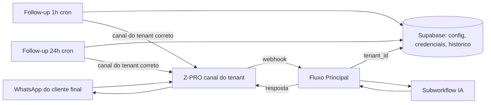

# TESE — Fluxo Central de Atendimento IA via WhatsApp

> **Proposta:** adotar a arquitetura central multi-tenant (4 workflows N8N + Supabase)
> como **fluxo padrão da empresa** para atendimento automatizado via WhatsApp.
> **Tese central:** um único fluxo atende N clientes; cliente novo entra por
> **cadastro de dados**, não por cópia de código.
>
> Documento de defesa técnica e manual operacional de onboarding.
> Última atualização: 2026-06-11 (pós-auditoria completa dos 4 workflows).

---

## 1. Resumo executivo

A empresa precisa atender 20 clientes (e os próximos) com chatbot de IA no
WhatsApp. Existem dois caminhos possíveis:

- **(A) Replicar:** copiar o fluxo para cada cliente — 20 cópias para manter.
- **(B) Centralizar:** um único fluxo multi-tenant onde cada cliente é um
  conjunto de **linhas no banco de dados**.

Este documento defende o caminho **(B)**, que já está construído, auditado e
validado em produção com 2 clientes reais. Os números que sustentam a decisão:

| Indicador | Valor |
|---|---|
| Workflows a manter (para 20 ou 200 clientes) | **4** (sempre 4) |
| Tempo para inserir um cliente novo | **~30 min** (5 INSERTs + teste) |
| Custo de corrigir um bug para todos os clientes | **1 correção** (vs. 20) |
| Camadas de resiliência da IA | **3** (principal → fallback → emergência) |
| Cliente final fica sem resposta? | **Nunca** (por desenho) |
| Observabilidade | tokens, latência e categoria **por atendimento, por cliente** |

---

## 2. O que é o sistema

Quatro workflows N8N centrais + Supabase como camada de dados e configuração:

| Componente | Função | Gatilho |
|---|---|---|
| **Fluxo Principal** (102 nós) | Recebe toda mensagem do WhatsApp, identifica o cliente (tenant), normaliza mídia, aplica proteções e orquestra a resposta | Webhook (Z-PRO) |
| **Subworkflow IA** | O "cérebro": monta contexto (histórico + catálogo + regras), chama o modelo e interpreta a resposta | Chamado pelo Principal |
| **Follow-up 1h** | Reengaja o lead que parou de responder há ~1h, com mensagem **personalizada pela IA** baseada na conversa | Cron 5 min |
| **Follow-up 24h** | Recupera o lead frio há ~24h com mensagem padrão | Cron 30 min |



**O ponto-chave da arquitetura:** o fluxo não "pertence" a nenhum cliente.
Cada mensagem que chega traz o identificador do canal Z-PRO (`tenantId`);
o fluxo consulta `ia_tenants` e carrega **em tempo de execução** o prompt,
as regras, o catálogo, os modelos de IA e as credenciais de envio **daquele
cliente**. Dois clientes nunca compartilham configuração — compartilham apenas
a infraestrutura.

---

## 3. A jornada de uma mensagem (ponta a ponta)

O que acontece quando o cliente final manda "oi, vi o apartamento no anúncio":

1. **Recepção** — Z-PRO entrega a mensagem no webhook central
   (`https://212hook.criate.online/webhook/ia-atendimento-central`). O fluxo
   responde `200` **imediatamente** — o Z-PRO nunca fica esperando.
2. **Identificação do tenant** — o `tenantId` do payload é casado com
   `ia_tenants.instancia`. Tenant inexistente ou inativo → fluxo para limpo.
3. **Normalização de mídia** — texto segue direto; áudio é **transcrito**,
   imagem/vídeo/documento são **descritos** pelo Gemini; localização vira
   coordenada legível. Tipo desconhecido cai no ramo texto (catch-all) —
   nenhuma mensagem morre sem tratamento.
4. **Deduplicação** — cada mensagem tem ID único; duplicata (reentrega do
   webhook) é barrada por constraint no banco e a execução para sem efeito.
5. **Pausa humana automática** — se o **corretor** responde manualmente pelo
   painel (`fromMe`), a IA se pausa para aquele cliente. Humano e robô nunca
   falam ao mesmo tempo.
6. **Comando administrativo** — `@reset` (limpar memória da conversa) só
   funciona para telefones cadastrados em `ia_admins` daquele tenant.
   Para qualquer outra pessoa, é mensagem comum.
7. **Debounce / consolidação** — se o cliente manda 5 mensagens picadas em
   segundos, o fluxo espera (janela configurável por tenant, padrão 8s),
   consolida tudo e responde **uma vez, com contexto completo**. Se chega
   mensagem mais nova durante o processamento, a execução antiga se cancela —
   só a mais recente responde.
8. **Guard rails** — antes da IA, a mensagem passa por detecção de:
   *prompt injection* ("ignore suas instruções..."), dados sensíveis
   (CPF, cartão, CVV, senha, chave de API, CNPJ) e spam (repetição). Eventos
   são registrados para auditoria.
9. **Catálogo com cache** — o estoque (planilha do cliente) é carregado com
   cache TTL por tenant: resposta rápida e sem estourar cota da fonte.
10. **IA em 3 camadas** — modelo principal do tenant (ex.: Gemini 2.5 flash via
    OpenRouter) → falhou? **fallback** (ex.: GPT-4o-mini) → falhou também?
    **mensagem de emergência** educada com rota de escape para atendente.
    O cliente final **nunca** fica sem resposta.
11. **Ação decidida pela IA** — `continuar` (responde), `transferir` (handoff:
    gera **resumo da conversa**, abre nota + tag + fila no painel Z-PRO, avisa
    o corretor no WhatsApp interno e **pausa a IA**) ou `transferir_agente`
    (troca de persona — ex.: do agente de vendas para o de locação). Qualquer
    valor inesperado cai em `continuar` (catch-all).
12. **Persistência e métricas** — tudo registrado por tenant: histórico da
    conversa, log do atendimento com **tokens de entrada/saída, latência e
    categoria**. É a base para medir custo e cobrar por uso.
13. **Reengajamento automático** — se o cliente não responde:
    - **~1h depois** (janela 55–65 min): a IA lê o histórico e gera um
      follow-up **personalizado** ("Oi! Ficou alguma dúvida sobre o apê do
      Setor Bueno?"). Enviado pelo **canal do tenant correto**.
    - **~24h depois** (janela 23–25h): mensagem padrão de recuperação.
    - Ambos respeitam **horário comercial** (7h–21h, seg–sáb, fuso de SP),
      enviam **no máximo 1 vez** (dedup por registro com estado
      `enviando → enviado` — à prova de falha: se o envio falhar, o pior caso
      é *não enviar*, nunca *enviar duplicado*) e se cancelam sozinhos se o
      cliente responder antes.

---

## 4. Por que este deve ser o fluxo padrão — os 8 pilares

### Pilar 1 — Fonte única de verdade
Um bug corrigido no fluxo central está corrigido **para os 20 clientes no
mesmo segundo**. Com 20 cópias, cada correção vira 20 operações manuais — e na
prática as cópias divergem ("cliente 7 está na versão de março"), criando 20
sistemas diferentes com 20 comportamentos diferentes. É o princípio mais básico
de engenharia: *don't repeat yourself*.

### Pilar 2 — Custo marginal de cliente ≈ zero
Cliente novo = **5 INSERTs no banco + 30 minutos de teste** (seção 6). Não há
desenvolvimento, não há deploy, não há novo workflow. O custo de adicionar o
21º cliente é igual ao do 201º. Isso transforma o atendimento IA de "projeto
por cliente" em **produto escalável**.

### Pilar 3 — Resiliência por desenho, não por sorte
Três camadas de IA + resposta imediata ao webhook + dedup + catch-all em todos
os pontos de decisão + fail-safe nos follow-ups. Cada modo de falha foi mapeado
e tem um comportamento definido — e o comportamento definido é sempre o
inofensivo (parar limpo ou degradar com elegância), nunca o catastrófico
(spam, resposta dupla, silêncio).

### Pilar 4 — Qualidade de conversa
Debounce/consolidação faz a IA responder como um humano atento (uma resposta
completa) e não como um robô afobado (5 respostas picadas). Transcrição de
áudio e leitura de imagem significam que o cliente final conversa **do jeito
que ele já conversa** — manda áudio, manda print — e é entendido.

### Pilar 5 — Segurança operacional
Guard rails contra manipulação do bot e vazamento de dados sensíveis; comando
de administração restrito a telefones autorizados por cliente; pausa automática
quando o humano assume; credenciais isoladas por tenant no banco — nunca
embutidas no fluxo.

### Pilar 6 — Observabilidade que vira dinheiro
Cada atendimento registra tokens consumidos, latência e categoria, **por
cliente**. Isso responde perguntas de negócio: quanto custa cada cliente?
Qual cliente dá lucro? Qual prompt está caro? Onde a IA transfere demais?
Sem isso, não há como precificar nem otimizar.

### Pilar 7 — Reengajamento que recupera receita
Lead que esfria recebe follow-up contextual em 1h e recuperação em 24h —
automático, com limite, em horário comercial, pelo canal certo. É a parte do
funil que nenhuma equipe humana faz de forma consistente.

### Pilar 8 — Validado em produção, não em slide
O sistema já roda com **2 clientes reais de segmentos diferentes**
(imobiliária e loja de pneus — prova da flexibilidade por configuração).
Testes de produção em 03/06 cobriram texto, áudio, imagem com e sem legenda e
mensagens simultâneas, com **zero erros**. A auditoria completa de 11/06
revisou os 4 workflows nó a nó, corrigiu os pontos encontrados e confirmou a
integridade de todas as conexões.

---

## 5. A alternativa rejeitada: um fluxo por cliente

Para defender uma escolha é preciso mostrar o que ela evita:

| Critério | Fluxo central (proposto) | 20 cópias (rejeitado) |
|---|---|---|
| Correção de bug | 1× | 20×, manual, sujeito a esquecimento |
| Evolução (nova feature) | 1× | 20× ou clientes em versões diferentes |
| Onboarding | INSERTs (~30 min) | Copiar, renomear, reconfigurar webhook, credenciais, testar tudo (~horas) |
| Webhook | 1 endpoint estável | 20 endpoints; reconfigurar canal Z-PRO de cada cliente |
| Risco de erro humano | Baixo (processo repetível por script) | Alto (20 edições manuais por mudança) |
| Auditoria | Auditar 4 workflows | Auditar 80 workflows |
| Custo de infra N8N | 4 workflows ativos | 80 workflows ativos (4×20), crons duplicados disparando 20× |
| Limite de crescimento | Nenhum prático | Cada cliente novo piora todos os problemas acima |

**Detalhe técnico decisivo:** os crons de follow-up consultam *views* que
retornam candidatos de **todos os tenants** (cada linha já carrega o canal de
envio correto do seu tenant). Replicar esses crons faria cada cópia processar
os clientes de todos — mensagens duplicadas multiplicadas pelo número de
cópias. A arquitetura foi desenhada para ser central; replicá-la não é
"mais seguro", é **incompatível com o próprio desenho**.

> **Resposta à pergunta "e a personalização?"** — Ela já existe e é total,
> só que **por dados**: prompt, regras, slogan, catálogo, modelos de IA,
> tempo de debounce, follow-up ligado/desligado e delay, agentes/personas e
> admins são **colunas e linhas por tenant**. Personalizar não exige tocar
> no fluxo.

---

## 6. Onboarding — como cada um dos 20 clientes entra

### 6.1 O que coletar de cada cliente (ficha de entrada)

**Comercial / conteúdo:**
- [ ] Nome do negócio e segmento
- [ ] Prompt do negócio: como a IA deve se apresentar, tom de voz, o que pode
      e não pode prometer
- [ ] Regras gerais (horários, políticas, diferenciais)
- [ ] Catálogo/estoque: URL da planilha (ou fonte) de produtos/imóveis
- [ ] Telefones dos **administradores** (quem pode usar `@reset`)
- [ ] Follow-up: ativo? Com que delay?

**Técnico (gerado no provisionamento):**
- [ ] Tenant Z-PRO criado (o `tenantId` numérico → vira `ia_tenants.instancia`)
- [ ] Canal WhatsApp conectado (instância UAZAPI com token)
- [ ] API externa do Z-PRO criada (URL `.../v2/api/external/<uuid>` + token)

### 6.2 Passo 1 — Provisionar o canal (Z-PRO + UAZAPI)

Se o cliente entra pela **esteira ImobiFlow** (signup + pagamento Asaas), isto
é **automático** — a esteira cria tenant, usuário, canal, instância UAZAPI,
webhook, API externa e ativa os Bots IA (8 passos documentados em
`DOCUMENTACAO.md`). Para cliente avulso (fora da esteira), executa-se a mesma
sequência manualmente. Ao final, ter em mãos:

| Dado | Exemplo | Vai para |
|---|---|---|
| `tenantId` Z-PRO | `209` | `ia_tenants.instancia` |
| Token instância UAZAPI | `460f781f-...` | `ia_tenant_credentials.uazapi_token` |
| URL UAZAPI | `https://criate.uazapi.com` | `ia_tenant_credentials.uazapi_url` |
| URL API externa Z-PRO | `https://appback.criate.online/v2/api/external/<uuid>` | `ia_tenant_credentials.zpro_link` |
| Token API externa | `Token <plaintoken>` ⚠️ **com o prefixo `Token `** | `ia_tenant_credentials.zpro_auth` |

E configurar **no canal Z-PRO**: `n8nUrl` apontando para o webhook central
(`https://212hook.criate.online/webhook/ia-atendimento-central`) e Bots IA
habilitados (`n8n` + `n8nAllTickets`).

### 6.3 Passo 2 — Cadastrar o cliente no cérebro (5 INSERTs)

Template SQL (substituir os `<placeholders>`; para `ia_tenant_config`,
recomenda-se partir de um `SELECT` do tenant-gabarito e ajustar):

```sql
-- 1) Tenant: o roteador. instancia = tenantId numérico do Z-PRO.
INSERT INTO ia_tenants (id, nome, instancia, ativo)
VALUES (gen_random_uuid(), '<Nome do Cliente>', '<tenantId-zpro>', true)
RETURNING id;   -- guarde: este é o <TENANT_UUID> dos próximos passos

-- 2) Credenciais de envio (isoladas por cliente)
INSERT INTO ia_tenant_credentials (tenant_id, uazapi_token, uazapi_url, zpro_link, zpro_auth)
VALUES ('<TENANT_UUID>',
        '<token-instancia-uazapi>',
        'https://criate.uazapi.com',
        'https://appback.criate.online/v2/api/external/<uuid-api-externa>',
        'Token <plaintoken-api-externa>');   -- ⚠️ prefixo "Token " obrigatório

-- 3) Comportamento da IA (copie o gabarito e ajuste prompt/estoque)
INSERT INTO ia_tenant_config (tenant_id, prompt_principal, regras_gerais, slogan,
        estoque_url, estoque_modo, estoque_ttl_min,
        modelo_principal, modelo_fallback,
        debounce_seg, followup_ativo, followup_delay_min, followup_max)
SELECT '<TENANT_UUID>', '<prompt do negócio>', '<regras>', '<slogan>',
        '<url-planilha-estoque>', estoque_modo, estoque_ttl_min,
        modelo_principal, modelo_fallback,
        debounce_seg, followup_ativo, followup_delay_min, followup_max
FROM ia_tenant_config WHERE tenant_id = '<UUID-TENANT-GABARITO>';

-- 4) Agente padrão (persona). Slug 'default' é obrigatório; outros são opcionais.
INSERT INTO ia_agentes (tenant_id, slug, nome, personalidade, especialidade,
        system_prompt, ativo)
VALUES ('<TENANT_UUID>', 'default', '<Nome da persona>', '<personalidade>',
        '<especialidade>', '<system prompt da persona>', true);

-- 5) Administradores (quem pode @reset)
INSERT INTO ia_admins (tenant_id, telefone)
VALUES ('<TENANT_UUID>', '55629XXXXXXXX');
```

> Opcional: `ia_tenant_handoff_routes` — rotas de transbordo por assunto
> (financeiro, suporte etc.), se o cliente quiser direcionamento por fila.

### 6.4 Passo 3 — Teste de aceitação (checklist, ~15 min)

| # | Teste | Resultado esperado |
|---|---|---|
| 1 | Mandar "oi" de um celular de teste | IA responde com a persona/prompt do cliente |
| 2 | Mandar **áudio** | IA entende e responde o conteúdo |
| 3 | Mandar **3 mensagens picadas** em 5s | **Uma** resposta consolidada |
| 4 | Repetir a mesma pergunta sobre um item do catálogo | Resposta usa o estoque do cliente |
| 5 | `@reset` do telefone **admin** | Memória limpa, confirmação |
| 6 | `@reset` de telefone **não-admin** | Tratado como mensagem comum |
| 7 | Pedir "quero falar com atendente" | Resumo no painel Z-PRO + IA pausada |
| 8 | Corretor responde pelo painel | IA pausa sozinha para aquele contato |
| 9 | Não responder a IA por ~1h | **Um** follow-up personalizado chega (horário comercial) |
| 10 | Conferir `ia_atendimentos_log` | Linhas do tenant com tokens/latência preenchidos |

Passou nos 10 → cliente em produção.

### 6.5 Plano de rollout dos 20 clientes — ondas

Não ligar os 20 de uma vez. Proposta: **4 ondas de 5 clientes, 1 onda por
semana**:

| Onda | Clientes | Critério para avançar |
|---|---|---|
| 1 | 5 (os mais engajados) | 1 semana sem erro de execução; follow-ups corretos; custo/tenant dentro do esperado |
| 2 | +5 | Idem, com 10 ativos |
| 3 | +5 | Idem, com 15 ativos |
| 4 | +5 | Operação completa |

Ondas dão ponto de freio: qualquer surpresa afeta 5 clientes, não 20 — e o
aprendizado da onda 1 melhora o onboarding das seguintes. Como o custo de
inserção é ~30 min/cliente, uma onda inteira é **meio dia de trabalho**.

---

## 7. Operação contínua (runbook)

**Diário (5 min):**
- Painel de execuções do N8N: erros nos 4 workflows
- `SELECT status, count(*) FROM ia_followups WHERE criado_em > now() - interval '1 day' GROUP BY status;`
  — linhas presas em `enviando` indicam falha de envio (investigar canal)

**Semanal:**
- `ia_atendimentos_log`: tokens e atendimentos por tenant (custo por cliente)
- Taxa de handoff por tenant (IA transferindo demais = prompt para ajustar)
- Guard rails disparados (tentativas de injection/spam por tenant)

**Por mudança no fluxo:**
- Alterar **uma vez** no workflow central → vale para todos
- Testar com o tenant-gabarito antes (checklist 6.4 reduzido)

---

## 8. Riscos conhecidos e plano de mitigação

Uma defesa séria não esconde pendências — mostra que estão sob controle:

| # | Risco | Estado | Mitigação |
|---|---|---|---|
| 1 | RLS desabilitado nas tabelas `ia_*` | Pendente | O isolamento hoje é por `tenant_id` em **todas** as queries (auditado). RLS é **defesa em profundidade** a ativar antes da onda 2. O N8N usa `service_role`, então a ativação não quebra o fluxo. |
| 2 | Chave OpenRouter antiga exposta no histórico | Pendente | Revogar no painel OpenRouter (ação de 2 min, sem impacto — a chave ativa é outra). |
| 3 | Credenciais de IA compartilhadas (1 chave OpenRouter para todos) | Aceito por ora | Quota e custo são monitorados por tenant via log. Evolução: chave por tenant em `ia_tenant_credentials`. |
| 4 | Sem rate-limit por telefone | Aceito por ora | Guard rail de spam cobre o caso grosseiro; rate-limit fino é item de backlog. |
| 5 | Contagem de tokens é estimada (±25%) | Aceito | O N8N não expõe o uso real do provedor; a estimativa (4 chars/token) é suficiente para gestão de custo. Faturamento fino exigiria chamada direta à API. |

Itens 1 e 2 são **pré-requisitos da onda 2** do rollout; 3–5 são evolução.

---

## 9. FAQ — perguntas prováveis da diretoria

**"Por que não um fluxo separado por cliente? Não é mais isolado?"**
Não — é mais frágil. O isolamento real está nos dados (cada query filtra por
`tenant_id`, cada envio usa a credencial do tenant). Cópias não adicionam
isolamento; adicionam 20 pontos de falha, 20 manutenções e divergência de
versão. E os crons de follow-up são incompatíveis com réplica (seção 5).

**"E se a IA sair do ar?"**
Há 3 camadas: modelo principal → modelo de fallback (provedor diferente) →
mensagem de emergência com rota para atendente humano. O cliente final sempre
recebe algo, e o caso extremo degrada para atendimento humano — nunca para
silêncio.

**"Um cliente pode ver dados de outro?"**
Toda consulta e todo envio são filtrados por `tenant_id`, verificado em
auditoria nó a nó (11/06). Como reforço adicional, o RLS no banco será ativado
antes da onda 2 (seção 8).

**"Como sabemos quanto cada cliente nos custa?"**
`ia_atendimentos_log` registra tokens e latência por atendimento, por tenant.
Relatório de custo por cliente é uma query.

**"E se o cliente 21 chegar amanhã?"**
Ficha de entrada (6.1) + provisionamento (6.2) + 5 INSERTs (6.3) + checklist
(6.4). ~30 minutos de trabalho técnico. Nada é desenvolvido.

**"Quem garante que a IA não fala besteira ou é manipulada?"**
Guard rails de injection/spam/dados sensíveis antes da IA; prompt e regras por
cliente; ação de transbordo para humano; pausa automática quando o corretor
assume; e tudo logado para auditoria.

**"O que acontece se duas mensagens chegarem ao mesmo tempo?"**
Dedup barra duplicatas; o debounce consolida rajadas em uma resposta; e o
controle de janela cancela execuções obsoletas. Testado em produção com
mensagens simultâneas, zero erros.

**"Por que confiar que está 'pronto'?"**
2 clientes reais em produção, de segmentos diferentes; bateria de testes de
03/06 (texto, áudio, imagem, consolidação) sem erros; auditoria completa nó a
nó em 11/06 com os ajustes aplicados e verificados no servidor.

---

## 10. Glossário

| Termo | Significado |
|---|---|
| **Tenant** | Um cliente da empresa (imobiliária, loja...) dentro do sistema |
| **Z-PRO** | Plataforma de atendimento WhatsApp (painel + tickets) — 1 tenant Z-PRO por cliente |
| **UAZAPI** | Provedor da conexão WhatsApp (1 instância por cliente) |
| **N8N** | Orquestrador onde rodam os 4 workflows centrais |
| **Handoff** | Transferência da conversa da IA para atendente humano |
| **Debounce** | Janela de espera que consolida mensagens picadas |
| **Follow-up** | Mensagem automática de reengajamento (1h personalizada / 24h padrão) |
| **Guard rails** | Filtros de segurança aplicados antes da IA |
| **RLS** | Row Level Security — isolamento por linha no banco (reforço planejado) |

---

*Documento gerado a partir da auditoria técnica completa dos workflows
`IA Atendimento WhatsApp - Central v2`, `SW-Pipeline-IA`, `Follow-Up 1h` e
`Follow-Up 24h` em 11/06/2026, com todas as correções aplicadas e verificadas
em produção.*
